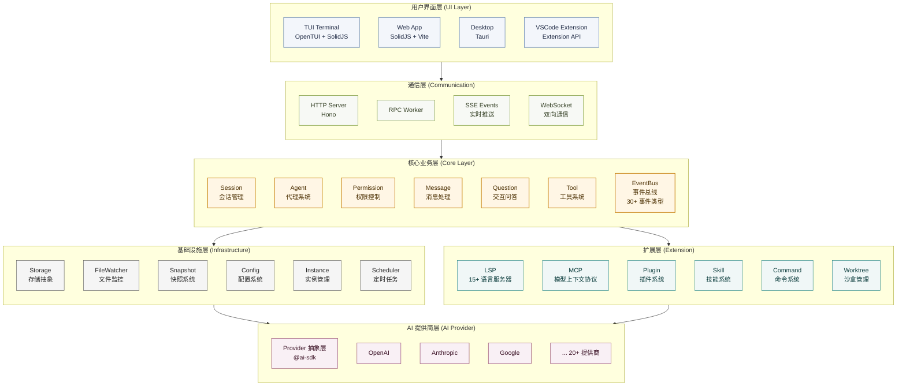

# 第 1 章 设计哲学：为什么是 CLI Agent？

当我们准备从零开始编写一个 AI 编码助手时，我们第一步该做什么？

在动手之前，我们需要先确定它的宿主形态。直觉告诉我们，开发者在 IDE 里写代码，所以将 AI 集成进 IDE 是理所当然的选择。现有的主流产品（如 Cursor 或 GitHub Copilot）大多也是这么做的。但还有另外一种宿主形态占据了相当大的市场份额——— CLI Agent。为什么会存在 CLI Agent 这种宿主形态呢？我们可以拿市面上两款主流产品来对比：Cursor 和 Claude Code。

## 1.1 上下文管理

Claude Code 是 Anthropic 推出的编程智能体（Agent），可在终端、VS Code、JetBrains、桌面端以及 Web 端运行。它凭借对代码库的深入理解，能够自主执行多步骤的任务。Cursor 则是一款以 Agent 为核心重构的 VS Code 衍生编辑器，提供 Tab 键代码补全、多模型对话功能，以及可以直接在 IDE 中编辑文件的 Cursor Agent 模式。如今，两者都支持后台智能体和命令行（CLI）工作流，并且都在深入触及对方的核心领域。

两者真正的产品哲学分歧在于“控制权”。Claude Code 是“智能体优先”（Agent-first）：由你描述需求，AI 负责主导执行，最后由你来审查结果。Cursor 则是“IDE 优先”（IDE-first）：由你主导开发，AI 负责提供代码补全、修改建议以及内联编辑，并由你逐一批准确认。

相信深度使用过 Cursor 和 Claude Code 的开发者都会有类似感受：面对同样的重构任务，即使底层调用的都是 Claude 3.5 Sonnet 模型接口，在 IDE 中使用与在 CLI 中使用，体验与效果依然存在显著差异。

既然底层模型完全一致，问题出在哪里？这主要源于上下文（context）管理方式的不同。

Cursor会自动把当前打开的文件、侧边栏信息、终端输出、打开的Tab等IDE状态塞进模型的上下文，虽然你可以手动用@File、@Code、@Folder等指令来指定上下文，但IDE状态往往默认参与，导致Token消耗更高, 模型注意力分散。除此之外，使用Cursor的用户经常反馈在使用 70K 到 120K tokens 时就会达到上限，系统会在后台触发截断与性能保护机制，导致实际可用的上下文被压缩。
有人做过对比测评，评测内容是：使用 Tailwind 4 和 shadcn 组件构建一个 Next.js 应用。同任务情况下，Cursor 消耗的 Token 数量是 Claude Code 的 5.5 倍。

而Claude Code这样的CLI 工具的上下文更纯净。它确保了模型能将有限的 Context Window 完全聚焦于代码逻辑本身，尤其适合大量的重构或后台agent任务。

## 1.2 可移植性与场景扩展

我们再来看看这两种形态在软件工程全生命周期中的差异。

IDE 强绑定于个人的开发机器与特定的可视化界面，而 CLI 本质上是一个标准的系统命令，它天然具备极佳的可移植性。你可以在本地用 CLI 工具，可以在远程服务器上用，可以在 Docker 容器里用，可以直接集成到 CI/CD 流水线里。Anthropic 官方已经发布了 GitHub Action 和 GitLab CI/CD 集成，你在 PR 里 @claude 就能触发自动 Code Review、自动修复 Bug、甚至自动实现 Issue 里描述的功能。

CLI 已经从一个“帮你写下一行代码的辅助工具”，转变为一个“可编排的虚拟工程师”。这就解释了为什么当 Agent 的自治能力跨越某个临界点后，IDE 界面反而会退居二线：因为开发者不再需要逐行确认代码，而是转变为类似 Tech Lead 的角色，通过终端指令调度 Agent 完成模块级的任务。

场景还在继续扩展。已经有很多人用 Claude Code 做编程之外的事情：批量处理文件、生成报告、操作数据库、甚至辅助视频剪辑。当你的 AI 工作流是以命令行为入口的时候，编程只是它能做的事情之一。

包括 Anthropic 也推出了针对办公场景的 Cowrok，可以满足很多办公需求，甚至于不需要打开办公软件可以生成不错的 PPT。这些都是相同的趋势，人会越来越多的以 Agent 为中心，去指挥 Agent 操作软件，而不是直接打开软件，这个变化正在发生。

## 1.3 模型集成的飞轮效应

从模型调用来看，Cursor 是一个第三方工具，它接入多种模型，Claude、GPT、Gemini 都可以用。

听上去很灵活对吧？但问题是，它要为每一种模型做优化：不同的系统提示词、不同的工具调用方式、不同的擅长领域。

Codex 喜欢写 Python，Claude 习惯用 Bash，每次模型升级，这些适配都要重新调整。维护成本很高，而且很难做到极致。

Claude Code 只需要考虑一件事：怎么把 Claude 模型的能力发挥到最大。它知道模型的所有技术细节，知道什么提示词效果最好，知道怎么拆分任务最高效。甚至 Anthropic 可以反过来，专门针对 Claude Code 的使用场景去训练模型。

这就形成了一个飞轮：用户用 Claude Code 产生真实的交互数据，Anthropic 用这些数据训练下一代模型，模型变强后 Claude Code 更好用，吸引更多用户，产生更多数据。Cursor 做不到这个循环，因为数据和模型分属不同的公司。

飞轮效应还体现在定价上。Anthropic 可以把 Claude Code 的订阅价格定得相对便宜，因为用户产生的数据本身就有价值，相当于用补贴换数据。

Cursor 的商业模式是赚差价：用户付月费，它去调 API，中间的差价就是利润。用户的 Token 用得越少，Cursor 赚得越多。它之前尝试过比较大方的包月方案，很快就扛不住成本了，现在改成包月加超额付费的模式。做 Agent 功能的时候，它就有动力去省 Token，但一省 Token 上下文就可能被截断，效果就打折扣。

这也是为什么同样的模型，Cursor 的表现不一定比得上 Claude Code。需要强调的是，我们并不是在批判Cursor有多么的不好，相反，Cursor在特定工作场景中表现出色，比如：自动补全速度、可视化体验、快速修复等。作为工具，它们本来就是为不同的场景而设计的。Reddit 上一个比较中肯的观点：

> "Cursor to get started, Claude Code to debug and refactor."

# 第 2 章 Agent 核心：从函数调用到状态机

有了对编码辅助工具的清晰认识，我们就可以在设计自己的Opencode架构时，根据自己的产品定位，去选择合适的运行形态。接下来我们从一个最基础的Agent入手，理解编码辅助Agent的本质原理。

## 2.1 从一次调用到持续循环

最简单的 AI 调用是一个异步函数，传入一段文本，等待返回：

```typescript
async function main() {
  const answer = await llm.ask("帮我写一个快速排序");
  console.log(answer);
}

main();
```
但当我们尝试用这种模式去处理真实世界的工程问题时，会面临着诸多挑战。

假设用户提出了一个任务：「帮我修复项目中的类型报错」。这时，AI 仅靠一次「输入-输出」是无法完成任务的。因为它必须先查看具体的报错信息，读取代码文件，尝试修改，然后再次确认是否还有报错。

这意味着，智能体的行为不再是一次性的，而是一个持续的、有反馈的过程。为了实现这种持续性，我们必须引入一个最基础的结构：循环。

为了理解这一点，我们可以试着写一个最简陋的 Agent。为了让它能够不断地检查环境并做出反应，最直观的代码可能是这样的：

```typescript
// 这是一个有缺陷的初步设计
function runAgent() {
  while (true) {
    const userInput = getUserInput();
    const result = llm.think(userInput);
    console.log(result);
  }
}
```

然而，以上简单的循环存在两个致命的问题：

第一个问题是缺乏终止条件。在计算机科学中，任何递归或循环都需要一个基准情形来退出。对于 LLM Agent 而言，无限循环意味着无限消耗 Token。

第二个问题是状态丢失。runAgent 函数内部是无状态的。Agent 不知道自己上一轮做了什么，也不知道距离目标还有多远。它就像一条金鱼，每一轮循环都是全新的开始。

为了解决这些问题，我们需要将 AI 助手从一个简单的函数升级为一个对象，利用对象来通过内存维持状态。

## 2.2 引入状态与资源约束

让我们声明一个 SimpleAgent 类，并定义一个状态接口 AgentState 来描述 Agent 的状态。为了解决无限消耗 Token 问题，我们引入了一个资源约束变量：energy。为了解决 Agent 不知道什么时候完成目标，我们引入了一个验收条件变量：targetCondition。

```typescript
interface AgentState {
  // 资源约束：用于解决无限循环和成本控制问题
  energy: number;
  // 核心指令：Agent 存在的终极目的
  goal: string;
  // 可变状态：描述 Agent 当前在环境中的状态
  progress: number;
  // 验收条件：Agent 怎么知道自己做完了
  targetCondition: number;
}

class SimpleAgent {
  // 使用 private 封装状态，避免外部随意修改导致状态机混乱
  private state: AgentState;

  constructor() {
    // 初始化状态，这相当于 Agent 的「出厂设置」
    this.state = {
      energy: 100,
      goal: "reach target",
      progress: 0,
      targetCondition: 10
    };
  }
  
  // 后续逻辑
}
```

我们可以将以上代码与真实的 LLM 编码助手场景进行对应：

**energy** 代表资源约束，在真实场景中对应 Context Window 的剩余空间，或者是用户的 API 预算。每次 Agent 执行操作，都会消耗能量。当能量耗尽时，无论任务是否完成，Agent 都必须强制停止。这是为了防止程序陷入死循环而设计的「熔断机制」。

**goal** 对应 System Prompt，它定义了 Agent 的行为边界，例如「你是一个资深的 TypeScript 程序员」。

**progress** 是一个典型的可变状态。在编码助手中，它代表当前代码库的状态、报错信息或文件内容。随着 Agent 的运行，这个状态会不断发生变化。

**targetCondition** 是验收条件。Agent 怎么知道自己做完了？在前面的简单循环中，Agent 是不知道停下来的。而在状态机模型中，当 progress 达到 targetCondition（例如：单元测试全绿），即视为任务达成。在这个简化示例中，我们用数值来表示进度，但在真实场景中，验收条件可能是更复杂的判定逻辑。

## 2.3 感知–决策–行动（PDA）

有了状态，Agent 依然是静止的。为了让它动起来，我们需要实现一个驱动循环。但在实现循环之前，必须先定义循环体内的逻辑。

在控制论中，智能体的行为通常遵循 PDA 范式：

1. 感知：从环境中获取信息，更新内部认知。
2. 决策：基于感知到的信息和当前目标，选择下一个动作。
3. 行动：执行动作，产生副作用，改变环境。

### 感知

Agent 无法直接处理原始的物理世界数据，它需要将环境信息抽象为它能理解的数据格式。

```typescript
// Agent perceives its environment
private perceive(): { distanceToTarget: number; energyLevel: string } {
  const distance = Math.abs(this.state.targetCondition - this.state.progress);
  // 将连续的数值离散化为状态标签，降低决策的复杂度
  const energyLevel = this.state.energy > 50 ? "high" : this.state.energy > 20 ? "medium" : "low";

  return { distanceToTarget: distance, energyLevel };
}
```

注意这里的一个细节：我们在 perceive 中并没有直接返回 energy 的数值，而是将其转换为了 high | medium | low 这样的语义化标签。这种处理方式在 AI 领域非常常见——通过抽象降低决策模型的输入维度。对于 LLM 来说，「High」比「87」更容易作为 prompt 的一部分进行推理。

### 决策

有了感知数据，Agent 就需要做出判断。这部分逻辑构成了 Agent 的「大脑」。

```typescript
// Agent decides what to do
private decide(perception: { distanceToTarget: number; energyLevel: string }): string {
  // 优先级 1：生存优先。如果能量过低，必须休息，否则任务会失败。
  if (perception.energyLevel === "low") {
    return "rest";
  }

  // 优先级 2：任务优先。如果还未到达目标，继续移动。
  if (perception.distanceToTarget > 0) {
    return "move";
  }

  // 优先级 3：任务完成。
  return "celebrate";
}
```

这里的 decide 函数是一个纯函数，它完全依赖于输入产生输出，没有副作用。在真实的 AI Agent 中，这个函数内部通常就是一次 LLM API Call。我们把感知到的环境发给 LLM，它返回一个意图。

### 行动

最后，我们需要一个函数来执行决策。这是整个系统中唯一产生副作用的地方。

```typescript
// Agent takes action
private act(action: string): boolean {
  console.log(`Agent action: ${action}`);

  switch (action) {
    case "move":
      // 模拟向目标逼近的副作用
      if (this.state.progress < this.state.targetCondition) {
        this.state.progress++;
      } else if (this.state.progress > this.state.targetCondition) {
        this.state.progress--;
      }
      // 关键点：行动必然伴随着资源的消耗
      this.state.energy -= 10;
      console.log(`   Moved to progress ${this.state.progress} (Energy: ${this.state.energy})`);
      break;

    case "rest":
      this.state.energy += 30;
      console.log(`   Resting... (Energy: ${this.state.energy})`);
      break;

    case "celebrate":
      console.log(`   Goal achieved! Reached progress ${this.state.progress}`);
      return true; // 信号：任务完成
  }

  return false; // 信号：继续运行
}
```

### 组装运行时

现在，我们将上述所有部件组装在一起，放入一个循环中，让 Agent 动起来，形成最终的 run 方法。

```typescript
public run(): void {
  console.log("Agent starting...\n");

  let isRunning = true;
  let step = 0;
  
  // 这里的 20 是一个硬性的 Safety Limit，防止程序失控
  while (isRunning && step < 20) { 
    step++;
    console.log(`--- Step ${step} ---`);

    // 1. 感知
    const perception = this.perceive();
    // 2. 决策
    const decision = this.decide(perception);
    // 3. 行动（并获取反馈）
    const missionComplete = this.act(decision);

    // 检查终止条件：任务完成
    if (missionComplete) {
      isRunning = false;
    }

    // 检查终止条件：资源耗尽（熔断机制）
    if (this.state.energy <= 0) {
      console.log("Agent ran out of energy!");
      isRunning = false;
    }

    console.log(); 
  }

  console.log("Agent stopped.");
}
```

下面是完整的代码实现：

```typescript
interface AgentState {
  energy: number;
  goal: string;
  progress: number;
  targetCondition: number;
}

class SimpleAgent {
  private state: AgentState;

  constructor() {
    this.state = {
      energy: 100,
      goal: "reach target",
      progress: 0,
      targetCondition: 10
    };
  }

  // Agent perceives its environment
  private perceive(): { distanceToTarget: number; energyLevel: string } {
    const distance = Math.abs(this.state.targetCondition - this.state.progress);
    const energyLevel = this.state.energy > 50 ? "high" : this.state.energy > 20 ? "medium" : "low";

    return { distanceToTarget: distance, energyLevel };
  }

  // Agent decides what to do
  private decide(perception: { distanceToTarget: number; energyLevel: string }): string {
    if (perception.energyLevel === "low") {
      return "rest";
    }

    if (perception.distanceToTarget > 0) {
      return "move";
    }

    return "celebrate";
  }

  // Agent takes action
  private act(action: string): boolean {
    console.log(`Agent action: ${action}`);

    switch (action) {
      case "move":
        // Move towards target
        if (this.state.progress < this.state.targetCondition) {
          this.state.progress++;
        } else if (this.state.progress > this.state.targetCondition) {
          this.state.progress--;
        }
        this.state.energy -= 10;
        console.log(`   Moved to progress ${this.state.progress} (Energy: ${this.state.energy})`);
        break;

      case "rest":
        this.state.energy += 30;
        console.log(`   Resting... (Energy: ${this.state.energy})`);
        break;

      case "celebrate":
        console.log(`   Goal achieved! Reached progress ${this.state.progress}`);
        return true; // Mission complete
    }

    return false; // Continue running
  }

  // Main agent loop
  public run(): void {
    console.log("Agent starting...\n");

    let isRunning = true;
    let step = 0;

    while (isRunning && step < 20) { // Safety limit
      step++;
      console.log(`--- Step ${step} ---`);

      // Agent cycle: Perceive -> Decide -> Act
      const perception = this.perceive();
      const decision = this.decide(perception);
      const missionComplete = this.act(decision);

      // Check if mission is complete
      if (missionComplete) {
        isRunning = false;
      }

      // Check if agent is out of energy
      if (this.state.energy <= 0) {
        console.log("Agent ran out of energy!");
        isRunning = false;
      }

      console.log(); // Empty line for readability
    }

    console.log("Agent stopped.");
  }
}

// Run the agent
async function main() {
  const agent = new SimpleAgent();
  agent.run();
}

main();
```

通过这段 SimpleAgent 的实现，我们构建了一个最小化的智能体模型。它不仅解决了最初「无限循环」和「状态丢失」的问题，还引入了资源约束和感知抽象的概念。

然而，细心的读者可能会发现，当前的 SimpleAgent 依然存在一个巨大的局限性：它的行为逻辑是硬编码的，写死在 switch-case 中。

第一个问题是交互的阻塞性。当 callLLM 正在进行网络请求时，整个程序是「假死」的。用户无法中断当前的执行，无法输入新的指令修正方向，甚至连实时的流式输出都很难优雅地插入到这个同步循环中。

第二个问题是能力的耦合。SimpleAgent 使用了很多 console.log，如果某天我们需要为它开发一个 VS Code 插件或者 Web 界面，这段逻辑就必须重写，因为 VS Code 不需要 console.log，而是需要 window.showInformationMessage。我们需要一套机制，让核心逻辑「看不见」用户界面，无论是 TUI、Web 还是 IDE，对核心逻辑来说都应该只是不同的「渲染端」。

第三个问题是状态的易失性。所有的上下文都保存在内存变量中。一旦用户关闭终端，或者程序因网络波动崩溃，所有的对话历史、AI 对项目结构的理解瞬间归零。

为了解决这些问题，我们需要对上述代码重新进行架构设计。

首先，为了解决耦合问题，我们将「大脑」与「肢体」分离。Core 层只负责思考和决策，不负责显示；UI 层只负责渲染，不负责逻辑。两者之间不能直接调用，必须通过事件或消息进行通信。这样，Core 层就不再依赖于 console.log，而是发布一个 MessageUpdated 事件，无论是 TUI 还是 Web UI，监听到这个事件后自行决定如何渲染。

其次，为了解决阻塞问题，我们将同步的 while 循环改为异步的事件驱动模型。AI 的思考、工具的执行、文件的读写，都被抽象为系统中的异步任务。

最后，为了解决易失性，我们需要引入一个持久化的基础设施层，实时将内存中的状态同步到硬盘上。

# 第 3 章 OpenCode 架构：分层与解耦

为了解决前面的问题，OpenCode 采用了分层架构。它不再是一个简单的脚本，而更像是一个运行在本地的微型操作系统。

从底层基础设施到顶层用户界面，OpenCode 共分为 6 个核心层次：



自上而下划分为表现层、通信层、领域核心层、基础设施层及扩展层。各层之间通过标准协议或事件总线进行交互，确保了高内聚低耦合。

**1. 用户界面层 (UI Layer)**
该层的设计理念是「Write Once, Run Anywhere」，旨在实现跨端的无缝交付。它通过共享核心业务逻辑和数据接口，支持 TUI、Web 和 Desktop 多种终端，使用户体验一致。UI 组件采用状态驱动渲染，只依赖下层分发的状态进行响应式渲染，不包含复杂的业务逻辑。

**2. 通信层 (Communication)**
作为前端与核心业务层之间的桥梁，通信层负责处理跨进程通信和网络请求，确保核心层的纯粹性和稳定性。它通过集成 Hono 框架提供 RESTful API 和 SSE 实时流推送，同时使用 WebSocket 维持全双工通信。针对 TUI 场景，内部集成了轻量级 RPC 机制，使得核心层通过事件总线发布数据时，无需关心调用端是 HTTP 请求还是本地 Worker，实现了传输协议与业务逻辑的完全解耦。

**3. 核心业务层 (Core Layer)**
作为系统的大脑，核心业务层采用事件驱动架构，围绕 EventBus 构建核心生命周期。事件总线作为系统的中枢神经，实现模块间的松耦合通信，所有业务流转皆通过事件触发。集成 AI Agent 执行引擎，通过 @ai-sdk 调用外部 LLM，动态调度包含文件操作、代码索引等在内的 20+ 种原子工具。会话状态管理负责维护上下文窗口、消息历史及会话生命周期，确保多轮对话的连贯性。

**4. 基础设施层 (Infrastructure Layer)**
为上层提供持久化存储、环境隔离及文件系统监听等底层服务，解决「状态易失性」问题。状态持久化采用文件系统存储，结合内存快照技术，实时将运行时状态同步至磁盘。环境感知通过集成 @parcel/watcher 和 chokidar 实现文件系统的高效监听，通过 Instance 机制实现实例隔离，确保多项目并行开发时的环境独立性与配置安全。

**5. 生态扩展层 (Extension Layer)**
基于开放封闭原则（OCP）设计的插件化体系，该层旨在构建可生长的开发者生态。全面支持 LSP 接入 20+ 种语言服务（包括 TypeScript、Python、Rust、Go、Java 等主流语言），并通过 MCP 引入外部知识库与工具。提供 Plugin 和 Skill 扩展点，允许第三方开发者通过定义标准接口注入自定义能力。

**6. AI 提供商层 (AI Provider)**
该层基于 @ai-sdk 抽象层，提供对 20+ 种 AI 模型的统一访问接口。支持 OpenAI、Anthropic、Google 等主流模型，未来还计划整合其他厂商的模型。通过插件化设计，允许开发者根据需求自定义模型配置和调用逻辑。


