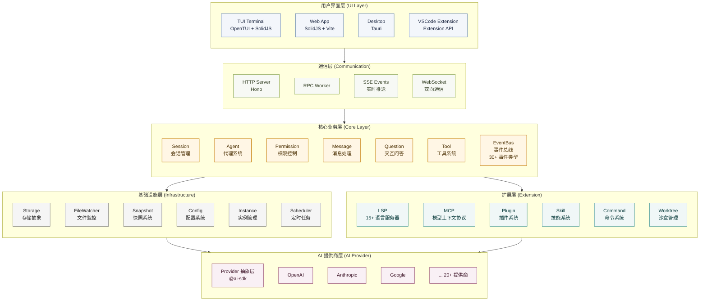
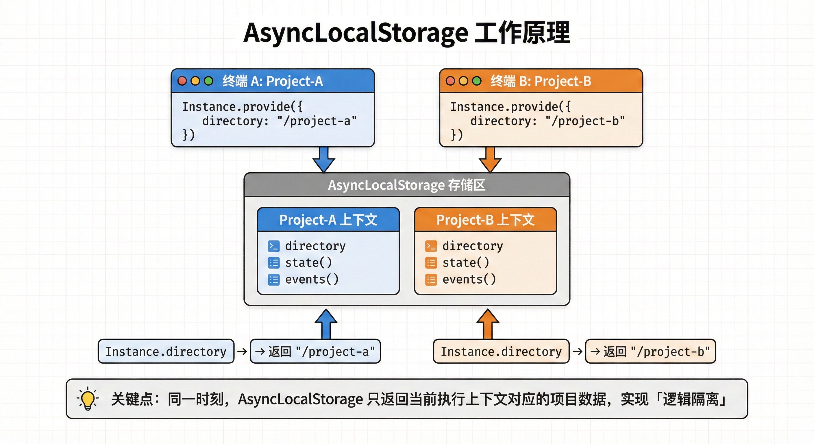
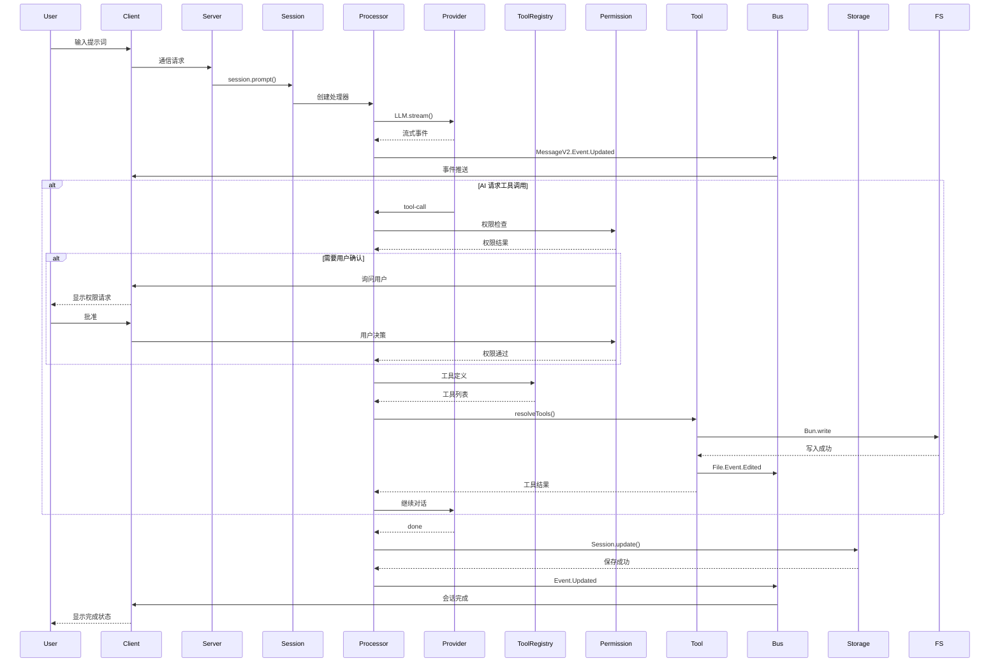
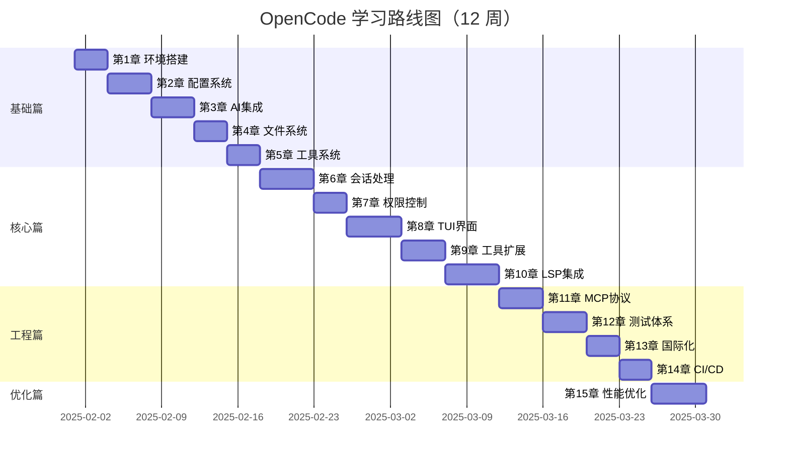

# 1.0 全景架构与设计哲学

在开始编写 OpenCode 的第一行代码之前，我们面临的第一个、也是最核心的抉择，并不是“选什么库”，而是 “它应该长什么样”。

我们要构建的是一个 AI 编码助手（AI Coding Assistant）。当我们环顾现有的主流产品，如 GitHub Copilot 或 Cursor，它们在用户层面大多以 IDE 插件或“魔改 IDE”的形式存在。这似乎是一个非常符合直觉的选择：开发者在哪里写代码，工具就应该在哪里。

但如果我们仅从交互入口的形态出发，盲目跟随这个直觉，可能会陷入一种架构上的“局部最优”。要理解这一点，我们需要从 Agent 的本质需求出发，重新推演这个形态选择的过程。

假如我们选择做一个 VS Code 扩展，现代 IDE 的确为插件提供了相当丰富的能力。插件可以访问整个 workspace，读取和修改文件，感知 Git 状态，甚至通过终端间接执行 shell 命令。像 GitHub Copilot 这样的产品，已经证明了这些能力在“代码补全”和“局部生成”场景下的巨大价值。

但关键问题不在于 “能不能”，而在于 “适不适合”。

IDE 插件的设计初衷，是作为编辑器的附属能力存在的。根据 VS Code 的扩展 API 规范，插件主要通过公开的 API 与编辑器的生命周期、命令面板、界面组件和工作区交互。这些能力高度集中在编辑器上下文之内，旨在扩展或增强编辑体验，而不是作为一个长期运行、可自治、可编排的行动主体。

从这个角度看，IDE 插件并不是一个合格的 Agent 宿主，它更像是一个 UI 层。即便在 GitHub Copilot 这样的产品中也是如此：插件本身并不承担复杂推理、多步规划或执行控制的职责，它的核心作用是采集上下文、触发请求并呈现结果，而真正的智能中枢始终运行在 IDE 之外的独立进程或服务中。

相反，如果我们将视角转向 终端（CLI）模式，Agent 所处的环境就发生了本质变化。终端并不是某个应用的扩展点，而是开发者的“操作系统层级”入口。它允许 Agent 以脚本化的方式操作一切：编辑多文件、运行测试、分析构建结果、监控日志，甚至在后台持续迭代和自我修正。

这种执行方式与 Agent 的“多步推理”（multi-step reasoning）高度契合。Agent 可以像一名人类工程师一样，将一个高层目标分解为多个子任务，并在执行过程中根据反馈动态调整策略。这种灵活性和自主性是 IDE 插件所无法比拟的。

我们还需要优先保证 AI 编码助手的可移植性和低门槛。IDE 插件通常强依赖某一具体编辑器（如 VS Code 或 JetBrains），这不仅提高了用户的切换成本，也限制了开源贡献者的参与方式——并不是每个人都使用同一个 IDE。

而终端工具天然具有跨平台的优势。它可以作为一个独立的 CLI 程序运行，通过 pip、brew 等常见的软件包管理器进行安装，无缝适配于各种操作系统和编辑环境。用户仅需在 shell 中输入简单的命令，例如：

```bash
opencode --task "build a web app"
```
即可轻松启动一个完整的编码 Agent，无需改变用户的开发习惯。

从安全角度看，本地 Agent 还需要一个相对清晰的“执行边界”，这是为了应对那些潜在的风险操作，比如运行生成的脚本或执行构建命令。幸运的是，终端工具的形态使其更容易与容器化机制（如Docker）相结合，使得Agent能够在隔离环境中运行和测试，从而避免对主机系统造成不必要的污染。相比之下，在集成开发环境（IDE）的插件模型中实现这一点则显得更为复杂，通常需要更精细的权限设计和安全假设。

此外，开源社区长期形成的开发工具范式，本身就高度偏好 CLI。Git、npm、Cargo 等工具的成功，很大程度上来自于它们的**组合性**：用户可以将这些命令自由地嵌入脚本、流水线或自动化系统中。一个以终端为核心形态的 AI 编码助手，也可以自然地融入这些工作流，例如作为 GitHub Actions 的一个步骤，或被 Neovim / Vim 作为外部命令调用。

当然，这并不意味着我们要完全放弃图形化界面。更合理的路径是将终端中的 Agent 视为核心“引擎”，并在其之上构建可选的GUI层。例如，Agent 在 CLI 中执行核心逻辑，但通过 WebSocket 将执行进度、决策过程和中间结果实时可视化到浏览器或其他前端界面中。

这是一种渐进式的架构选择：

> **先定义一个独立、自治、可编排的编码 Agent，再为它提供 IDE 作为可选界面。**

在这种架构下，IDE 不再是能力的边界，而只是 Agent 的众多“窗口”之一。这也更符合我们对 AI 编码助手的判断：它应该是一个独立的能力层，而不是某个特定编辑器的附属功能。

## 1.0.1 架构的演进：从一个 while 循环说起

确立了“以终端为核心”的形态后，摆在我们面前的下一个问题是：如何组织代码？

如果我们忽略所有的工程细节，我们需要思考一个基本问题：一个 AI 编码助手本质上是什么？它并非简单的“输入-输出”函数，也非单纯的聊天机器人，而是一个具备副作用的无限状态机。

一个功能往往可以抽象为一个函数：给它一个输入，它返回一个输出。对于 AI 助手来说，最简单的模型如下：

```javascript
const answer = await llm.ask("帮我写一个快速排序")
console.log(answer)
```
但当我们尝试用这种模式去处理真实世界的工程问题时，会面临着诸多挑战。

### 为什么需要“循环”？
假设用户提出了一个任务：“帮我修复项目中的类型报错”。这时，AI 仅靠一次“输入-输出”是无法完成任务的。因为它必须先查看具体的报错信息，读取代码文件，尝试修改，然后再次确认是否还有报错。

这意味着，智能体的行为不再是一次性的，而是一个持续的、有反馈的过程。为了实现这种持续性，我们必须引入一个最基础的结构：while 循环。

为了理解这一点，我们可以试着写一个最简陋的 Agent 。为了让它能够不断地检查环境并做出反应，最直观的代码可能是这样的：
```javascript
// ❌ 这是一个有缺陷的初步设计
function runAgent() {
  while (true) {
    const userInput = getUserInput();
    const result = llm.think(userInput);
    console.log(result);
  }
}
```
然而，以上简单的循环存在两个致命的问题：
1. 缺乏终止条件：在计算机科学中，任何递归或循环都需要一个基准情形（Base Case）来退出。对于 LLM Agent 而言，无限循环意味着无限消耗 Token。
2. 状态丢失：runAgent 函数内部是无状态的。Agent 不知道自己上一轮做了什么，也不知道距离目标还有多远。它就像一条金鱼，每一轮循环都是全新的开始。

为了解决这些问题，我们需要将AI助手从一个简单的函数升级为一个对象，利用对象来通过内存维持状态。这样，AI助手就能知道自己上一轮做了什么，也知道距离目标还有多远。

### 引入状态与约束
让我们声明一个 SimpleAgent 类，并定义一个状态接口 AgentState 来描述 Agent 的状态。为了解决无限消耗Token问题，我们引入了一个资源约束变量： energy。为了解决Agent不知道什么时候完成目标，我们引入了一个验收标准变量： targetPosition。代码如下。

```typescript
interface AgentState {
  // 资源约束：用于解决无限循环和成本控制问题
  energy: number;
  // 核心指令：Agent 存在的终极目的
  goal: string;
  // 可变状态：描述 Agent 当前在环境中的位置
  position: number;
  // 验收标准：当 position === targetPosition 时，任务结束
  targetPosition: number;
}

class SimpleAgent {
  // 使用 private 封装状态，避免外部随意修改导致状态机混乱
  private state: AgentState;

  constructor() {
    // 初始化状态，这相当于 Agent 的“出厂设置”
    this.state = {
      energy: 100,
      goal: "reach target",
      position: 0,
      targetPosition: 10
    };
  }
  
  // ... 后续逻辑
}
```
我们可以将以上代码与真实的 LLM 编码助手场景进行对应：
- energy (资源约束)：在真实场景中，它对应着 Context Window（上下文窗口） 的剩余空间，或者是用户的 API 预算。每次 Agent 执行操作（Act），都会消耗能量。当能量耗尽时，无论任务是否完成，Agent 都必须强制停止。这是为了防止程序陷入死循环而设计的“熔断机制”。
- goal (核心指令)：对应 System Prompt（系统提示词）。它定义了 Agent 的行为边界，例如“你是一个资深的 TypeScript 程序员”。
- position (当前上下文)：这是一个典型的可变状态（Mutable State）。在编码助手中，它代表当前代码库的状态（Git Diff）、报错信息或文件内容。随着 Agent 的运行，这个状态会不断发生变化（即副作用）。
- targetPosition (验收标准)：Agent 怎么知道自己做完了？在前面的简单循环中，Agent 是不知道停下来的。而在状态机模型中，当 position 与 targetPosition 重合（例如：单元测试全绿），即视为任务达成。

### 感知-决策-行动 循环
有了状态，Agent 依然是静止的。为了让它动起来，我们需要实现一个驱动循环。但在实现循环之前，必须先定义循环体内的逻辑。
在控制论中，智能体的行为通常遵循 P-D-A 范式：
1. 感知 (Perceive)：从环境中获取信息，更新内部认知。
2. 决策 (Decide)：基于感知到的信息和当前目标，选择下一个动作。
3. 行动 (Act)：执行动作，产生副作用，改变环境。

#### 感知 (Perceive)
Agent 无法直接处理原始的物理世界数据，它需要将环境信息抽象为它能理解的数据格式。

```typescript
// Agent perceives its environment
  private perceive(): { distanceToTarget: number; energyLevel: string } {
    const distance = Math.abs(this.state.targetPosition - this.state.position);
    // 将连续的数值离散化为状态标签，降低决策的复杂度
    const energyLevel = this.state.energy > 50 ? "high" : this.state.energy > 20 ? "medium" : "low";

    return { distanceToTarget: distance, energyLevel };
  }
```
> 注意这里的一个细节：我们在 perceive 中并没有直接返回 energy 的数值，而是将其转换为了 'high' | 'medium' | 'low' 这样的语义化标签。这种处理方式在 AI 领域非常常见——通过抽象降低决策模型的输入维度。对于 LLM 来说，"High" 比 "87" 更容易作为 prompt 的一部分进行推理。

#### 决策 (Decide)
有了感知数据，Agent 就需要做出判断。这部分逻辑构成了 Agent 的“大脑”。

```typescript
// Agent decides what to do
  private decide(perception: { distanceToTarget: number; energyLevel: string }): string {
    // 优先级 1：生存优先。如果能量过低，必须休息，否则任务会失败。
    if (perception.energyLevel === "low") {
      return "rest";
    }

    // 优先级 2：任务优先。如果还未到达目标，继续移动。
    if (perception.distanceToTarget > 0) {
      return "move";
    }

    // 优先级 3：任务完成。
    return "celebrate";
  }
```
这里的 decide 函数是一个纯函数（Pure Function），它完全依赖于输入产生输出，没有副作用。在真实的 AI Agent 中，这个函数内部通常就是一次 LLM API Call。我们把感知到的环境（Prompt）发给 LLM，它返回一个意图（Intent）。

#### 行动 (Act)
最后，我们需要一个函数来执行决策。这是整个系统中唯一产生副作用的地方。

```typescript
// Agent takes action
  private act(action: string): boolean {
    console.log(`🤖 Agent action: ${action}`);

    switch (action) {
      case "move":
        // 模拟向目标逼近的副作用
        if (this.state.position < this.state.targetPosition) {
          this.state.position++;
        } else if (this.state.position > this.state.targetPosition) {
          this.state.position--;
        }
        // 关键点：行动必然伴随着资源的消耗
        this.state.energy -= 10;
        console.log(`   Moved to position ${this.state.position} (Energy: ${this.state.energy})`);
        break;

      case "rest":
        this.state.energy += 30;
        console.log(`   Resting... (Energy: ${this.state.energy})`);
        break;

      case "celebrate":
        console.log(`   🎉 Goal achieved! Reached position ${this.state.position}`);
        return true; // 信号：任务完成
    }

    return false; // 信号：继续运行
  }
```

#### 组装运行时 (Runtime)
现在，我们将上述所有部件组装在一起，放入一个while循环中, 让Agent动起来， 形成最终的 run 方法。

```typescript
public run(): void {
    console.log("🚀 Agent starting...\n");

    let isRunning = true;
    let step = 0;
    
    // 这里的 20 是一个硬性的 Safety Limit，防止程序失控
    while (isRunning && step < 20) { 
      step++;
      console.log(`--- Step ${step} ---`);

      // 1. 感知
      const perception = this.perceive();
      // 2. 决策
      const decision = this.decide(perception);
      // 3. 行动（并获取反馈）
      const missionComplete = this.act(decision);

      // 检查终止条件：任务完成
      if (missionComplete) {
        isRunning = false;
      }

      // 检查终止条件：资源耗尽（熔断机制）
      if (this.state.energy <= 0) {
        console.log("💀 Agent ran out of energy!");
        isRunning = false;
      }

      console.log(); 
    }

    console.log("🏁 Agent stopped.");
  }
```

下面是完整的代码实现：

```typescript
interface AgentState {
  energy: number;
  goal: string;
  position: number;
  targetPosition: number;
}

class SimpleAgent {
  private state: AgentState;

  constructor() {
    this.state = {
      energy: 100,
      goal: "reach target",
      position: 0,
      targetPosition: 10
    };
  }

  // Agent perceives its environment
  private perceive(): { distanceToTarget: number; energyLevel: string } {
    const distance = Math.abs(this.state.targetPosition - this.state.position);
    const energyLevel = this.state.energy > 50 ? "high" : this.state.energy > 20 ? "medium" : "low";

    return { distanceToTarget: distance, energyLevel };
  }

  // Agent decides what to do
  private decide(perception: { distanceToTarget: number; energyLevel: string }): string {
    if (perception.energyLevel === "low") {
      return "rest";
    }

    if (perception.distanceToTarget > 0) {
      return "move";
    }

    return "celebrate";
  }

  // Agent takes action
  private act(action: string): boolean {
    console.log(`🤖 Agent action: ${action}`);

    switch (action) {
      case "move":
        // Move towards target
        if (this.state.position < this.state.targetPosition) {
          this.state.position++;
        } else if (this.state.position > this.state.targetPosition) {
          this.state.position--;
        }
        this.state.energy -= 10;
        console.log(`   Moved to position ${this.state.position} (Energy: ${this.state.energy})`);
        break;

      case "rest":
        this.state.energy += 30;
        console.log(`   Resting... (Energy: ${this.state.energy})`);
        break;

      case "celebrate":
        console.log(`   🎉 Goal achieved! Reached position ${this.state.position}`);
        return true; // Mission complete
    }

    return false; // Continue running
  }

  // Main agent loop
  public run(): void {
    console.log("🚀 Agent starting...\n");

    let isRunning = true;
    let step = 0;

    while (isRunning && step < 20) { // Safety limit
      step++;
      console.log(`--- Step ${step} ---`);

      // Agent cycle: Perceive -> Decide -> Act
      const perception = this.perceive();
      const decision = this.decide(perception);
      const missionComplete = this.act(decision);

      // Check if mission is complete
      if (missionComplete) {
        isRunning = false;
      }

      // Check if agent is out of energy
      if (this.state.energy <= 0) {
        console.log("💀 Agent ran out of energy!");
        isRunning = false;
      }

      console.log(); // Empty line for readability
    }

    console.log("🏁 Agent stopped.");
  }
}

// Run the agent
const agent = new SimpleAgent();
agent.run();
```

通过这段 SimpleAgent 的实现，我们构建了一个最小化的智能体模型。它不仅解决了最初“无限循环”和“状态丢失”的问题，还引入了资源约束和感知抽象的概念。

然而，细心的读者可能会发现，当前的 SimpleAgent 依然存在一个巨大的局限性：它的行为逻辑是硬编码的（写死在 switch-case 中）。

1. **交互的阻塞性**： 当 `callLLM` 正在进行网络请求时（这通常需要几秒甚至更久），整个程序是“假死”的。用户无法中断当前的执行，无法输入新的指令修正方向，甚至连实时的流式输出（Streaming）都很难优雅地插入到这个同步循环中，
2. **能力的耦合**： SimpleAgent使用了很多`console.log`, 如果某天我们需要为它开发一个 VS Code 插件或者 Web 界面，上这段逻辑就必须重写，因为 VS Code 不需要 console.log，而是需要 window.showInformationMessage。我们需要一套机制，让核心逻辑“看不见”用户界面，无论是 TUI、Web 还是 IDE，对核心逻辑来说都应该只是不同的“渲染端”。
3. **状态的易失性**： 所有的上下文（context）都保存在内存变量中。一旦用户关闭终端，或者程序因网络波动崩溃，所有的对话历史、AI 对项目结构的理解瞬间归零。

为了解决这些问题，我们需要需要对上述代码重新进行架构设计。
首先，为了解决耦合问题，我们将“大脑”与“肢体”分离。Core 层只负责思考和决策，不负责显示；UI 层只负责渲染，不负责逻辑。两者之间不能直接调用，必须通过事件（Event） 或 消息（Message） 进行通信。这样，Core 层就不再依赖于 console.log，而是发布一个 MessageUpdated 事件，无论是 TUI 还是 Web UI，监听到这个事件后自行决定如何渲染。
其次，为了解决阻塞问题，我们将同步的 while 循环改为异步的事件驱动模型。AI 的思考、工具的执行、文件的读写，都被抽象为系统中的异步任务。
最后，为了解决易失性，我们需要引入一个持久化的基础设施层（Infra），实时将内存中的状态同步到硬盘上。

### 架构层次说明

为了解决前面的问题， OpenCode 采用了分层架构。它不再是一个简单的脚本，而更像是一个运行在本地的微型操作系统。
从底层基础设施到顶层用户界面，OpenCode 共分为 6 个核心层次：



自上而下划分为表现层、通信层、领域核心层、基础设施层及扩展层。各层之间通过标准协议或事件总线进行交互，确保了高内聚低耦合。

**1. 用户界面层 (UI Layer)**
该层的设计理念是“Write Once, Run Anywhere”，旨在实现跨端的无缝交付。它通过共享核心业务逻辑和数据接口，支持 TUI、Web 和 Desktop 多种终端，使用户体验一致。UI 组件采用状态驱动渲染，只依赖下层分发的状态进行响应式渲染，不包含复杂的业务逻辑。

**2. 通信层 (Communication)**
作为前端与核心业务层之间的桥梁，通信层负责处理跨进程通信和网络请求，确保核心层的纯粹性和稳定性。它通过集成 Hono 框架提供 RESTful API 和 SSE 实时流推送，同时使用 WebSocket 维持全双工通信。针对 TUI 场景，内部集成了轻量级 RPC 机制，使得核心层通过事件总线发布数据时，无需关心调用端是 HTTP 请求还是本地 Worker，实现了传输协议与业务逻辑的完全解耦。

**3. 核心业务层 (Core Layer)**
作为系统的大脑，核心业务层采用事件驱动架构，围绕 EventBus 构建核心生命周期。事件总线作为系统的中枢神经，实现模块间的松耦合通信，所有业务流转皆通过事件触发。集成 AI Agent 执行引擎，通过 @ai-sdk 调用外部 LLM，动态调度包含文件操作、代码索引等在内的 20+ 种原子工具。会话状态管理负责维护上下文窗口、消息历史及会话生命周期，确保多轮对话的连贯性。

**4. 基础设施层 (Infrastructure Layer)**
为上层提供持久化存储、环境隔离及文件系统监听等底层服务，解决“状态易失性”问题。状态持久化采用文件系统存储，结合内存快照技术，实时将运行时状态同步至磁盘。环境感知通过集成 了 @parcel/watcher 和 chokidar 实现文件系统的高效监听，通过 Instance 机制实现实例隔离，确保多项目并行开发时的环境独立性与配置安全。

**5. 生态扩展层 (Extension Layer)**
基于开放封闭原则（OCP）设计的插件化体系，该层旨在构建可生长的开发者生态。全面支持 LSP 接入 20+ 种语言服务（包括 TypeScript、Python、Rust、Go、Java 等主流语言），并通过 MCP 引入外部知识库与工具。提供 Plugin 和 Skill 扩展点，允许第三方开发者通过定义标准接口注入自定义能力。

**6. AI 提供商层 (AI Provider)**
该层基于 @ai-sdk 抽象层，提供对 20+ 种 AI 模型的统一访问接口。支持 OpenAI、Anthropic、Google 等主流模型，未来还计划整合其他厂商的模型。通过插件化设计，允许开发者根据需求自定义模型配置和调用逻辑。

## 1.0.2 核心设计哲学
OpenCode 的架构设计围绕一个核心问题展开：如何让 AI Agent 能够在本地环境中安全、高效地执行多步骤编程任务。本节将从实践角度阐述我们的设计决策及其背后的技术考量。

### 1. 事件驱动的状态管理
在传统的命令行界面（CLI）工具中，同步执行模式是标准的操作方式。用户输入命令，工具处理并返回结果，这种方式对于简单的单次交互任务（例如列出文件列表或查看文件内容）非常有效。然而，对于需要多轮交互和反馈的复杂场景（如智能助手或代理程序），这种模式就显露出局限性。

考虑以下TypeScript代码示例：
```typescript
// 一个典型的同步过程
async function runAgent() {
  const session = createSession();
  // 1. 同步到云端
  await syncToCloud(session); 
  // 2. 更新 UI
  await updateUI(session); 
  // 3. 执行任务...
}
```
这段代码在逻辑上看似清晰，但在实际的软件开发中，它存在一个显著的缺点：高耦合性。runAgent 函数必须直接依赖于 syncToCloud 和 updateUI 函数。如果需要添加新功能，例如日志记录，那么必须修改 runAgent 的代码。随着功能的不断增加，这个函数会变得越发复杂和难以维护。
为了解决这一问题，我们可以引入一个发布订阅中心（Event Bus）的模式。这种模式通过事件驱动的架构，将功能的响应责任从调用方转移到订阅方，从而大幅降低了功能扩展的难度。

```typescript
// 1. 发布事件
Bus.publish(Session.Event.Created, { info: session })

// 2. 多个订阅者独立响应
Bus.subscribe(Session.Event.Created, async (evt) => {
  // 订阅者 A: 同步到共享服务
  await syncToCloud(evt.properties.info)
})

Bus.subscribe(Session.Event.Created, async (evt) => {
  // 订阅者 B: 更新 UI
  await updateUI(evt.properties.info)
})
```
然而，事件驱动架构虽然解决了耦合问题，但也带来了新的挑战。首先是执行顺序的不确定性：同一事件可能被多个订阅者以任意顺序处理。为了解决这个问题，OpenCode 采用了事件处理约定和幂等性设计。其次是调试难度的增加，因为事件的传播和处理过程变得更加分散和复杂。OpenCode 引入了完整的事件日志系统，记录每个事件的发布时机、处理耗时和异常信息。此外，**内存泄漏风险**也不容忽视，订阅者未正确清理会导致内存持续增长，OpenCode 在 Instance 销毁时自动执行所有注册的清理回调。


### 2. 项目实例隔离机制

当用户在多个终端窗口中同时操作不同的项目时，必须确保各项目的状态相互独立。为了解决这个问题，我们需要为每一个项目创建一个独立的上下文环境。有两种方案，第一种方案是为每个终端窗口创建独立的进程，通过进程级隔离实现状态分离，这种方式简单直接但资源开销较大，且进程间通信增加了系统复杂度。第二种方案是单进程多实例，通过命名空间或上下文对象实现状态分离，资源利用率高但需要严格的隔离机制。OpenCode 选择了第二种方案，因为它更符合本地 Agent 的轻量化定位，同时通过 Instance 抽象层提供了进程级隔离的开发体验。示例代码如下：

使用 Instance 抽象层的典型方式如下。这段代码演示了隔离机制的核心——即使在同一进程中操作两个不同项目，它们的状态也完全独立：

```typescript
// 模拟在终端 A 中操作 Project-A
await Instance.provide({
  directory: "/users/alice/project-a",
  async fn() {
    const projectName = Instance.directory  // → "/users/alice/project-a"
    // 创建项目级状态
    const getConfig = Instance.state(() => ({
      theme: "dark",
      language: "typescript"
    }))
    // 首次调用时初始化
    const config = getConfig()
    config.theme = "light"  // 只修改 Project-A 的配置
    
    console.log(Instance.directory)  // → "/users/alice/project-a"
  }
})

// 模拟在终端 B 中操作 Project-B（同一进程）
await Instance.provide({
  directory: "/users/bob/project-b",
  async fn() {
    const projectName = Instance.directory  // → "/users/bob/project-b"
    // 创建同名状态
    const getConfig = Instance.state(() => ({
      theme: "dark",
      language: "python"
    }))
    // 首次调用时初始化
    const config = getConfig()
    config.language = "rust"  // 只修改 Project-B 的配置
    console.log(Instance.directory)  // → "/users/bob/project-b"
  }
})
```

Instance.provide() 是进入项目上下文的入口。它内部利用 Node.js 的 AsyncLocalStorage 机制实现了轻量级的状态隔离。AsyncLocalStorage 就像一条“时空隧道”。当程序执行进入 Instance.provide() 的回调时，系统会自动将当前线程绑定到指定的项目目录。在回调执行期间，无论用户调用 Instance.directory 还是 Instance.state()，程序获取的都是该项目的数据。回调结束后，绑定会自动解除。这套机制不需要创建独立进程。但它能提供进程级的隔离效果。



OpenCode 没有在启动时一次性创建所有状态。它采用了延迟初始化（Lazy Initialization）的策略。系统只有在首次调用 getSessionManager() 时，它才会创建对应的状态。开发者做出这个设计决定有三个原因。首先是内存效率。在大型开发环境中，用户可能打开多个项目。但他们通常只同时操作其中一两个。延迟初始化能避免不必要的内存占用。其次是启动速度。如果系统即时初始化所有状态，这会显著增加冷启动时间。这会影响用户体验。第三是上下文绑定。Instance.state() 返回的函数在执行时，程序会通过 root() 获取当前的 Instance.directory。这确保了状态与正确的项目关联。
我们使用初始化函数本身作为 Map 的键。这种做法确保了不同模块之间的状态不会发生命名冲突。即使它们在同一个实例下，冲突也不会发生。这个方案的优势在于实现简洁。它不需要额外的 ID 生成机制。但是，它的劣势在于函数引用作为键在序列化时可能会出问题。因此，该机制主要用于内存中的状态管理。对于需要持久化的状态，OpenCode 会使用显式的存储键（Storage Key）进行隔离。
Instance.state() 还支持可选的 dispose 回调函数。这个函数用于在实例销毁时清理资源。每个状态容器可能持有文件句柄、网络连接或定时器等资源。如果程序未能正确清理这些资源，这会导致资源泄漏。更严重的情况涉及事件监听器。如果监听器未被清理，僵尸监听器可能会响应已销毁实例的事件。这会引发难以追踪的错误。

### 3. 工具调用的类型保障

Agent 在执行过程中需要调用多种外部工具。这些工具包括文件读写、命令执行或代码索引等。当 Agent 决定调用工具时，它生成的参数本质上基于概率。编译器无法在编译时知道 LLM 具体会传回什么内容。返回值可能是一个完美的 JSON，也可能是一个格式错误的字符串。OpenCode 采用了运行时验证配合编译时推导的策略。我们引入了 Zod 来保证工具调用时的安全性。
我们在选择工具参数校验技术时评估了多种方案。原生 TypeScript 类型仅在编译期有效。它无法约束运行时的动态数据。JSON Schema 虽然表达能力完整，但它缺乏与 TypeScript 的良好集成。开发者手写模式定义既繁琐又容易出错。Zod 是一个优先支持 TypeScript 的模式定义库。它能够从 Schema 自动推断类型。这实现了“一次定义，双重保障”。这是我们选择 Zod 的核心原因。
Zod 的 Schema 可以通过 .describe() 方法生成描述文档。系统可以将文档直接提供给 AI。这能帮助 AI 理解工具的用途。这意味着定义即是文档，校验即是类型。我们通过一套代码同时解决了两个问题。这两个问题包括“告诉 AI 怎么用”和“检查 AI 用得对不对”。
此外，OpenCode 通过 Tool.define() 泛型函数封装了 Zod 的验证逻辑。这为每个工具提供了统一的类型安全和验证机制。

```typescript
// packages/opencode/src/tool/bash.ts - Bash 工具定义（复杂示例）
export const BashTool = Tool.define("bash", {
  description: "Execute a shell command",
  parameters: z.object({
    command: z.string().describe("The command to execute"),
    timeout: z.number().describe("Optional timeout in milliseconds").optional(),
    workdir: z.string().describe(
      `The working directory to run the command in. Defaults to ${Instance.directory}. Use this instead of 'cd' commands.`,
    ).optional(),
    description: z.string().describe(
      "Clear, concise description of what this command does in 5-10 words. Examples:\n" +
      "Input: ls\n" +
      "Output: Lists files in current directory\n" +
      "Input: git status\n" +
      "Output: Shows working tree status",
    ).optional(),
  }),
  async execute(params, ctx) {
    const cwd = params.workdir || Instance.directory
    const result = await exec(params.command, { cwd, timeout: params.timeout })
    return {
      title: params.description || params.command,
      metadata: {
        exit: result.exitCode,
        output: result.stdout.slice(0, 30000),
      },
      output: result.stdout,
    }
  },
})
```
但我要强调的是，类型校验无法解决 AI 的逻辑错误，只能确保参数格式正确。一个 AI 可能生成格式完美但逻辑荒谬的参数（如读取一个不存在的文件路径），这是 LLM 本身的概率性质决定的。类型安全解决的是"参数能不能用"的问题，而"参数对不对"需要结合其他机制（如静态分析、测试执行）来综合判断。

### 4. 配置系统的优先级策略

配置系统是 OpenCode 实现灵活定制的基础。一个优秀的配置系统不仅需要区分不同来源的配置优先级。它还需要智能地合并冲突配置。这能避免因“覆盖”而导致的信息丢失。
开发者在实际开发中经常面临复杂的场景。组织希望团队成员使用统一的 LLM 模型配置，但个别项目可能有特殊的权限需求。用户希望保持个人的使用习惯，但特定项目需要临时调整参数。单一的配置文件无法同时满足这些需求。
OpenCode 为此构建了一个七级优先级的配置架构。配置数据像水流一样从远程流向本地，从通用流向特定。系统将低优先级的配置作为默认基础。高优先级的配置会根据需要覆盖和细化基础设置。这种设计遵循一个核心理念。越接近当前操作环境的配置，它的优先级越高。
我们可以通过一个例子来说明这个过程。公司组织在 .well-known/opencode 中定义了默认模型 claude-3-5-sonnet。组织同时设置了严格的权限规则以禁止执行任何 Bash 命令。用户在全局配置中将模型改为了 gpt-4。用户同时也放宽了 Bash 权限限制。某个特定项目为了调试方便，在项目配置中临时切回了 claude-3-5-sonnet。该项目也完全允许 Bash 操作。开发者在这个项目中运行时，他会看到经过三层覆盖后的最终配置。远程的高优先级安全设置保持不变。但模型和 Bash 权限已经被项目级配置覆盖。
这种层级设计带来了三个关键优势。首先是渐进式定制。用户可以从组织的默认配置开始，并在全局级别添加个人偏好。用户随后可以在项目级别做临时调整。每一层只需要定义“与上一级不同的部分”。其次是环境适应性。CI/CD 环境可以通过环境变量注入配置。这不需要修改任何文件。容器化部署也可以直接通过环境变量提供完整的配置内容。最后是安全可控。企业可以将托管配置设定为最高优先级。这能确保敏感的安全策略永远不会被本地配置绕过。

**配置优先级**（优先级从低到高）：

1. **远程配置**: `.well-known/opencode`（组织默认配置）
2. **全局配置**: `~/.config/opencode/opencode.json{,c}`（用户偏好）
3. **自定义配置**: `OPENCODE_CONFIG` 环境变量指定的路径
4. **项目配置**: 项目根目录的 `opencode.json{,c}`
5. **.opencode 目录**: `.opencode/opencode.json{,c}` 及其子目录中的 agents、commands、plugins
6. **内联配置**: `OPENCODE_CONFIG_CONTENT` 环境变量
7. **托管配置**: 企业级管理配置（最高优先级，仅企业版）

如果系统只是简单地用高优先级配置覆盖低优先级配置，开发者很快会遇到问题。我们可以想象一种情况。组织在远程配置中定义了完整的权限规则。这些规则包含 read、edit 和 bash 三个维度。用户只想在全局配置中修改 bash 权限。如果系统采用简单覆盖，用户配置会完全取代组织配置。这会导致 read 和 edit 权限丢失。
OpenCode 采用的深度合并策略解决了这个问题。深度合并机制会递归地遍历对象结构。它只替换那些在高优先级配置中明确指定的字段。该机制会保留其他字段不变。我们继续分析上面的例子。系统会保留组织配置的 permission.read 和 permission.edit。系统只用用户配置的 permission.bash 进行替换。
OpenCode 对于数组字段采用了去重拼接策略。我们假设远程配置定义了 plugins: ["plugin-a"]。项目配置定义了 plugins: ["plugin-a", "plugin-b"]。合并后的结果应该是 plugins: ["plugin-a", "plugin-b"]。结果不会覆盖成一个数组，也不会合并成重复元素的数组。去重操作确保了插件只会被加载一次。拼接操作确保了各层配置的能力都能叠加。
实现这一逻辑的核心函数是 mergeConfigConcatArrays。这个函数的思路很清晰。它首先使用 mergeDeep 进行深度合并。然后，它用 Set 对数组字段进行去重处理。这个函数位于 packages/opencode/src/config/config.ts。它是配置系统最核心的模块之一。

```typescript
function mergeConfigConcatArrays(target: Info, source: Info): Info {
    const merged = mergeDeep(target, source)
    if (target.plugin && source.plugin) {
      merged.plugin = Array.from(new Set([...target.plugin, ...source.plugin]))
    }
    if (target.instructions && source.instructions) {
      merged.instructions = Array.from(new Set([...target.instructions, ...source.instructions]))
    }
    return merged
  }
```

### 5. 权限控制模型

权限控制是保障用户项目安全的关键机制。这对本地运行的 Agent 工具尤为重要。OpenCode 采用了基于规则的权限模型。
系统需要足够严格以防止恶意操作。但系统也不能过于繁琐。否则它会影响正常使用效率。我们的设计遵循“最小权限原则”和“渐进式授权”的理念。最小权限原则意味着 Agent 默认只能执行最基础的操作。任何可能产生副作用的行为都需要明确授权。渐进式授权通过“ask”模式实现。系统在首次遇到敏感操作时会请求用户许可。后续相同模式的操作会自动放行。这种做法平衡了安全性和用户体验。
团队经过反复权衡设计了 allow、ask 和 deny 三种动作。allow 表示系统完全信任该模式的操作。它适用于经过充分测试且可信度高的工具调用。deny 用于明确禁止高风险操作。这些操作包括删除系统文件或执行未知脚本。这种硬性阻断是不可绕过的安全底线。ask 是安全与便利的平衡点。它在首次使用时会暂停执行并请求确认。它同时支持“总是允许”选项以避免重复询问。这种设计避免了“全有或全无”的二元选择。它提供了更精细的控制粒度。
代码实现如下：
```typescript
// evaluate() 函数实现 (packages/opencode/src/permission/next.ts)
 export function evaluate(permission: string, pattern: string, ...rulesets: Ruleset[]): Rule {
    const merged = merge(...rulesets)
    log.info("evaluate", { permission, pattern, ruleset: merged })
    const match = merged.findLast(
      (rule) => Wildcard.match(permission, rule.permission) && Wildcard.match(pattern, rule.pattern),
    )
    return match ?? { action: "ask", permission, pattern: "*" }
  }
```
可以看到，OpenCode 使用 findLast() 算法来寻找最后一个匹配的规则。系统并非简单地使用“后定义覆盖前定义”的方式。如果没有任何规则匹配，系统默认返回 ask 动作。这种设计确保了配置的可预测性。当你无法确定某个操作会发生什么时，系统会安全地询问用户。

## 1.0.3 技术栈选型理由
我们来看看opencode的技术选型

> **关于性能数据**: 本节中提到的性能对比数据基于社区基准测试和实际使用经验。具体性能表现会因项目规模、网络环境、硬件配置和缓存状态而有所不同。这些数据仅供参考，旨在说明技术选型的相对优势。

### 为什么选择 TypeScript

OpenCode 最初采用 Go 语言开发。我们在项目演进中决定将其重写为 TypeScript。具体有如下以下几个考量：

**1. 拥抱行业标准的 AI 工具链**
我们重写的首要动力是对 **Vercel AI SDK** 的深度集成需求。该 SDK 专为 TypeScript 和 Web 标准设计，已成为构建 AI 应用的主流选择，它提供了统一接口来流式调用 20+ 种主流大模型（LLM）。在 Go 语言中，要实现类似的流式响应（Streaming）、工具调用（Tool Calling）和多模态交互，不仅需要大量定制开发，还面临生态碎片化的问题。切换到 TypeScript让我们能直接复用这一成熟的基础设施，大幅降低维护成本。

**2. 突破 TUI 渲染性能瓶颈**
在项目演进中，我们发现 Go 生态的主流 TUI 库（Charm/Bubble Tea 系列）在处理复杂交互和大规模渲染时存在严重的性能瓶颈，难以满足 OpenCode 对流畅度的极致追求。为此，我们将底层渲染引擎替换为 **OpenTUI**——这是一个基于 **Zig** 构建并提供 TypeScript 接口的高性能 TUI 库。这种“Zig 负责底层渲染 + TypeScript 负责业务逻辑”的混合架构，既解决了 Go 版本的性能顽疾，又保留了脚本语言的开发效率。

**3. 兼顾单文件分发与数据灵活性**
通过使用 **Bun** 作为运行时，我们将 TypeScript 代码编译为单一的跨平台可执行文件。这意味着我们**保留了原 Go 版本“零依赖、单文件分发”的用户体验优势**，并未因语言切换而牺牲部署的便捷性。此外，AI 交互本质上是处理大量非结构化 JSON 数据，TypeScript 的结构化类型系统（Structural Typing）和泛型在处理此类数据映射时，比 Go 严格的结构体（Struct）定义更加灵活且富有表现力。

**4. 应用层 AI 生态的主导地位**
虽然 Python 在模型训练领域占据主导，但在 **AI 应用工程（AI Engineering）** 领域，TypeScript/npm 生态正展现出压倒性的活跃度。作为全球最大的包管理器，npm 提供了海量的现成工具库，能加速 OpenCode 在插件系统、网络协议和即时通讯功能的迭代。这种生态优势配合 OpenTUI 的高性能表现，让我们能专注于核心业务逻辑，而不是重复造轮子。

下面是基于以上考虑的技术选型理由：
| 技术 | 选型理由 | 优势 | Trade-off |
|------|---------|------|-----------|
| **Bun** | 约 3-5x 快于 npm，原生 TypeScript 支持 | • 快速安装和执行<br/>• 内置测试框架<br/>• 原生 TypeScript | • 生态成熟度 < Node.js<br/>• 部分包不兼容 |
| **Turbo** | 增量构建，大幅提升大型项目 | • 智能缓存<br/>• 任务依赖管理<br/>• 并行执行 | • 配置复杂度增加<br/>• 学习曲线 |
| **Zod** | 类型安全，运行时验证 | • 编译时 + 运行时双重保障<br/>• 自动生成类型<br/>• 详细错误信息 | • 学习成本<br/>• 轻微性能开销 |
| **@ai-sdk** | 统一接口，20+ 提供商 | • 提供商无关<br/>• 流式响应<br/>• 工具调用支持 | • 抽象层性能损耗<br/>• 部分提供商特性受限 |
| **OpenTUI** | 终端原生组件，高性能 | • 响应式更新<br/>• 组件化开发<br/>• 跨平台支持 | • 学习曲线陡峭<br/>• 生态较小且仍在开发中（非完全生产就绪） |
| **SolidJS** | 细粒度响应式，小体积 | • 性能优异<br/>• 无虚拟 DOM<br/>• 体积小 | • 生态 < React<br/>• 社区较小 |
| **Playwright** | 跨浏览器 E2E 测试 | • 多浏览器支持<br/>• 自动等待<br/>• 录制功能 | • 测试速度较慢<br/>• 资源占用高 |
| **Hono** | 轻量级 Web 框架 | • 极快的路由<br/>• 边缘运行时支持<br/>• TypeScript 优先 | • 生态较新<br/>• 中间件较少 |
在后续的章节中，我们将详细分析每个技术栈的选型理由，以及它们在 OpenCode 中的应用。

## 1.0.4 数据流向图

理解数据如何在系统中流动，是掌握架构的关键。



### 关键流程说明

用户在终端或浏览器中输入一段文字。流程一直持续到用户看到 AI 的完整回复。系统在此期间执行了一系列协作流程。本节内容以一次完整的对话为例。我们会跟踪数据在系统中的流动路径。我们会展示各组件如何配合来完成用户请求。这种视角能帮助读者理解系统的整体运作方式。读者不仅仅能了解单个模块的功能。

#### 第一阶段：请求入口与多客户端通信

用户在终端、桌面应用或 VSCode 插件中输入请求。例如，用户输入“帮我创建一个 README.md 文件”。不同的客户端会采用不同的通信机制。TUI 客户端采用双进程架构。主进程负责 UI 渲染和用户交互。Worker 进程负责与服务器通信。系统将用户的输入包装为一个 RPC 调用。系统通过 Worker 的 fetch 桥接函数将请求发送到服务器。Desktop 客户端和 VSCode 客户端的情况不同。它们直接使用 HTTP 与服务器通信。

OpenCode 拥有多客户端通信架构。TUI 客户端通过 Worker 进程中的 createWorkerFetch() 函数发送 RPC 调用。Desktop 客户端使用 Tauri 的 invoke API 或标准 HTTP 请求直接与服务器通信。VSCode 客户端通过 VSCode 扩展的 HTTP 客户端直接发送请求。

Worker 进程中的 fetch 函数不是真正的网络请求。它是一个 RPC 调用。它将请求参数序列化。它通过进程间通信将参数发送给服务器进程。服务器处理完成后，系统通过相同的渠道将结果返回给 Worker。这种架构设计有几个重要优势。首先是跨平台兼容性。TUI 可以运行在各种终端环境中而不受网络限制。其次是安全性。Worker 内部可以处理敏感的认证信息，而不用将其暴露给 UI 层。第三是稳定性。即使 UI 层发生崩溃，Worker 和会话状态也能保持完整。

Hono 框架在服务器端接收请求。它根据客户端类型处理不同形式的请求。TUI 的请求实际上是来自 Worker 的 RPC 调用。Desktop 和 VSCode 的请求则是标准的 HTTP POST。Hono 路由层将 /session/prompt 路径的请求分发到 SessionRoutes 模块处理。我们需要注意一点。客户端请求的端点返回 JSON 格式的完整响应。它不返回 SSE 流式数据。真正的流式更新通过独立的事件订阅机制实现。

OpenCode 主要将认证用于 AI Provider 的 API 访问控制。系统不使用请求级别的身份验证。Auth 模块管理各种 AI 服务商的认证信息。这些信息包括 OAuth 令牌和 API Key 等。这里有一个关键区别。系统在 Provider SDK 初始化时获取认证凭证。系统不会在每次调用 AI API 时重新获取凭证。每个 Provider（如 Anthropic、OpenAI、Google 等）都有独立的认证配置。系统支持同时配置多个 Provider，并允许在它们之间无缝切换。

---

#### 第二阶段：会话创建与处理器初始化

认证通过后，请求正式进入会话处理流程。Session 模块充当整个系统的核心协调者。它负责维护对话的完整生命周期。系统会为每一个新会话创建一个唯一的 Session ID。这个 ID 采用自定义的 Identifier 系统生成。该系统使用 6 字节十六进制时间戳与 14 位 base62 随机字符的组合，总长度为 26 个字符。系统支持升序（ascending）和降序（descending）两种变体。Session ID 使用降序变体，确保最新创建的会话在排序时位于最前面。Session ID 成为了贯穿整个对话过程的关联键。任何后续的操作都会携带这个标识符。这些操作包括 AI 调用、工具执行或权限检查。

会话对象不仅包含一个唯一的标识符。它还维护着对话所需的所有状态信息。MessageV2 类型的消息历史记录了所有的用户输入和 AI 响应。系统提示词定义了 AI 的角色定位和行为规范。程序从 session/system.ts 文件加载这些提示词。工具清单列出了 AI 可以调用的所有工具及其描述定义。配置参数控制着对话的各种行为选项。这些信息共同构成了基本的上下文环境，帮助AI理解当前的状态。

会话处理器（SessionProcessor）是处理 AI 流式响应的核心组件。SessionProcessor 模块负责协调会话处理工作。Session 模块负责创建和管理 Processor 的生命周期。Processor 实现了主处理循环。它不断接收 AI 的响应并决定下一步操作。当 Processor 创建时，它首先初始化一个消息对象。这个对象用来存储 AI 的响应内容。然后 Processor 进入处理循环。在每次循环中，Processor 调用 LLM.stream 方法发起 AI 调用。它会将 AI 的输出逐步追加到消息中。

权限配置采用动态加载机制。OpenCode 采用了动态权限检查策略，而非预加载策略。只有当 AI 在响应中请求调用某个工具时，Processor 才会触发权限检查流程。权限规则来自两个来源。这两个来源分别是 Agent.permission 和 Session.permission。系统通过 PermissionNext.merge 函数动态合并这两个来源的规则。系统会根据具体工具调用场景进行精确匹配。

会话创建完成后，系统会为这次对话分配状态。SessionStatus 模块负责跟踪每个会话的当前状态。空闲状态（Idle）表示系统正在等待用户输入。处理中状态（busy）表示系统正在响应用户请求。系统通过 EventBus 将状态变化广播给所有订阅者。UI 层据此更新界面显示。这能告诉用户当前对话正在进行还是已经完成。

---

#### 第三阶段：AI 调用与 Provider 初始化

会话模块在进入处理阶段后首先构建请求消息。系统将把这条消息发送给 AI 模型。这个请求由三部分组成。系统提示词定义了 AI 的行为准则和专业知识边界。历史消息提供了对话的上下文背景。这能让 AI 理解对话的连续性。当前用户输入则是这次交互的核心内容。消息构建完成后，系统会从配置中读取用户偏好的 AI 模型信息。系统随后准备发起实际的 API 调用。

LLM 模块负责 AI 调用的实际执行。该模块封装了与各种 AI Provider 的交互逻辑。它通过 Provider 模块获取具体的模型实例和调用接口。Provider 模块支持二十多家 AI 服务商。这些服务商包括 Anthropic、OpenAI、Google 和 DeepSeek 等。每个服务商都有独立的适配器实现。

Provider SDK 负责初始化与认证获取。当 LLM 模块首次调用 Provider 时，Provider SDK 会初始化并获取认证凭证。Provider.getProvider() 方法返回 Provider 配置信息。该信息包含认证数据。关键实现细节如下。认证凭证是在 Provider SDK 初始化时配置的。程序会从 Auth 模块获取这些凭证（如 API Key 或 OAuth Token）。程序不会在每次 API 调用时都重新获取凭证。这种设计避免了重复的认证开销。它提高了 API 调用的效率。LLM 模块随后调用 streamText 函数发起流式请求。这个函数来自 ai SDK。它提供了统一的流式响应处理接口。

系统在发起 AI 调用后开始处理流式响应。streamText 返回一个可迭代对象。该对象包含多种类型的事件。start 事件表示流式响应开始。text-delta 事件包含新生成的文本片段。tool-call 事件表示 AI 请求调用工具。done 事件表示响应完成。Processor 会遍历这些事件。它根据事件类型执行相应的处理逻辑。

流式响应的处理采用了事件驱动模式。Processor 监听 LLM 返回的完整流式事件。它根据事件类型执行不同操作。对于文本增量事件，Processor 将文本追加到当前消息的对应部分。对于工具调用事件，Processor 会暂停文本处理。它转而处理工具调用逻辑。对于完成事件，Processor 将消息保存到会话历史。它随后准备下一轮处理或结束会话。

---

#### 第四阶段：工具调用与动态权限检查

当 AI 在响应中请求调用某个工具时（比如写入文件、执行命令），系统会进入一个特殊的处理流程。Processor 检测到 tool-call 事件后，首先触发权限检查流程。**权限检查是动态的、按需进行的**，而不是在会话开始时预先加载所有权限规则。

**动态权限检查机制**：Processor 调用 `PermissionNext.ask()` 方法发起权限请求。这个方法接收动态合并的权限规则集（`PermissionNext.merge(agent.permission, session.permission ?? [])`），根据具体的工具调用场景进行匹配检查。权限检查遵循优先级规则：具体路径的规则优先于通用路径的规则，先出现的规则优先于后出现的规则。

如果权限规则配置为 ask 模式，系统需要等待用户确认才能继续执行。Processor 调用 `ctx.ask` 方法发布权限请求事件。UI 层订阅了这个事件后，会显示权限确认对话框，向用户解释 AI 想要执行什么操作以及可能的风险。用户可以选择允许、拒绝或仅允许这一次操作。这个过程是异步的，Processor 会暂停工具调用流程，等待用户决策。

Processor 在工具执行前需要获取工具定义。这涉及 ToolRegistry 与工具执行包装器。ToolRegistry.tools() 方法根据模型 ID 和提供商 ID 获取可用的工具列表。每个工具都有描述和参数模式等元数据。这里有一个关键实现细节。实际执行并不是直接调用工具。系统通过 resolveTools() 包装器来完成调用。这个包装器包含了三个部分。
第一部分是 Plugin Hooks。它在工具执行前后触发插件事件。第二部分是权限上下文。它为每个工具调用注入权限检查能力。第三部分是执行包装。它为工具调用添加超时控制和错误处理等逻辑。

权限检查通过后，工具进入实际执行阶段。每个工具都实现了统一的接口规范。该规范包含初始化函数和执行函数。初始化函数负责加载工具的描述信息和参数模式定义。执行函数接收参数和上下文。它执行具体操作并返回结果。工具执行完成后，系统将结果格式化为标准格式。该格式包含执行状态、输出文本和可选的附件信息。

---

#### 第五阶段：结果整合与混合存储架构

工具执行完成后，结果会被返回给 Processor。Processor 将工具结果格式化为 ToolPart 类型的消息片段。它将这些片段追加到当前助手消息中。系统随后将工具结果添加到消息历史。这使得 AI 在后续响应中可以引用工具的执行结果。这个过程会循环进行。AI 可能基于工具结果继续请求调用其他工具。AI 也可能决定结束对话并返回最终响应。

混合存储架构是 OpenCode 的核心策略。系统采用了文件系统直写和元数据存储相结合的方式。

第一部分是文件系统写入。工具直接使用 Bun.write() 或 fs.writeFile() 将内容写入磁盘。这个过程不经过 Storage 组件。这种设计利用了底层操作系统的高效文件 IO 能力。它避免了额外的抽象层开销。工具在写入完成后会发布 File.Event.Edited 事件。这能通知相关组件。

第二部分是会话元数据存储。系统通过 Storage.update() 方法保存 Session 的元数据。这些元数据包括标题、状态和权限配置等。Storage 组件使用分层 JSON 文件存储结构化数据，采用文件锁机制保证原子性。它负责持久化所有会话数据。Session.update() 内部调用 Storage.update()。它会在保存后发布 Event.Updated 事件以通知订阅者。

当 AI 最终完成所有处理后，Processor 会收到 done 事件。这个事件表明 AI 已经生成了完整的响应。Processor 将最终消息保存到会话历史。它随后将会话状态更新为空闲。

事件系统在处理过程中协同工作。不同的组件会发布不同类型的事件来同步状态。

首先是消息更新事件（MessageV2.Event.Updated）。当 AI 生成新的响应内容时，Session 模块会发布此事件。该事件携带完整的消息信息。它通知所有订阅者有新的消息内容需要显示。UI 层在收到事件后会实时更新对话界面。

其次是文件编辑事件（File.Event.Edited）。当工具执行成功修改了文件系统时，工具模块会发布此事件。该事件携带被编辑文件的路径信息。它会触发文件监控器和 UI 的同步更新。文件监控器收到事件后会重新读取文件内容。UI 层收到事件后会刷新文件浏览器。

最后是会话更新事件（Event.Updated）。当会话的元数据发生变化时，Session 模块会发布此事件。该事件携带更新后的会话信息。Processor 在对话结束时发布这个事件。UI 随即更新界面显示状态。

Storage 模块负责状态持久化。系统采用混合存储策略。系统使用分层 JSON 文件存储在本地存储核心状态数据，采用文件路径结构如 ["session", projectID, sessionID] 映射到文件系统。系统将临时状态存储在内存中以减少 IO 开销。持久化过程采用同步写入机制配合文件锁保证原子性。这不会阻塞主处理流程。系统按项目组织存储路径。每个会话都有独立的 JSON 存储文件。

会话恢复机制允许用户在中断后继续之前的对话。当用户重新打开会话时，系统从数据库加载会话信息。Processor 根据消息历史重建对话上下文。这包括所有之前的 AI 响应和工具调用结果。这种能力使得用户可以无缝切换设备。

---

#### 第六阶段：事件广播与多客户端同步

在整个处理过程中，EventBus 扮演着连接各组件的神经系统角色。EventBus 支持两种事件传递模式：内存事件和全局事件。内存事件在单个进程内通过订阅者列表直接传递，适用于组件间的紧耦合通信；全局事件通过 GlobalBus 跨进程广播，适用于 Worker 和主进程间的通信。

**多客户端事件同步机制**：不同的客户端通过不同的方式订阅服务器事件：

- **TUI 客户端**：通过 SDK 客户端订阅服务器的事件流。SDK 客户端创建 EventSource 来接收服务器推送的事件。实际的事件流订阅通过 `sdk.event.subscribe()` 方法实现，这个方法返回一个异步迭代器，客户端通过 `for await` 循环接收事件。Worker 进程接收事件后，通过进程间通信转发给 UI 主进程。

- **Desktop 客户端**：使用 Tauri 的事件系统订阅服务器推送的事件。由于 Desktop 应用运行在本地，可以通过标准的 HTTP 长连接或 WebSocket 接收实时事件更新。

- **VSCode 客户端**：利用 VSCode 扩展 API 的事件机制订阅服务器事件。VSCode 提供了 `vscode.EventEmitter` 等原语用于实现事件订阅模式。

**事件队列优化**：事件队列机制优化了 UI 更新性能。客户端维护一个事件队列，新收到的事件先进入队列而不是立即处理。如果两次事件的时间间隔小于 16 毫秒，客户端会将后续事件批量处理，避免频繁的 UI 重渲染。如果间隔较长，则立即处理以保持响应性。这种批量更新策略显著减少了 UI 渲染次数，提升了整体性能。

事件系统还支持通配符订阅模式。日志组件可以订阅所有事件来记录完整的操作历史；审计组件可以订阅特定领域的所有事件来生成合规报告；调试组件可以订阅带模式匹配的事件来追踪特定类型的操作。这种灵活性使得系统可以在不修改发布者代码的情况下，添加新的事件消费者。


## 1.0.5 学习路线图

本书共 15 章，建议按以下路线学习，每个阶段都有明确的里程碑验证。

### 学习阶段规划



### 详细学习计划

**Week 1-2: 基础篇（第 1-5 章）**

| 天数 | 章节 | 学习内容 | 验证目标 |
|------|------|---------|---------|
| Day 1-3 | 第1章 | Monorepo + Bun + CLI | ✅ 能运行 `opencode --version` |
| Day 4-7 | 第2章 | 配置系统 + EventBus | ✅ 能加载配置并发布事件 |
| Day 8-11 | 第3章 | AI 提供商集成 | ✅ 能调用 LLM 并获得响应 |
| Day 12-14 | 第4-5章 | 文件系统 + 工具 | ✅ 能执行文件操作工具 |

**Week 3-4: 核心篇（第 6-10 章）**

| 天数 | 章节 | 学习内容 | 验证目标 |
|------|------|---------|---------|
| Day 15-19 | 第6章 | 会话处理循环 | ✅ 能创建会话并处理多轮对话 |
| Day 20-22 | 第7章 | 权限控制系统 | ✅ 能配置权限规则并验证 |
| Day 23-27 | 第8章 | TUI 界面开发 | ✅ 能启动 TUI 并交互 |
| Day 28-31 | 第9-10章 | 工具扩展 + LSP | ✅ 能使用 LSP 代码智能 |

**Week 5-6: 工程篇（第 11-14 章）**

| 天数 | 章节 | 学习内容 | 验证目标 |
|------|------|---------|---------|
| Day 32-35 | 第11章 | MCP 协议集成 | ✅ 能连接 MCP 服务器 |
| Day 36-39 | 第12章 | 测试体系构建 | ✅ 能运行完整测试套件 |
| Day 40-42 | 第13章 | 国际化实现 | ✅ 能切换语言界面 |
| Day 43-45 | 第14章 | CI/CD 自动化 | ✅ 能自动构建和部署 |

**Week 7-12: 优化篇 + 实践项目**

| 周数 | 内容 | 目标 |
|------|------|------|
| Week 7 | 第15章 性能优化 | ✅ 理解性能优化策略 |
| Week 8-9 | 实践项目1：自定义 Agent | ✅ 开发完整的自定义 Agent |
| Week 10-11 | 实践项目2：MCP 服务器 | ✅ 开发自己的 MCP 服务器 |
| Week 12 | 实践项目3：插件开发 | ✅ 开发并发布插件 |

### 里程碑验证

每个阶段结束后，请完成以下验证：

**里程碑 1（Week 2）：基础环境搭建完成**

```bash
# 验证清单
✅ Bun 安装成功
✅ 项目依赖安装完成
✅ 能运行 opencode --version
✅ 能加载配置文件
✅ 能调用 AI 并获得响应
✅ 能执行基础工具（read/write）

# 验证命令
bun --version
opencode --version
opencode config get model
opencode session new --agent build
opencode tool exec read --path README.md
```

**里程碑 2（Week 4）：核心功能实现**

```bash
# 验证清单
✅ 能创建和管理会话
✅ 能处理多轮对话
✅ 权限系统正常工作
✅ TUI 界面可用
✅ LSP 代码智能可用

# 验证命令
opencode tui
# 在 TUI 中：
# 1. 创建新会话
# 2. 发送消息并获得响应
# 3. 执行文件操作（需要权限确认）
# 4. 使用代码跳转功能
```

**里程碑 3（Week 6）：工程化完成**

```bash
# 验证清单
✅ MCP 服务器连接成功
✅ 测试套件全部通过
✅ 多语言界面切换正常
✅ CI/CD 流程配置完成

# 验证命令
bun test
bun run test:e2e
opencode mcp list
# 切换语言并验证界面
```

**里程碑 4（Week 12）：完整项目交付**

```bash
# 验证清单
✅ 性能优化完成（缓存、节流等）
✅ 自定义 Agent 开发完成
✅ MCP 服务器开发完成
✅ 插件开发并发布

# 验证命令
# 运行自己开发的功能
opencode session new --agent my-custom-agent
# 连接自己的 MCP 服务器
# 使用自己开发的插件
```

### 学习建议

**1. 循序渐进，不要跳章**
- 每章都是后续章节的基础
- 跳章会导致理解困难

**2. 动手实践，运行所有代码**
- 不要只看代码，要实际运行
- 修改代码参数，观察效果变化

**3. 完成所有练习**
- 练习题设计用于巩固知识
- 参考答案仅供验证，先独立完成

**4. 记录学习笔记**
- 记录遇到的问题和解决方案
- 总结每章的核心概念

**5. 参与社区讨论**
- 加入 Discord 社区
- 分享学习心得和问题

---

