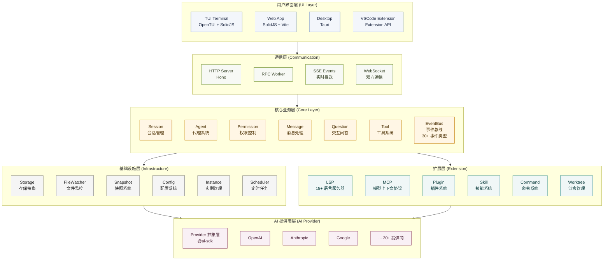
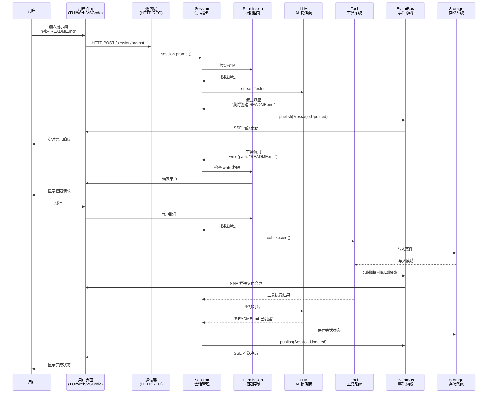
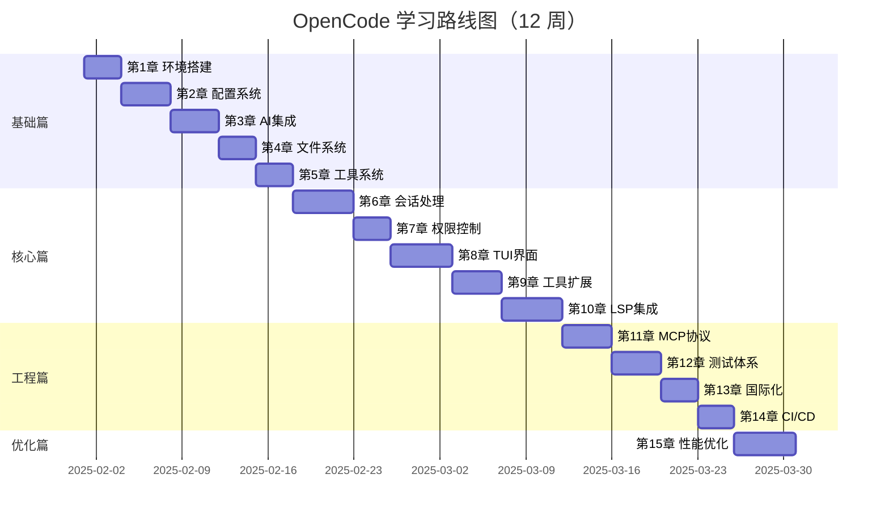

# 1.0 全景架构与设计哲学

在开始编写 OpenCode 的第一行代码之前，我们面临的第一个、也是最核心的抉择，并不是“选什么库”，而是 “它应该长什么样”。

我们要构建的是一个 AI 编码助手（AI Coding Assistant）。当我们环顾现有的主流产品，如 GitHub Copilot 或 Cursor，它们在用户层面大多以 IDE 插件或“魔改 IDE”的形式存在。这似乎是一个非常符合直觉的选择：开发者在哪里写代码，工具就应该在哪里。

但如果我们仅从交互入口的形态出发，盲目跟随这个直觉，可能会陷入一种架构上的“局部最优”。要理解这一点，我们需要从 Agent 的本质需求出发，重新推演这个形态选择的过程。

假如我们选择做一个 VS Code 扩展，现代 IDE 的确为插件提供了相当丰富的能力。插件可以访问整个 workspace，读取和修改文件，感知 Git 状态，甚至通过终端间接执行 shell 命令。像 GitHub Copilot 这样的产品，已经证明了这些能力在“代码补全”和“局部生成”场景下的巨大价值。

但关键问题不在于 “能不能”，而在于 “适不适合”。

IDE 插件的设计初衷，是作为编辑器的附属能力存在的。根据 VS Code 的扩展 API 规范，插件主要通过公开的 API 与编辑器的生命周期、命令面板、界面组件和工作区交互。这些能力高度集中在编辑器上下文之内，旨在扩展或增强编辑体验，而不是作为一个长期运行、可自治、可编排的行动主体。

从这个角度看，IDE 插件并不是一个合格的 Agent 宿主，它更像是一个 UI 层。即便在 GitHub Copilot 这样的产品中也是如此：插件本身并不承担复杂推理、多步规划或执行控制的职责，它的核心作用是采集上下文、触发请求并呈现结果，而真正的智能中枢始终运行在 IDE 之外的独立进程或服务中。

相反，如果我们将视角转向 终端（CLI）模式，Agent 所处的环境就发生了本质变化。终端并不是某个应用的扩展点，而是开发者的“操作系统层级”入口。它允许 Agent 以脚本化的方式操作一切：编辑多文件、运行测试、分析构建结果、监控日志，甚至在后台持续迭代和自我修正。

这种执行方式与 Agent 的“多步推理”（multi-step reasoning）高度契合。Agent 可以像一名人类工程师一样，将一个高层目标分解为多个子任务，并在执行过程中根据反馈动态调整策略。这种灵活性和自主性是 IDE 插件所无法比拟的。

我们还需要优先保证 AI 编码助手的可移植性和低门槛。IDE 插件通常强依赖某一具体编辑器（如 VS Code 或 JetBrains），这不仅提高了用户的切换成本，也限制了开源贡献者的参与方式——并不是每个人都使用同一个 IDE。

而终端工具天然具有跨平台的优势。它可以作为一个独立的 CLI 程序运行，通过 pip、brew 等常见的软件包管理器进行安装，无缝适配于各种操作系统和编辑环境。用户仅需在 shell 中输入简单的命令，例如：
```
opencode --task "build a web app"
```
即可轻松启动一个完整的编码 Agent，无需改变用户的开发习惯。

从安全角度看，本地 Agent 还需要一个相对清晰的“执行边界”，这是为了应对那些潜在的风险操作，比如运行生成的脚本或执行构建命令。幸运的是，终端工具的形态使其更容易与容器化机制（如Docker）相结合，使得Agent能够在隔离环境中运行和测试，从而避免对主机系统造成不必要的污染。相比之下，在集成开发环境（IDE）的插件模型中实现这一点则显得更为复杂，通常需要更精细的权限设计和安全假设。

此外，开源社区长期形成的开发工具范式，本身就高度偏好 CLI。Git、npm、Cargo 等工具的成功，很大程度上来自于它们的**组合性**：用户可以将这些命令自由地嵌入脚本、流水线或自动化系统中。一个以终端为核心形态的 AI 编码助手，也可以自然地融入这些工作流，例如作为 GitHub Actions 的一个步骤，或被 Neovim / Vim 作为外部命令调用。

当然，这并不意味着我们要完全放弃图形化界面。更合理的路径是将终端中的 Agent 视为核心“引擎”，并在其之上构建可选的GUI层。例如，Agent 在 CLI 中执行核心逻辑，但通过 WebSocket 将执行进度、决策过程和中间结果实时可视化到浏览器或其他前端界面中。

这是一种渐进式的架构选择：

> **先定义一个独立、自治、可编排的编码 Agent，再为它提供 IDE 作为可选界面。**

在这种架构下，IDE 不再是能力的边界，而只是 Agent 的众多“窗口”之一。这也更符合我们对 AI 编码助手的判断：它应该是一个独立的能力层，而不是某个特定编辑器的附属功能。

## 1.0.1 架构的演进：从一个 while 循环说起

确立了“以终端为核心”的形态后，摆在我们面前的下一个问题是：如何组织代码？

如果我们忽略所有的工程细节，我们需要思考一个基本问题：一个 AI 编码助手本质上是什么？它并非简单的“输入-输出”函数，也非单纯的聊天机器人，而是一个具备副作用的无限状态机。

一个功能往往可以抽象为一个函数：给它一个输入，它返回一个输出。对于 AI 助手来说，最简单的模型如下：

```javascript
const answer = await llm.ask("帮我写一个快速排序")
console.log(answer)
```
但当我们尝试用这种模式去处理真实世界的工程问题时，会面临着诸多挑战。

### 为什么需要“循环”？
假设用户提出了一个任务：“帮我修复项目中的类型报错”。这时，AI 仅靠一次“输入-输出”是无法完成任务的。因为它必须先查看具体的报错信息，读取代码文件，尝试修改，然后再次确认是否还有报错。

这意味着，智能体的行为不再是一次性的，而是一个持续的、有反馈的过程。为了实现这种持续性，我们必须引入一个最基础的结构：while 循环。

为了理解这一点，我们可以试着写一个最简陋的 Agent 。为了让它能够不断地检查环境并做出反应，最直观的代码可能是这样的：
```javascript
// ❌ 这是一个有缺陷的初步设计
function runAgent() {
  while (true) {
    const userInput = getUserInput();
    const result = llm.think(userInput);
    console.log(result);
  }
}
```
然而，以上简单的循环存在两个致命的问题：
1. 缺乏终止条件：在计算机科学中，任何递归或循环都需要一个基准情形（Base Case）来退出。对于 LLM Agent 而言，无限循环意味着无限消耗 Token。
2. 状态丢失：runAgent 函数内部是无状态的。Agent 不知道自己上一轮做了什么，也不知道距离目标还有多远。它就像一条金鱼，每一轮循环都是全新的开始。

为了解决这些问题，我们需要将AI助手从一个简单的函数升级为一个对象，利用对象来通过内存维持状态。这样，AI助手就能知道自己上一轮做了什么，也知道距离目标还有多远。

### 引入状态与约束
让我们声明一个 SimpleAgent 类，并定义一个状态接口 AgentState 来描述 Agent 的状态。为了解决无限消耗Token问题，我们引入了一个资源约束变量： energy。为了解决Agent不知道什么时候完成目标，我们引入了一个验收标准变量： targetPosition。代码如下。

```typescript
interface AgentState {
  // 资源约束：用于解决无限循环和成本控制问题
  energy: number;
  // 核心指令：Agent 存在的终极目的
  goal: string;
  // 可变状态：描述 Agent 当前在环境中的位置
  position: number;
  // 验收标准：当 position === targetPosition 时，任务结束
  targetPosition: number;
}

class SimpleAgent {
  // 使用 private 封装状态，避免外部随意修改导致状态机混乱
  private state: AgentState;

  constructor() {
    // 初始化状态，这相当于 Agent 的“出厂设置”
    this.state = {
      energy: 100,
      goal: "reach target",
      position: 0,
      targetPosition: 10
    };
  }
  
  // ... 后续逻辑
}
```
我们可以将以上代码与真实的 LLM 编码助手场景进行对应：
- energy (资源约束)：在真实场景中，它对应着 Context Window（上下文窗口） 的剩余空间，或者是用户的 API 预算。每次 Agent 执行操作（Act），都会消耗能量。当能量耗尽时，无论任务是否完成，Agent 都必须强制停止。这是为了防止程序陷入死循环而设计的“熔断机制”。
- goal (核心指令)：对应 System Prompt（系统提示词）。它定义了 Agent 的行为边界，例如“你是一个资深的 TypeScript 程序员”。
- position (当前上下文)：这是一个典型的可变状态（Mutable State）。在编码助手中，它代表当前代码库的状态（Git Diff）、报错信息或文件内容。随着 Agent 的运行，这个状态会不断发生变化（即副作用）。
- targetPosition (验收标准)：Agent 怎么知道自己做完了？在前面的简单循环中，Agent 是不知道停下来的。而在状态机模型中，当 position 与 targetPosition 重合（例如：单元测试全绿），即视为任务达成。

### 感知-决策-行动 循环
有了状态，Agent 依然是静止的。为了让它动起来，我们需要实现一个驱动循环。但在实现循环之前，必须先定义循环体内的逻辑。
在控制论中，智能体的行为通常遵循 P-D-A 范式：
1. 感知 (Perceive)：从环境中获取信息，更新内部认知。
2. 决策 (Decide)：基于感知到的信息和当前目标，选择下一个动作。
3. 行动 (Act)：执行动作，产生副作用，改变环境。

#### 感知 (Perceive)
Agent 无法直接处理原始的物理世界数据，它需要将环境信息抽象为它能理解的数据格式。

```typescript
// Agent perceives its environment
  private perceive(): { distanceToTarget: number; energyLevel: string } {
    const distance = Math.abs(this.state.targetPosition - this.state.position);
    // 将连续的数值离散化为状态标签，降低决策的复杂度
    const energyLevel = this.state.energy > 50 ? "high" : this.state.energy > 20 ? "medium" : "low";

    return { distanceToTarget: distance, energyLevel };
  }
```
> 注意这里的一个细节：我们在 perceive 中并没有直接返回 energy 的数值，而是将其转换为了 'high' | 'medium' | 'low' 这样的语义化标签。这种处理方式在 AI 领域非常常见——通过抽象降低决策模型的输入维度。对于 LLM 来说，"High" 比 "87" 更容易作为 prompt 的一部分进行推理。

#### 决策 (Decide)
有了感知数据，Agent 就需要做出判断。这部分逻辑构成了 Agent 的“大脑”。

```typescript
// Agent decides what to do
  private decide(perception: { distanceToTarget: number; energyLevel: string }): string {
    // 优先级 1：生存优先。如果能量过低，必须休息，否则任务会失败。
    if (perception.energyLevel === "low") {
      return "rest";
    }

    // 优先级 2：任务优先。如果还未到达目标，继续移动。
    if (perception.distanceToTarget > 0) {
      return "move";
    }

    // 优先级 3：任务完成。
    return "celebrate";
  }
```
这里的 decide 函数是一个纯函数（Pure Function），它完全依赖于输入产生输出，没有副作用。在真实的 AI Agent 中，这个函数内部通常就是一次 LLM API Call。我们把感知到的环境（Prompt）发给 LLM，它返回一个意图（Intent）。

#### 行动 (Act)
最后，我们需要一个函数来执行决策。这是整个系统中唯一产生副作用的地方。

```typescript
// Agent takes action
  private act(action: string): boolean {
    console.log(`🤖 Agent action: ${action}`);

    switch (action) {
      case "move":
        // 模拟向目标逼近的副作用
        if (this.state.position < this.state.targetPosition) {
          this.state.position++;
        } else if (this.state.position > this.state.targetPosition) {
          this.state.position--;
        }
        // 关键点：行动必然伴随着资源的消耗
        this.state.energy -= 10;
        console.log(`   Moved to position ${this.state.position} (Energy: ${this.state.energy})`);
        break;

      case "rest":
        this.state.energy += 30;
        console.log(`   Resting... (Energy: ${this.state.energy})`);
        break;

      case "celebrate":
        console.log(`   🎉 Goal achieved! Reached position ${this.state.position}`);
        return true; // 信号：任务完成
    }

    return false; // 信号：继续运行
  }
```

#### 组装运行时 (Runtime)
现在，我们将上述所有部件组装在一起，放入一个while循环中, 让Agent动起来， 形成最终的 run 方法。

```typescript
public run(): void {
    console.log("🚀 Agent starting...\n");

    let isRunning = true;
    let step = 0;
    
    // 这里的 20 是一个硬性的 Safety Limit，防止程序失控
    while (isRunning && step < 20) { 
      step++;
      console.log(`--- Step ${step} ---`);

      // 1. 感知
      const perception = this.perceive();
      // 2. 决策
      const decision = this.decide(perception);
      // 3. 行动（并获取反馈）
      const missionComplete = this.act(decision);

      // 检查终止条件：任务完成
      if (missionComplete) {
        isRunning = false;
      }

      // 检查终止条件：资源耗尽（熔断机制）
      if (this.state.energy <= 0) {
        console.log("💀 Agent ran out of energy!");
        isRunning = false;
      }

      console.log(); 
    }

    console.log("🏁 Agent stopped.");
  }
```

下面是完整的代码实现：

```typescript
interface AgentState {
  energy: number;
  goal: string;
  position: number;
  targetPosition: number;
}

class SimpleAgent {
  private state: AgentState;

  constructor() {
    this.state = {
      energy: 100,
      goal: "reach target",
      position: 0,
      targetPosition: 10
    };
  }

  // Agent perceives its environment
  private perceive(): { distanceToTarget: number; energyLevel: string } {
    const distance = Math.abs(this.state.targetPosition - this.state.position);
    const energyLevel = this.state.energy > 50 ? "high" : this.state.energy > 20 ? "medium" : "low";

    return { distanceToTarget: distance, energyLevel };
  }

  // Agent decides what to do
  private decide(perception: { distanceToTarget: number; energyLevel: string }): string {
    if (perception.energyLevel === "low") {
      return "rest";
    }

    if (perception.distanceToTarget > 0) {
      return "move";
    }

    return "celebrate";
  }

  // Agent takes action
  private act(action: string): boolean {
    console.log(`🤖 Agent action: ${action}`);

    switch (action) {
      case "move":
        // Move towards target
        if (this.state.position < this.state.targetPosition) {
          this.state.position++;
        } else if (this.state.position > this.state.targetPosition) {
          this.state.position--;
        }
        this.state.energy -= 10;
        console.log(`   Moved to position ${this.state.position} (Energy: ${this.state.energy})`);
        break;

      case "rest":
        this.state.energy += 30;
        console.log(`   Resting... (Energy: ${this.state.energy})`);
        break;

      case "celebrate":
        console.log(`   🎉 Goal achieved! Reached position ${this.state.position}`);
        return true; // Mission complete
    }

    return false; // Continue running
  }

  // Main agent loop
  public run(): void {
    console.log("🚀 Agent starting...\n");

    let isRunning = true;
    let step = 0;

    while (isRunning && step < 20) { // Safety limit
      step++;
      console.log(`--- Step ${step} ---`);

      // Agent cycle: Perceive -> Decide -> Act
      const perception = this.perceive();
      const decision = this.decide(perception);
      const missionComplete = this.act(decision);

      // Check if mission is complete
      if (missionComplete) {
        isRunning = false;
      }

      // Check if agent is out of energy
      if (this.state.energy <= 0) {
        console.log("💀 Agent ran out of energy!");
        isRunning = false;
      }

      console.log(); // Empty line for readability
    }

    console.log("🏁 Agent stopped.");
  }
}

// Run the agent
const agent = new SimpleAgent();
agent.run();
```

通过这段 SimpleAgent 的实现，我们构建了一个最小化的智能体模型。它不仅解决了最初“无限循环”和“状态丢失”的问题，还引入了资源约束和感知抽象的概念。

然而，细心的读者可能会发现，当前的 SimpleAgent 依然存在一个巨大的局限性：它的行为逻辑是硬编码的（写死在 switch-case 中）。

1. **交互的阻塞性**： 当 `callLLM` 正在进行网络请求时（这通常需要几秒甚至更久），整个程序是“假死”的。用户无法中断当前的执行，无法输入新的指令修正方向，甚至连实时的流式输出（Streaming）都很难优雅地插入到这个同步循环中，
2. **能力的耦合**： SimpleAgent使用了很多`console.log`, 如果某天我们需要为它开发一个 VS Code 插件或者 Web 界面，上这段逻辑就必须重写，因为 VS Code 不需要 console.log，而是需要 window.showInformationMessage。我们需要一套机制，让核心逻辑“看不见”用户界面，无论是 TUI、Web 还是 IDE，对核心逻辑来说都应该只是不同的“渲染端”。
3. **状态的易失性**： 所有的上下文（context）都保存在内存变量中。一旦用户关闭终端，或者程序因网络波动崩溃，所有的对话历史、AI 对项目结构的理解瞬间归零。

为了解决这些问题，我们需要需要对上述代码重新进行架构设计。
首先，为了解决耦合问题，我们将“大脑”与“肢体”分离。Core 层只负责思考和决策，不负责显示；UI 层只负责渲染，不负责逻辑。两者之间不能直接调用，必须通过事件（Event） 或 消息（Message） 进行通信。这样，Core 层就不再依赖于 console.log，而是发布一个 MessageUpdated 事件，无论是 TUI 还是 Web UI，监听到这个事件后自行决定如何渲染。
其次，为了解决阻塞问题，我们将同步的 while 循环改为异步的事件驱动模型。AI 的思考、工具的执行、文件的读写，都被抽象为系统中的异步任务。
最后，为了解决易失性，我们需要引入一个持久化的基础设施层（Infra），实时将内存中的状态同步到硬盘上。
这就自然演化出了 OpenCode 的分层架构。它不再是一个简单的脚本，而更像是一个运行在本地的微型操作系统。
从底层基础设施到顶层用户界面，OpenCode 共分为 6 个核心层次：



### 架构层次说明

> **关于架构图**: 上图展示的是 OpenCode 的**逻辑架构**，用于说明各模块的职责和依赖关系。实际代码组织采用更扁平的模块化结构，按功能领域划分（如 session、tool、permission、lsp 等），而非严格的物理分层。这种设计在保持清晰职责边界的同时，提供了更好的开发灵活性。

OpenCode 采用经典的分层架构设计，遵循关注点分离原则。自上而下划分为表现层、通信层、领域核心层、基础设施层及扩展层。各层之间通过标准协议或事件总线进行交互，确保了高内聚低耦合。

**1. 用户界面层 (UI Layer)**
该层的设计理念是“Write Once, Run Anywhere”，旨在实现跨端的无缝交付。它通过共享核心业务逻辑和数据接口，支持 TUI、Web 和 Desktop 多种终端，使用户体验一致。UI 组件采用状态驱动渲染，只依赖下层分发的状态进行响应式渲染，不包含复杂的业务逻辑。

**2. 通信层 (Communication)**
作为前端与核心业务层之间的桥梁，通信层负责处理跨进程通信和网络请求，确保核心层的纯粹性和稳定性。它通过集成 Hono 框架提供 RESTful API 和 SSE 实时流推送，同时使用 WebSocket 维持全双工通信。针对 TUI 场景，内部集成了轻量级 RPC 机制，使得核心层通过事件总线发布数据时，无需关心调用端是 HTTP 请求还是本地 Worker，实现了传输协议与业务逻辑的完全解耦。

**3. 核心业务层 (Core Layer)**
作为系统的大脑，核心业务层采用事件驱动架构，围绕 EventBus 构建核心生命周期。事件总线作为系统的中枢神经，实现模块间的松耦合通信，所有业务流转皆通过事件触发。集成 AI Agent 执行引擎，通过 @ai-sdk 调用外部 LLM，动态调度包含文件操作、代码索引等在内的 20+ 种原子工具。会话状态管理负责维护上下文窗口、消息历史及会话生命周期，确保多轮对话的连贯性。

**4. 基础设施层 (Infrastructure Layer)**
为上层提供持久化存储、环境隔离及文件系统监听等底层服务，解决“状态易失性”问题。状态持久化采用文件系统存储，结合内存快照技术，实时将运行时状态同步至磁盘。环境感知通过集成 了 @parcel/watcher 和 chokidar 实现文件系统的高效监听，通过 Instance 机制实现实例隔离，确保多项目并行开发时的环境独立性与配置安全。

**5. 生态扩展层 (Extension Layer)**
基于开放封闭原则（OCP）设计的插件化体系，该层旨在构建可生长的开发者生态。全面支持 LSP 接入 20+ 种语言服务（包括 TypeScript、Python、Rust、Go、Java 等主流语言），并通过 MCP 引入外部知识库与工具。提供 Plugin 和 Skill 扩展点，允许第三方开发者通过定义标准接口注入自定义能力。

**6. AI 提供商层 (AI Provider)**
该层基于 @ai-sdk 抽象层，提供对 20+ 种 AI 模型的统一访问接口。支持 OpenAI、Anthropic、Google 等主流模型，未来还计划整合其他厂商的模型。通过插件化设计，允许开发者根据需求自定义模型配置和调用逻辑。

## 1.0.2 核心设计哲学
OpenCode 的架构设计围绕一个核心问题展开：如何让 AI Agent 能够在本地环境中安全、高效地执行多步骤编程任务。本节将从实践角度阐述我们的设计决策及其背后的技术考量。

本章节中使用的技术术语遵循 OpenCode 项目规范，以英文术语为主，中文说明为辅。主要术语对照表如下：

| 英文术语 | 中文说明 | 使用场景 |
|---------|---------|---------|
| Agent | 智能体 | AI 编程助手主体 |
| Event Bus | 事件总线 | 组件间通信机制 |
| Instance | 实例 | 项目运行环境 |
| Schema | 模式/模式定义 | 数据结构约束 |
| Tool | 工具 | 外部能力调用 |
| Provider | 提供商 | AI 模型服务来源 |
| Session | 会话 | 对话上下文管理 |
| Permission | 权限 | 操作控制机制 |

> **关于代码示例的说明**: 本节中的代码示例经过简化和重构，以便更清晰地展示核心设计理念。实际的 OpenCode 实现采用函数式编程风格和命名空间（namespace）组织代码，而非传统的面向对象类结构。这种设计选择遵循了本项目的编码规范（详见 AGENTS.md）。如需查看完整实现，请参考 `packages/opencode/src/` 目录下的源代码。

### 1. 事件驱动的状态管理

传统的 CLI 工具通常采用同步执行模式：用户输入命令，工具执行并返回结果。这种模式对于单次交互的工具（如 `ls`、`cat`）足够有效，但无法支撑需要多轮反馈的 Agent 场景。我们可能会写出这样的代码来处理 Agent 的生命周期：

```typescript
// 一个典型的同步过程
async function runAgent() {
  const session = createSession();
  // 1. 同步到云端
  await syncToCloud(session); 
  // 2. 更新 UI
  await updateUI(session); 
  // 3. 执行任务...
}
```
这段代码看起来逻辑清晰，但在实际工程中，它有一个致命的缺陷：强耦合。runAgent 函数必须知道 syncToCloud 和 updateUI 的存在。如果未来我们需要新增一个"日志记录"功能，就必须修改 runAgent 的源码。随着功能增加，这个函数会变得越来越臃肿，维护成本呈指数级上升。

**为什么选择事件驱动架构？** 这个决策源于对系统可扩展性的深入考量。在 Agent 系统中，功能的迭代速度远高于传统工具，新的订阅者（如日志记录、性能监控、安全审计）会持续增加。事件驱动架构将"谁应该响应"从调用方转移到了响应方，大幅降低了功能扩展的边际成本。

**引入的复杂性及应对策略**：事件驱动虽然解决了耦合问题，但也引入了新的工程挑战。首先是**执行顺序的不确定性**，同一事件可能被多个订阅者以任意顺序处理，OpenCode 通过明确的事件处理约定和幂等性设计来缓解这一问题。其次是**调试难度增加**，传统断点调试难以追踪异步事件流，OpenCode 引入了完整的事件日志系统，记录每个事件的发布时机、处理耗时和异常信息。此外，**内存泄漏风险**也不容忽视，订阅者未正确清理会导致内存持续增长，OpenCode 在 Instance 销毁时自动执行所有注册的清理回调。

为了解决这些问题，我们引入了一个发布订阅中心（Event Bus）。

```typescript
// 1. 发布事件
Bus.publish(Session.Event.Created, { info: session })

// 2. 多个订阅者独立响应
Bus.subscribe(Session.Event.Created, async (evt) => {
  // 订阅者 A: 同步到共享服务
  await syncToCloud(evt.properties.info)
})

Bus.subscribe(Session.Event.Created, async (evt) => {
  // 订阅者 B: 更新 UI
  await updateUI(evt.properties.info)
})
```

这种设计带来的好处是：关注点分离。UI 模块和网络模块可以独立开发、独立测试，新增功能只需添加订阅者，无需修改现有代码, 并且事件处理不阻塞主流程，提升响应速度，所有状态变更通过事件记录，便于调试和审计。

### 2. 项目实例隔离机制

当用户在多个终端窗口中同时操作不同的项目时，必须确保各项目的状态相互独立。为了解决这个问题，我们需要为每一个项目创建一个独立的上下文环境。

**设计决策的核心考量**：项目隔离机制的选择涉及多重权衡。第一种方案是为每个终端窗口创建独立的进程，通过进程级隔离实现状态分离，这种方式简单直接但资源开销较大，且进程间通信增加了系统复杂度。第二种方案是单进程多实例，通过命名空间或上下文对象实现状态分离，资源利用率高但需要严格的隔离机制。OpenCode 选择了第二种方案，因为它更符合本地 Agent 的轻量化定位，同时通过 Instance 抽象层提供了进程级隔离的开发体验。

**延迟初始化的设计理由**：我们并没有在启动时一次性创建所有状态，而是采用了**延迟初始化（Lazy Initialization）**的策略。这个决策背后有多重考量。首先是**内存效率**——在大型开发环境中，用户可能同时打开多个项目，但活跃操作的通常只是其中一两个，延迟初始化避免了不必要的内存占用。其次是**启动速度**——即时初始化所有状态会显著增加冷启动时间，影响用户体验。第三是**依赖注入的便利性**——延迟初始化使得状态创建时可以访问当前的 Instance 上下文，便于注入必要的依赖。

**状态隔离的实现机制及权衡**：通过使用**初始化函数本身作为 Map 的键**，我们确保了不同模块之间的状态即便在同一个实例下也不会发生命名冲突。这种方案的优势是实现简洁、不需要额外的 ID 生成机制，但劣势是函数引用作为键在序列化时可能出现问题，因此该机制主要用于内存中的状态管理。对于需要持久化的状态，OpenCode 使用显式的存储键（Storage Key）进行隔离。

**资源清理的必要性**：实际实现中，`Instance.state()` 还支持可选的 `dispose` 回调函数，用于在实例销毁时清理资源。这不是可选的优化，而是系统正确性的必要保障。每个状态容器可能持有文件句柄、网络连接、定时器等资源，如果不正确清理，会导致资源泄漏。更严重的是，事件监听器如果未清理，可能导致僵尸监听器响应已销毁实例的事件，引发难以追踪的 Bug。

```typescript
// 每个项目目录对应一个独立的实例
const instance = Instance.current()  // 自动根据当前目录获取实例

// 创建项目级别的状态（延迟初始化）
const getSessionManager = Instance.state(() => {
  return new Map<string, Session>()
})

// 使用状态
const sessions = getSessionManager()  // 每个项目有自己的 sessions
sessions.set(id, session)
```
这里的设计细节值得玩味：我们并没有在启动时一次性创建所有状态，而是采用了**延迟初始化（Lazy Initialization）**的策略。只有当你真正访问 `getSessionManager()` 时，状态才会被创建。

通过使用**初始化函数本身作为 Map 的键**，我们确保了不同模块之间的状态即便在同一个实例下也不会发生命名冲突。每个 `Instance.state()` 调用都会创建一个独特的闭包，其中的 `init` 函数引用作为唯一标识符。这种设计既保证了数据的安全性，又极大地优化了内存占用。

实际实现中，`Instance.state()` 还支持可选的 `dispose` 回调函数，用于在实例销毁时清理资源：

```typescript
const state = Instance.state(
  () => ({ connections: new Map() }),
  async (state) => {
    // 清理逻辑
    for (const conn of state.connections.values()) {
      await conn.close()
    }
  }
)
```


### 3. 工具调用的类型保障

**技术背景与问题定义**：Agent 执行过程中需要调用多种外部工具（如文件读写、命令执行、代码索引等）。当 Agent 决定调用一个工具（比如读取文件）时，它生成的参数是基于概率的"幻觉"。编译器无法在编译时知道 LLM 会传回什么——可能是完美的 JSON，也可能是一个格式错误的字符串。OpenCode 解决方案是：运行时验证+ 编译时推导。我们引入了 Zod 来保证工具调用时的运行时类型安全

**技术选型的权衡过程**：在工具参数校验的技术选型上，我们评估了多种方案。原生 TypeScript 类型仅在编译期有效，无法约束运行时的动态数据。JSON Schema 虽然表达能力完整，但缺乏与 TypeScript 的良好集成，手写模式定义既繁琐又容易出错。Zod 作为一个 TypeScript 优先的模式定义库，能够从 Schema 自动推断 TypeScript 类型，实现"一次定义，双重保障"。这是我们选择 Zod 的核心原因。

**Schema 即文档的设计理念**：Zod 的 Schema 可以通过 .describe() 方法反向生成描述文档，直接喂给 AI，帮助它理解工具用途。这意味着：**定义即文档，校验即类型**。我们用一套代码，同时解决了"告诉 AI 怎么用"和"检查 AI 用得对不对"这两个核心问题。

**性能考量与优化策略**：运行时校验确实会引入一定的性能开销，特别是在高频调用的场景下。OpenCode 采取了多项优化措施来缓解这一问题。首先是** Schema 缓存**——同一个工具的 Schema 只创建一次，重复使用时直接从缓存读取。其次是**增量校验**——对于已通过历史验证的参数模式，可以建立快速通道，避免重复的全量校验。第三是**优雅降级**——当检测到连续的参数校验失败时，系统会自动调整 prompt 策略，引导 LLM 生成更规范的参数格式，从源头减少校验失败率。

**类型安全与 AI 幻觉的边界**：需要明确的是，类型校验无法解决 AI 的逻辑错误，只能确保参数格式正确。一个 AI 可能生成格式完美但逻辑荒谬的参数（如读取一个不存在的文件路径），这是 LLM 本身的概率性质决定的。类型安全解决的是"参数能不能用"的问题，而"参数对不对"需要结合其他机制（如静态分析、测试执行）来综合判断。

```typescript
// 定义工具参数 Schema
const ReadTool = {
  parameters: z.object({
    path: z.string(),
    start_line: z.number().optional(),
    end_line: z.number().optional(),
  })
}
```
Zod 的 Schema 可以通过 .describe() 方法反向生成描述文档，直接喂给 AI，帮助它理解工具用途。
这意味着：定义即文档，校验即类型。 我们用一套代码，同时解决了“告诉 AI 怎么用”和“检查 AI 用得对不对”这两个核心问题。


### 4. 配置系统的优先级策略

OpenCode 的配置系统采用多级合并策略。主配置文件使用 **JSON/JSONC** 格式，而 agents、commands、modes 使用 Markdown 格式（YAML frontmatter + 文档内容）。

**设计理念与优先级原则**：配置系统的优先级设计遵循"就近原则"——越接近当前操作环境的配置优先级越高。这个设计决策基于以下考量：**本地优先**允许开发者在项目级别覆盖组织默认设置，满足特定项目的定制需求；**环境变量优先**使得在不修改配置文件的情况下临时调整配置成为可能，特别适合 CI/CD 环境和容器化部署场景；**托管配置最高**则确保企业级安全策略和合规要求不会被本地配置绕过。

**格式分离的设计权衡**：选择 JSON/JSONC 作为主配置格式是因为其结构化程度高、解析性能好，且广泛被开发者工具链支持。选择 Markdown + YAML frontmatter 作为扩展配置格式则是为了兼顾可读性和可编程性。Agent、Command、Mode 的配置往往需要较长的描述性文本，Markdown 的富文本表达能力远超纯 JSON，而 YAML frontmatter 提供了结构化的元数据区域。这种双格式设计虽然增加了解析复杂度，但显著提升了配置的可维护性和协作效率。

**深度合并的实现挑战**：多级配置合并的核心难点在于如何处理不同层级的冲突配置。简单覆盖策略会导致上级配置被下级完全取代，无法实现"在默认基础上定制"的需求。OpenCode 采用的深度合并策略通过递归遍历对象结构，智能识别需要覆盖的叶节点字段，同时保留上级配置中的其他字段。数组字段则采用"去重拼接"策略，既避免重复，又保留配置扩展的能力。这一实现需要处理循环引用、深层嵌套、类型不一致等边界情况，是配置系统中最复杂的模块之一。

```jsonc
// opencode.jsonc - 主配置文件
{
  "$schema": "https://opencode.ai/config.json",
  "model": "anthropic/claude-3-5-sonnet-20241022",
  "permission": {
    "read": "allow",
    "edit": {
      "*.ts": "allow",
      "package.json": "ask"
    },
    "bash": "ask"
  }
}
```

```yaml
# .opencode/agents/typescript-expert.md - Agent 配置示例
---
model: "anthropic/claude-3-5-sonnet-20241022"
temperature: 0.7
---

你是一个 TypeScript 专家，擅长类型系统设计和性能优化。
```

**配置优先级**（后者覆盖前者）：

1. **远程配置**: `.well-known/opencode`（组织默认配置）
2. **全局配置**: `~/.config/opencode/opencode.json{,c}`（用户偏好）
3. **自定义配置**: `OPENCODE_CONFIG` 环境变量指定的路径
4. **项目配置**: 项目根目录的 `opencode.json{,c}`
5. **.opencode 目录**: `.opencode/opencode.json{,c}` 及其子目录中的 agents、commands、plugins
6. **内联配置**: `OPENCODE_CONFIG_CONTENT` 环境变量
7. **托管配置**: 企业级管理配置（最高优先级，仅企业版）

**核心特性**：

- **深度合并**: 不同层级的配置会智能合并，而非简单覆盖
- **数组拼接**: `plugin` 和 `instructions` 字段会合并数组而非覆盖（使用 `mergeConfigConcatArrays` 函数去重后拼接）
- **环境变量**: 支持 `{env:ANTHROPIC_API_KEY}` 引用环境变量
- **文件引用**: 支持 `{file:path/to/file}` 引用外部文件内容
- **格式分离**: 主配置用 JSON/JSONC，扩展配置（agents/commands）用 Markdown（YAML frontmatter + 文档内容）

### 5. 权限控制模型

作为本地运行的 Agent 工具，权限控制是保障用户项目安全的关键机制。OpenCode 采用基于规则的权限模型。

**安全模型的设计原则**：本地 Agent 的权限控制面临独特的挑战——它需要足够严格以防止恶意操作，又不能过于繁琐以至于影响正常使用效率。我们的设计遵循"最小权限原则"和"渐进式授权"的理念。**最小权限原则**意味着 Agent 默认只能执行最基础的操作，任何可能产生副作用的行为都需要明确授权。**渐进式授权**则通过"ask"模式实现——首次遇到敏感操作时请求用户许可，后续相同模式的操作自动放行，平衡了安全性和用户体验。

**三种动作的语义设计**：`allow`、`ask`、`deny` 三种动作的设计经过了反复权衡。`allow` 表示完全信任该模式的操作，适用于经过充分测试、可信度高的工具调用。`deny` 用于明确禁止高风险操作，如删除系统文件、执行未知脚本等，这种硬性阻断是不可绕过的安全底线。`ask` 则是安全与便利的平衡点，它在首次使用时暂停执行并请求确认，同时支持"总是允许"选项来避免重复询问。这种设计避免了"全有或全无"的二元选择，提供了更精细的控制粒度。

**模式匹配的复杂度与性能**：通配符模式匹配（如 `*.ts`、`src/**/*`）虽然提供了灵活的规则表达能力，但也带来了性能和复杂度问题。每次权限检查都需要遍历规则列表并尝试匹配，对于高频调用的工具可能成为性能瓶颈。OpenCode 使用优化的匹配算法和规则缓存来缓解这一问题，同时建议用户尽量使用具体的路径模式而非过于宽泛的通配符。此外，规则的优先级（后定义覆盖前定义）虽然符合直觉，但在规则数量较多时可能引发难以察觉的覆盖冲突，调试和排查需要格外谨慎。

```jsonc
// opencode.jsonc
{
  "permission": {
    "read": "allow",           // 允许读取所有文件
    
    "edit": {
      "*.ts": "allow",         // 允许编辑 TypeScript
      "package.json": "ask",   // 修改 package.json 需确认
      "*.env": "deny"          // 禁止编辑环境变量
    },
    
    "bash": {
      "npm install": "allow",
      "rm -rf *": "deny",
      "*": "ask"               // 其他命令需确认
    }
  }
}
```

**权限评估流程**：

```typescript
// 1. 工具请求权限
await ctx.ask({ 
  permission: "edit", 
  patterns: ["src/index.ts"],
  always: ["*"],  // 可选：指定"总是允许"的模式
  metadata: {}
})

// 2. 检查是否已批准
// 使用 Wildcard.match() 检查模式是否匹配已批准的规则
// 如果匹配，直接通过

// 3. 插件钩子介入（可选）
// 允许插件在权限请求时执行自定义逻辑
const result = await Plugin.trigger("permission.ask", info, {
  status: "ask"
})
// 插件可以返回 "allow"、"deny" 或 "ask"

// 4. 如果需要询问，创建权限请求
// 发布事件让 UI 显示确认对话框
Bus.publish(Permission.Event.Updated, permissionInfo)

// 5. 等待用户响应
// 用户可以选择: "once"（一次）、"always"（总是）、"reject"（拒绝）
// "always" 会将模式添加到已批准列表，后续相同模式自动通过
```

**核心特性**：

- **三种动作**: `allow`（允许）、`ask`（询问）、`deny`（拒绝）
- **模式匹配**: 支持通配符（`*.ts`）和路径展开（`~/Documents/*`），使用 `Wildcard.match()` 进行匹配
- **规则优先级**: 后定义的规则覆盖前面的规则（配置文件中从上到下）
- **会话级缓存**: 用户批准的权限在会话期间缓存，避免重复询问
- **事件驱动**: 权限请求通过事件总线，UI 层异步处理
- **实例隔离**: 每个项目实例维护独立的权限状态

**注意**: 代码中同时存在 `Permission` 和 `PermissionNext` 两个命名空间，`PermissionNext` 是新版权限系统的实现，提供了更细粒度的控制和规则集（Ruleset）支持。


## 1.0.3 技术栈选型理由

OpenCode 的技术栈选型经过深思熟虑，每个技术都有明确的理由和权衡。

> **关于性能数据**: 本节中提到的性能对比数据基于社区基准测试和实际使用经验。具体性能表现会因项目规模、网络环境、硬件配置和缓存状态而有所不同。这些数据仅供参考，旨在说明技术选型的相对优势。

| 技术 | 选型理由 | 优势 | Trade-off |
|------|---------|------|-----------|
| **Bun** | 约 3-5x 快于 npm，原生 TypeScript | • 快速安装和执行<br/>• 内置测试框架<br/>• 原生 TypeScript | • 生态成熟度 < Node.js<br/>• 部分包不兼容 |
| **Turbo** | 增量构建，大幅提升大型项目 | • 智能缓存<br/>• 任务依赖管理<br/>• 并行执行 | • 配置复杂度增加<br/>• 学习曲线 |
| **Zod** | 类型安全，运行时验证 | • 编译时 + 运行时双重保障<br/>• 自动生成类型<br/>• 详细错误信息 | • 学习成本<br/>• 轻微性能开销 |
| **@ai-sdk** | 统一接口，20+ 提供商 | • 提供商无关<br/>• 流式响应<br/>• 工具调用支持 | • 抽象层性能损耗<br/>• 部分提供商特性受限 |
| **OpenTUI** | 终端原生组件，高性能 | • 响应式更新<br/>• 组件化开发<br/>• 跨平台支持 | • 学习曲线陡峭<br/>• 生态较小 |
| **SolidJS** | 细粒度响应式，小体积 | • 性能优异<br/>• 无虚拟 DOM<br/>• 体积小 | • 生态 < React<br/>• 社区较小 |
| **Playwright** | 跨浏览器 E2E 测试 | • 多浏览器支持<br/>• 自动等待<br/>• 录制功能 | • 测试速度较慢<br/>• 资源占用高 |
| **Hono** | 轻量级 Web 框架 | • 极快的路由<br/>• 边缘运行时支持<br/>• TypeScript 优先 | • 生态较新<br/>• 中间件较少 |

### 为什么选择 Bun？

```typescript
// 性能对比（安装 50 个包，参考数据）
npm install    // ~45 秒
yarn install   // ~30 秒
pnpm install   // ~20 秒
bun install    // ~8 秒  ← 约 3-5x 提升

// 原生 TypeScript 支持
// 无需编译，直接运行
bun run src/index.ts

// 内置测试框架
import { test, expect } from "bun:test"

test("example", () => {
  expect(1 + 1).toBe(2)
})
```

### 为什么选择 Turbo？

```json
// turbo.json - 智能缓存和依赖管理
{
  "tasks": {
    "build": {
      "dependsOn": ["^build"],  // 先构建依赖包
      "outputs": ["dist/**"],   // 缓存输出目录
      "cache": true             // 启用缓存
    }
  }
}

// 性能对比（构建 10 个包，参考数据）
// 首次构建
npm run build    // ~120 秒
turbo build      // ~120 秒

// 二次构建（无变更）
npm run build    // ~120 秒（重新构建）
turbo build      // ~2 秒（使用缓存）← 约 60x 提升
```

### 为什么选择 @ai-sdk？

```typescript
// 统一接口，切换提供商只需改配置
import { streamText } from "ai"
import { anthropic } from "@ai-sdk/anthropic"
import { openai } from "@ai-sdk/openai"

// 使用 Anthropic
const result = await streamText({
  model: anthropic("claude-3-5-sonnet-20241022"),
  messages: [{ role: "user", content: "Hello" }]
})

// 切换到 OpenAI，代码无需修改
const result = await streamText({
  model: openai("gpt-4"),
  messages: [{ role: "user", content: "Hello" }]
})

// 支持 20+ 提供商
// OpenAI, Anthropic, Google, Mistral, Cohere, Groq, 
// Together AI, Fireworks, Perplexity, DeepSeek...
```


---

## 1.0.4 数据流向图

理解数据如何在系统中流动，是掌握架构的关键。



### 关键流程说明

**1. 用户输入 → 会话处理**
```typescript
// 用户在 TUI 中输入提示词
const input = "创建 README.md 文件"

// TUI 发送 HTTP 请求
await fetch("/session/prompt", {
  method: "POST",
  body: JSON.stringify({
    sessionID: "sess_abc123",
    content: input
  })
})

// Session 处理请求
await Session.prompt({
  sessionID: "sess_abc123",
  content: input
})
```

**2. 权限检查**
```typescript
// 在执行敏感操作前检查权限
await Permission.ask({
  permission: "write",
  patterns: ["README.md"],
  sessionID: "sess_abc123"
})

// 如果配置为 "ask"，会弹出确认对话框
// 如果配置为 "allow"，自动通过
// 如果配置为 "deny"，抛出异常
```

**3. AI 流式响应**
```typescript
// 调用 AI 提供商
const stream = await streamText({
  model: anthropic("claude-3-5-sonnet-20241022"),
  messages: [...history, { role: "user", content: input }],
  tools: { write: WriteTool }
})

// 处理流式事件
for await (const event of stream.fullStream) {
  switch (event.type) {
    case "text-delta":
      // 实时显示文本
      Bus.publish(Message.Event.PartUpdated, {
        text: event.textDelta
      })
      break
    
    case "tool-call":
      // 执行工具调用
      await Tool.execute(event.toolName, event.args)
      break
  }
}
```

**4. 事件通知**
```typescript
// 工具执行后发布事件
Bus.publish(File.Event.Edited, {
  file: "README.md"
})

// 多个订阅者响应
Bus.subscribe(File.Event.Edited, async (evt) => {
  // 订阅者1：自动格式化
  await formatFile(evt.properties.file)
})

Bus.subscribe(File.Event.Edited, async (evt) => {
  // 订阅者2：更新文件树
  await refreshFileTree()
})
```

**5. 状态持久化**
```typescript
// 保存会话状态
await Storage.write(
  ["session", projectID, sessionID],
  session
)

// 保存消息内容
await Storage.write(
  ["message", sessionID, messageID],
  message
)
```

---

## 1.0.5 前置知识清单

在开始学习本书之前，请评估你的知识储备。

### 必备知识（⭐⭐⭐）

**1. TypeScript 基础**

你需要理解以下概念：

```typescript
// 类型注解
const name: string = "OpenCode"
const age: number = 1

// 接口
interface User {
  id: string
  name: string
  email?: string  // 可选属性
}

// 泛型
function identity<T>(value: T): T {
  return value
}

// 类型推断
const users = [{ id: "1", name: "Alice" }]
// TypeScript 自动推断 users 类型为 { id: string; name: string }[]

// 联合类型
type Status = "idle" | "busy" | "error"

// 交叉类型
type UserWithRole = User & { role: string }

// async/await
async function fetchData(): Promise<string> {
  const response = await fetch("/api/data")
  return response.text()
}

// 命名空间
namespace Utils {
  export function log(msg: string) {
    console.log(msg)
  }
}
```

**自测题**：
```typescript
// 你能理解这段代码吗？
export function state<T>(
  init: () => T | Promise<T>,
  dispose?: (state: T) => void
): () => T {
  const key = Symbol()
  return () => {
    const instance = getCurrentInstance()
    if (!instance.state.has(key)) {
      const value = init()
      instance.state.set(key, value)
      if (dispose) instance.disposers.push(() => dispose(value))
    }
    return instance.state.get(key)
  }
}

// 问题：
// 1. 泛型 <T> 的作用是什么？
// 2. Symbol() 为什么能确保状态隔离？
// 3. 闭包在这里如何应用？
// 4. dispose 函数的作用是什么？
```

**推荐学习资源**：
- [TypeScript 官方文档](https://www.typescriptlang.org/docs/)
- [TypeScript Deep Dive](https://basarat.gitbook.io/typescript/)

**2. Git 基础**

你需要掌握：

```bash
# 基本操作
git clone <url>           # 克隆仓库
git status                # 查看状态
git add .                 # 添加文件
git commit -m "message"   # 提交
git push                  # 推送
git pull                  # 拉取

# 分支管理
git branch feature        # 创建分支
git checkout feature      # 切换分支
git merge feature         # 合并分支

# 高级概念（OpenCode 使用）
git worktree add <path>   # 创建工作树
git worktree list         # 列出工作树
```

**自测题**：
- 什么是工作区、暂存区、仓库？
- `git reset` 和 `git revert` 的区别？
- 什么是 Git worktree？

**3. 终端操作**

你需要熟悉：

```bash
# 文件操作
cd /path/to/dir          # 切换目录
ls -la                   # 列出文件
mkdir -p dir/subdir      # 创建目录
rm -rf dir               # 删除目录
cat file.txt             # 查看文件
echo "text" > file.txt   # 写入文件

# 环境变量
export VAR=value         # 设置环境变量
echo $VAR                # 读取环境变量

# 包管理器
npm install              # 安装依赖
npm run build            # 运行脚本
```

### 推荐知识（⭐⭐）

**1. Node.js 生态**

```json
// package.json 配置
{
  "name": "@opencode/core",
  "version": "1.0.0",
  "type": "module",           // ESM 模块
  "exports": {
    ".": "./src/index.ts"     // 导出路径
  },
  "dependencies": {
    "zod": "^3.22.0"
  },
  "scripts": {
    "build": "tsc",
    "test": "bun test"
  }
}
```

**2. 设计模式**

OpenCode 使用的设计模式：

```typescript
// 观察者模式（EventBus）
Bus.subscribe(Event.Created, handler)

// 工厂模式（Provider）
Provider.create({ providerID: "openai", modelID: "gpt-4" })

// 单例模式（Instance）
const instance = Instance.current()

// 策略模式（Permission）
Permission.evaluate(rule, context)
```

**3. 函数式编程**

```typescript
// 高阶函数
const map = <T, U>(arr: T[], fn: (item: T) => U): U[] => {
  return arr.map(fn)
}

// 闭包
function counter() {
  let count = 0
  return () => ++count
}

// 纯函数
function add(a: number, b: number): number {
  return a + b  // 无副作用
}
```

### 加分项（⭐）

- 🔹 Monorepo 经验（Turborepo/Nx/Lerna）
- 🔹 LSP 协议了解（Language Server Protocol）
- 🔹 终端 UI 开发（Ink/Blessed/Charm）
- 🔹 AI/LLM 基础知识（Prompt Engineering）
- 🔹 Rust 基础（部分工具用 Rust 实现）

### 自测题答案

**TypeScript 自测题答案**：
1. **泛型 <T>**：允许函数适用于任意类型，保持类型安全
2. **Symbol()**：每次调用返回唯一值，确保不同实例的 key 不冲突
3. **闭包**：返回的函数捕获了 `key` 变量，形成闭包
4. **dispose**：清理函数，在实例销毁时释放资源

**Git 自测题答案**：
- **工作区/暂存区/仓库**：工作区是当前目录，暂存区是 `git add` 后的状态，仓库是 `git commit` 后的历史
- **reset vs revert**：reset 修改历史，revert 创建新提交撤销
- **worktree**：允许同一仓库有多个工作目录，用于并行开发


---

## 1.0.6 学习路线图

本书共 15 章，建议按以下路线学习，每个阶段都有明确的里程碑验证。

### 学习阶段规划



### 详细学习计划

**Week 1-2: 基础篇（第 1-5 章）**

| 天数 | 章节 | 学习内容 | 验证目标 |
|------|------|---------|---------|
| Day 1-3 | 第1章 | Monorepo + Bun + CLI | ✅ 能运行 `opencode --version` |
| Day 4-7 | 第2章 | 配置系统 + EventBus | ✅ 能加载配置并发布事件 |
| Day 8-11 | 第3章 | AI 提供商集成 | ✅ 能调用 LLM 并获得响应 |
| Day 12-14 | 第4-5章 | 文件系统 + 工具 | ✅ 能执行文件操作工具 |

**Week 3-4: 核心篇（第 6-10 章）**

| 天数 | 章节 | 学习内容 | 验证目标 |
|------|------|---------|---------|
| Day 15-19 | 第6章 | 会话处理循环 | ✅ 能创建会话并处理多轮对话 |
| Day 20-22 | 第7章 | 权限控制系统 | ✅ 能配置权限规则并验证 |
| Day 23-27 | 第8章 | TUI 界面开发 | ✅ 能启动 TUI 并交互 |
| Day 28-31 | 第9-10章 | 工具扩展 + LSP | ✅ 能使用 LSP 代码智能 |

**Week 5-6: 工程篇（第 11-14 章）**

| 天数 | 章节 | 学习内容 | 验证目标 |
|------|------|---------|---------|
| Day 32-35 | 第11章 | MCP 协议集成 | ✅ 能连接 MCP 服务器 |
| Day 36-39 | 第12章 | 测试体系构建 | ✅ 能运行完整测试套件 |
| Day 40-42 | 第13章 | 国际化实现 | ✅ 能切换语言界面 |
| Day 43-45 | 第14章 | CI/CD 自动化 | ✅ 能自动构建和部署 |

**Week 7-12: 优化篇 + 实践项目**

| 周数 | 内容 | 目标 |
|------|------|------|
| Week 7 | 第15章 性能优化 | ✅ 理解性能优化策略 |
| Week 8-9 | 实践项目1：自定义 Agent | ✅ 开发完整的自定义 Agent |
| Week 10-11 | 实践项目2：MCP 服务器 | ✅ 开发自己的 MCP 服务器 |
| Week 12 | 实践项目3：插件开发 | ✅ 开发并发布插件 |

### 里程碑验证

每个阶段结束后，请完成以下验证：

**里程碑 1（Week 2）：基础环境搭建完成**

```bash
# 验证清单
✅ Bun 安装成功
✅ 项目依赖安装完成
✅ 能运行 opencode --version
✅ 能加载配置文件
✅ 能调用 AI 并获得响应
✅ 能执行基础工具（read/write）

# 验证命令
bun --version
opencode --version
opencode config get model
opencode session new --agent build
opencode tool exec read --path README.md
```

**里程碑 2（Week 4）：核心功能实现**

```bash
# 验证清单
✅ 能创建和管理会话
✅ 能处理多轮对话
✅ 权限系统正常工作
✅ TUI 界面可用
✅ LSP 代码智能可用

# 验证命令
opencode tui
# 在 TUI 中：
# 1. 创建新会话
# 2. 发送消息并获得响应
# 3. 执行文件操作（需要权限确认）
# 4. 使用代码跳转功能
```

**里程碑 3（Week 6）：工程化完成**

```bash
# 验证清单
✅ MCP 服务器连接成功
✅ 测试套件全部通过
✅ 多语言界面切换正常
✅ CI/CD 流程配置完成

# 验证命令
bun test
bun run test:e2e
opencode mcp list
# 切换语言并验证界面
```

**里程碑 4（Week 12）：完整项目交付**

```bash
# 验证清单
✅ 性能优化完成（缓存、节流等）
✅ 自定义 Agent 开发完成
✅ MCP 服务器开发完成
✅ 插件开发并发布

# 验证命令
# 运行自己开发的功能
opencode session new --agent my-custom-agent
# 连接自己的 MCP 服务器
# 使用自己开发的插件
```

### 学习建议

**1. 循序渐进，不要跳章**
- 每章都是后续章节的基础
- 跳章会导致理解困难

**2. 动手实践，运行所有代码**
- 不要只看代码，要实际运行
- 修改代码参数，观察效果变化

**3. 完成所有练习**
- 练习题设计用于巩固知识
- 参考答案仅供验证，先独立完成

**4. 记录学习笔记**
- 记录遇到的问题和解决方案
- 总结每章的核心概念

**5. 参与社区讨论**
- 加入 Discord 社区
- 分享学习心得和问题

---

## 1.0.7 从零开始：完整项目初始化

现在让我们开始实际操作，从零搭建 OpenCode 开发环境。

### 步骤 1：克隆仓库

```bash
# 克隆 OpenCode 仓库
git clone https://github.com/anomalyco/opencode.git
cd opencode

# 查看项目结构
ls -la

# 输出：
# drwxr-xr-x  .git/
# drwxr-xr-x  packages/
# -rw-r--r--  package.json
# -rw-r--r--  turbo.json
# -rw-r--r--  bunfig.toml
# -rw-r--r--  README.md
# ...

# 查看分支（默认分支是 dev）
git branch -a
# * dev
#   remotes/origin/dev
#   remotes/origin/main
```

**注意事项**：
- OpenCode 的默认分支是 `dev`，不是 `main`
- 如果需要稳定版本，切换到 `main` 分支

### 步骤 2：安装 Bun

Bun 是 OpenCode 的核心依赖，必须先安装。

```bash
# macOS/Linux 安装
curl -fsSL https://bun.sh/install | bash

# 验证安装
bun --version
# 输出：1.3.5

# 查看 Bun 路径
which bun
# 输出：/Users/username/.bun/bin/bun

# 如果命令未找到，添加到 PATH
echo 'export PATH="$HOME/.bun/bin:$PATH"' >> ~/.zshrc
source ~/.zshrc
```

**Windows 用户**：
```bash
# 使用 WSL (Windows Subsystem for Linux)
wsl --install
# 然后在 WSL 中安装 Bun
curl -fsSL https://bun.sh/install | bash
```

**验证 Bun 功能**：
```bash
# 测试 Bun 运行 TypeScript
echo 'console.log("Hello from Bun!")' > test.ts
bun run test.ts
# 输出：Hello from Bun!

# 测试 Bun 包管理
bun --help
# 显示帮助信息
```

### 步骤 3：安装依赖

```bash
# 安装所有 workspace 依赖
bun install

# 安装过程输出：
# bun install v1.3.5
# 🔍 Resolving dependencies...
# 📦 Downloading packages...
# ⚙️  Installing packages...
# + 1234 packages installed [12.34s]

# 验证安装
ls node_modules/
# 输出：大量依赖包

# 检查 workspace 包
ls packages/
# 输出：
# app/
# console/
# desktop/
# docs/
# enterprise/
# function/
# opencode/
# plugin/
# sdk/
# ui/
# util/
# web/
```

**常见问题**：

```bash
# 问题1：安装失败 - 网络问题
# 解决：使用国内镜像
bun config set registry https://registry.npmmirror.com

# 问题2：权限错误
# 解决：不要使用 sudo
# Bun 应该安装在用户目录，不需要 root 权限

# 问题3：依赖冲突
# 解决：清理缓存重试
rm -rf node_modules bun.lock
bun install
```

### 步骤 4：构建项目

```bash
# 使用 Turbo 构建所有包
bun run build

# 构建过程输出：
# • packages/util:build: cache miss, executing...
# • packages/ui:build: cache miss, executing...
# • packages/opencode:build: cache miss, executing...
# ...
# • packages/opencode:build: finished in 5.2s
# 
# Tasks:    12 successful, 12 total
# Cached:   0 cached, 12 total
# Time:     15.3s

# 二次构建（验证缓存）
bun run build

# 输出：
# • packages/util:build: cache hit, replaying logs...
# • packages/ui:build: cache hit, replaying logs...
# ...
# Tasks:    12 successful, 12 total
# Cached:   12 cached, 12 total
# Time:     1.2s  ← 快了 10x+
```

**构建产物检查**：
```bash
# 查看构建产物
ls packages/opencode/dist/
# 输出：
# index.js
# index.d.ts
# ...

# 查看其他包的构建产物
ls packages/ui/dist/
ls packages/util/dist/
```

### 步骤 5：验证安装

```bash
# 方式1：直接运行源码
bun run packages/opencode/src/index.ts --version
# 输出：opencode version 1.1.39

# 方式2：运行构建产物
node packages/opencode/dist/index.js --version
# 输出：opencode version 1.1.39

# 查看所有可用命令
bun run packages/opencode/src/index.ts --help

# 输出：
# opencode <command>
# 
# Commands:
#   acp              Start ACP server
#   mcp              Manage MCP servers
#   tui              Launch TUI interface
#   session          Manage sessions
#   project          Manage projects
#   tool             Execute tools
#   config           Manage configuration
#   ... (28 个命令)
# 
# Options:
#   --version        Show version number
#   --help           Show help
```

**创建全局命令（可选）**：
```bash
# 创建软链接
sudo ln -s $(pwd)/packages/opencode/src/index.ts /usr/local/bin/opencode

# 或者使用 bun link
cd packages/opencode
bun link
cd ../..

# 验证全局命令
opencode --version
# 输出：opencode version 1.1.39
```

### 步骤 6：配置开发环境

```bash
# 创建配置目录
mkdir -p .opencode

# 创建配置文件
cat > .opencode/opencode.md << 'EOF'
---
model: "anthropic/claude-3-5-sonnet-20241022"
agent: "build"
permission:
  edit:
    "*.ts": "allow"
    "*.md": "allow"
  bash:
    "*": "ask"
  read:
    "*": "allow"
provider:
  anthropic:
    apiKey: "your-api-key-here"
---

# OpenCode 配置

这是项目的 OpenCode 配置文件。
EOF

# 设置环境变量（推荐方式）
cat >> ~/.zshrc << 'EOF'

# OpenCode 配置
export ANTHROPIC_API_KEY="sk-ant-your-key-here"
export OPENAI_API_KEY="sk-your-key-here"
EOF

source ~/.zshrc

# 验证配置
opencode config get model
# 输出：anthropic/claude-3-5-sonnet-20241022
```

**获取 API 密钥**：

1. **Anthropic (Claude)**
   - 访问：https://console.anthropic.com/
   - 注册账号并创建 API 密钥
   - 复制密钥：`sk-ant-...`

2. **OpenAI (GPT)**
   - 访问：https://platform.openai.com/api-keys
   - 创建 API 密钥
   - 复制密钥：`sk-...`

### 步骤 7：运行第一个会话

```bash
# 方式1：命令行模式
# 创建新会话
opencode session new --agent build
# 输出：Session created: sess_abc123def456

# 发送消息
opencode session prompt sess_abc123def456 "Hello, OpenCode!"
# 输出：
# AI: Hello! I'm OpenCode, an AI coding assistant. 
# How can I help you with your code today?

# 方式2：TUI 模式（推荐）
opencode tui

# TUI 界面启动：
# ┌─────────────────────────────────────┐
# │ OpenCode TUI                        │
# ├─────────────────────────────────────┤
# │ Sessions:                           │
# │   • New Session                     │
# │                                     │
# │ Prompt:                             │
# │ > _                                 │
# └─────────────────────────────────────┘

# 在 TUI 中输入：
# > 创建一个 hello.ts 文件，输出 "Hello, World!"

# AI 响应并执行工具：
# [Tool: write]
# path: hello.ts
# content: console.log("Hello, World!")
# 
# [Permission Request]
# Allow write to hello.ts? (y/n)
# > y
# 
# File created successfully!

# 验证文件
cat hello.ts
# 输出：console.log("Hello, World!")

# 运行文件
bun run hello.ts
# 输出：Hello, World!
```

### 常见问题排查

**问题1：Bun 安装失败**

```bash
# 症状
curl: (7) Failed to connect to bun.sh

# 原因：网络问题或防火墙

# 解决方案1：使用代理
export https_proxy=http://127.0.0.1:7890
curl -fsSL https://bun.sh/install | bash

# 解决方案2：手动下载
# 访问 https://github.com/oven-sh/bun/releases
# 下载对应平台的二进制文件
# 解压到 ~/.bun/bin/
```

**问题2：依赖安装失败**

```bash
# 症状
error: Failed to download package

# 解决方案：清理缓存
rm -rf node_modules bun.lock ~/.bun/install/cache
bun install

# 如果仍然失败，使用 npm
npm install
```

**问题3：构建失败**

```bash
# 症状
error TS2307: Cannot find module

# 原因：TypeScript 版本不兼容

# 解决方案：检查 Node.js 版本
node --version
# 需要 >= 18.0.0

# 升级 Node.js
nvm install 20
nvm use 20
```

**问题4：API 密钥未配置**

```bash
# 症状
Error: API key not found

# 解决方案：设置环境变量
export ANTHROPIC_API_KEY="sk-ant-..."

# 或在配置文件中设置
# .opencode/opencode.md
---
provider:
  anthropic:
    apiKey: "sk-ant-..."
---
```

**问题5：权限被拒绝**

```bash
# 症状
Permission denied: write to file.ts

# 原因：权限配置为 "deny"

# 解决方案：修改配置
# .opencode/opencode.md
---
permission:
  edit:
    "*.ts": "allow"  # 改为 allow
---
```

### 开发工具推荐

**VSCode 扩展**：

```bash
# 安装推荐扩展
code --install-extension dbaeumer.vscode-eslint
code --install-extension esbenp.prettier-vscode
code --install-extension oven.bun-vscode
code --install-extension bradlc.vscode-tailwindcss

# 配置 VSCode
mkdir -p .vscode
cat > .vscode/settings.json << 'EOF'
{
  "editor.formatOnSave": true,
  "editor.defaultFormatter": "esbenp.prettier-vscode",
  "editor.codeActionsOnSave": {
    "source.fixAll.eslint": true
  },
  "typescript.tsdk": "node_modules/typescript/lib",
  "typescript.enablePromptUseWorkspaceTsdk": true
}
EOF

# 配置推荐扩展
cat > .vscode/extensions.json << 'EOF'
{
  "recommendations": [
    "dbaeumer.vscode-eslint",
    "esbenp.prettier-vscode",
    "oven.bun-vscode"
  ]
}
EOF
```

**终端工具**：

```bash
# 安装 Oh My Zsh（可选）
sh -c "$(curl -fsSL https://raw.githubusercontent.com/ohmyzsh/ohmyzsh/master/tools/install.sh)"

# 安装 zsh-autosuggestions
git clone https://github.com/zsh-users/zsh-autosuggestions ${ZSH_CUSTOM:-~/.oh-my-zsh/custom}/plugins/zsh-autosuggestions

# 安装 zsh-syntax-highlighting
git clone https://github.com/zsh-users/zsh-syntax-highlighting.git ${ZSH_CUSTOM:-~/.oh-my-zsh/custom}/plugins/zsh-syntax-highlighting

# 启用插件
# 编辑 ~/.zshrc
plugins=(git zsh-autosuggestions zsh-syntax-highlighting)
```

---

## 🎉 恭喜！环境搭建完成

现在你已经完成了 OpenCode 开发环境的搭建，可以开始学习后续章节了。

**下一步**：
- 📖 阅读 [1.1 Monorepo 架构设计](./01-monorepo.md)
- 💻 完成第1章的练习题
- 🔍 探索 OpenCode 源码结构

**遇到问题？**
- 📚 查看 [故障排除指南](../../appendix/D-troubleshooting.md)
- 💬 加入 [Discord 社区](https://discord.gg/opencode)
- 🐛 提交 [GitHub Issue](https://github.com/anomalyco/opencode/issues)

**学习建议**：
- ✅ 不要急于求成，扎实掌握每个概念
- ✅ 多动手实践，运行所有代码示例
- ✅ 完成每章的练习题
- ✅ 记录学习笔记和遇到的问题
- ✅ 参与社区讨论，分享学习心得

祝你学习愉快！🚀
);
    return regex.test(target);
  }
}
```

用户在配置文件中可以针对不同工具和文件模式设置权限级别：


---

## 1.0.4 数据流向图

理解数据如何在系统中流动，是掌握架构的关键。


### 关键流程说明

**1. 用户输入 → 会话处理**
```typescript
// 用户在 TUI 中输入提示词
const input = "创建 README.md 文件"

// TUI 发送 HTTP 请求
await fetch("/session/prompt", {
  method: "POST",
  body: JSON.stringify({
    sessionID: "sess_abc123",
    content: input
  })
})

// Session 处理请求
await Session.prompt({
  sessionID: "sess_abc123",
  content: input
})
```

**2. 权限检查**
```typescript
// 在执行敏感操作前检查权限
await Permission.ask({
  permission: "write",
  patterns: ["README.md"],
  sessionID: "sess_abc123"
})

// 如果配置为 "ask"，会弹出确认对话框
// 如果配置为 "allow"，自动通过
// 如果配置为 "deny"，抛出异常
```

**3. AI 流式响应**
```typescript
// 调用 AI 提供商
const stream = await streamText({
  model: anthropic("claude-3-5-sonnet-20241022"),
  messages: [...history, { role: "user", content: input }],
  tools: { write: WriteTool }
})

// 处理流式事件
for await (const event of stream.fullStream) {
  switch (event.type) {
    case "text-delta":
      // 实时显示文本
      Bus.publish(Message.Event.PartUpdated, {
        text: event.textDelta
      })
      break
    
    case "tool-call":
      // 执行工具调用
      await Tool.execute(event.toolName, event.args)
      break
  }
}
```

**4. 事件通知**
```typescript
// 工具执行后发布事件
Bus.publish(File.Event.Edited, {
  file: "README.md"
})

// 多个订阅者响应
Bus.subscribe(File.Event.Edited, async (evt) => {
  // 订阅者1：自动格式化
  await formatFile(evt.properties.file)
})

Bus.subscribe(File.Event.Edited, async (evt) => {
  // 订阅者2：更新文件树
  await refreshFileTree()
})
```

**5. 状态持久化**
```typescript
// 保存会话状态
await Storage.write(
  ["session", projectID, sessionID],
  session
)

// 保存消息内容
await Storage.write(
  ["message", sessionID, messageID],
  message
)
```

---

## 1.0.5 前置知识清单

在开始学习本书之前，请评估你的知识储备。

### 必备知识（⭐⭐⭐）

**1. TypeScript 基础**

你需要理解以下概念：

```typescript
// 类型注解
const name: string = "OpenCode"
const age: number = 1

// 接口
interface User {
  id: string
  name: string
  email?: string  // 可选属性
}

// 泛型
function identity<T>(value: T): T {
  return value
}

// 类型推断
const users = [{ id: "1", name: "Alice" }]
// TypeScript 自动推断 users 类型为 { id: string; name: string }[]

// 联合类型
type Status = "idle" | "busy" | "error"

// 交叉类型
type UserWithRole = User & { role: string }

// async/await
async function fetchData(): Promise<string> {
  const response = await fetch("/api/data")
  return response.text()
}

// 命名空间
namespace Utils {
  export function log(msg: string) {
    console.log(msg)
  }
}
```

**自测题**：
```typescript
// 你能理解这段代码吗？
export function state<T>(
  init: () => T | Promise<T>,
  dispose?: (state: T) => void
): () => T {
  const key = Symbol()
  return () => {
    const instance = getCurrentInstance()
    if (!instance.state.has(key)) {
      const value = init()
      instance.state.set(key, value)
      if (dispose) instance.disposers.push(() => dispose(value))
    }
    return instance.state.get(key)
  }
}

// 问题：
// 1. 泛型 <T> 的作用是什么？
// 2. Symbol() 为什么能确保状态隔离？
// 3. 闭包在这里如何应用？
// 4. dispose 函数的作用是什么？
```

**推荐学习资源**：
- [TypeScript 官方文档](https://www.typescriptlang.org/docs/)
- [TypeScript Deep Dive](https://basarat.gitbook.io/typescript/)

**2. Git 基础**

你需要掌握：

```bash
# 基本操作
git clone <url>           # 克隆仓库
git status                # 查看状态
git add .                 # 添加文件
git commit -m "message"   # 提交
git push                  # 推送
git pull                  # 拉取

# 分支管理
git branch feature        # 创建分支
git checkout feature      # 切换分支
git merge feature         # 合并分支

# 高级概念（OpenCode 使用）
git worktree add <path>   # 创建工作树
git worktree list         # 列出工作树
```

**自测题**：
- 什么是工作区、暂存区、仓库？
- `git reset` 和 `git revert` 的区别？
- 什么是 Git worktree？

**3. 终端操作**

你需要熟悉：

```bash
# 文件操作
cd /path/to/dir          # 切换目录
ls -la                   # 列出文件
mkdir -p dir/subdir      # 创建目录
rm -rf dir               # 删除目录
cat file.txt             # 查看文件
echo "text" > file.txt   # 写入文件

# 环境变量
export VAR=value         # 设置环境变量
echo $VAR                # 读取环境变量

# 包管理器
npm install              # 安装依赖
npm run build            # 运行脚本
```

### 推荐知识（⭐⭐）

**1. Node.js 生态**

```json
// package.json 配置
{
  "name": "@opencode/core",
  "version": "1.0.0",
  "type": "module",           // ESM 模块
  "exports": {
    ".": "./src/index.ts"     // 导出路径
  },
  "dependencies": {
    "zod": "^3.22.0"
  },
  "scripts": {
    "build": "tsc",
    "test": "bun test"
  }
}
```

**2. 设计模式**

OpenCode 使用的设计模式：

```typescript
// 观察者模式（EventBus）
Bus.subscribe(Event.Created, handler)

// 工厂模式（Provider）
Provider.create({ providerID: "openai", modelID: "gpt-4" })

// 单例模式（Instance）
const instance = Instance.current()

// 策略模式（Permission）
Permission.evaluate(rule, context)
```

**3. 函数式编程**

```typescript
// 高阶函数
const map = <T, U>(arr: T[], fn: (item: T) => U): U[] => {
  return arr.map(fn)
}

// 闭包
function counter() {
  let count = 0
  return () => ++count
}

// 纯函数
function add(a: number, b: number): number {
  return a + b  // 无副作用
}
```

### 加分项（⭐）

- 🔹 Monorepo 经验（Turborepo/Nx/Lerna）
- 🔹 LSP 协议了解（Language Server Protocol）
- 🔹 终端 UI 开发（Ink/Blessed/Charm）
- 🔹 AI/LLM 基础知识（Prompt Engineering）
- 🔹 Rust 基础（部分工具用 Rust 实现）

### 自测题答案

**TypeScript 自测题答案**：
1. **泛型 <T>**：允许函数适用于任意类型，保持类型安全
2. **Symbol()**：每次调用返回唯一值，确保不同实例的 key 不冲突
3. **闭包**：返回的函数捕获了 `key` 变量，形成闭包
4. **dispose**：清理函数，在实例销毁时释放资源

**Git 自测题答案**：
- **工作区/暂存区/仓库**：工作区是当前目录，暂存区是 `git add` 后的状态，仓库是 `git commit` 后的历史
- **reset vs revert**：reset 修改历史，revert 创建新提交撤销
- **worktree**：允许同一仓库有多个工作目录，用于并行开发


---

## 1.0.6 学习路线图

本书共 15 章，建议按以下路线学习，每个阶段都有明确的里程碑验证。

### 学习阶段规划


### 详细学习计划

**Week 1-2: 基础篇（第 1-5 章）**

| 天数 | 章节 | 学习内容 | 验证目标 |
|------|------|---------|---------|
| Day 1-3 | 第1章 | Monorepo + Bun + CLI | ✅ 能运行 `opencode --version` |
| Day 4-7 | 第2章 | 配置系统 + EventBus | ✅ 能加载配置并发布事件 |
| Day 8-11 | 第3章 | AI 提供商集成 | ✅ 能调用 LLM 并获得响应 |
| Day 12-14 | 第4-5章 | 文件系统 + 工具 | ✅ 能执行文件操作工具 |

**Week 3-4: 核心篇（第 6-10 章）**

| 天数 | 章节 | 学习内容 | 验证目标 |
|------|------|---------|---------|
| Day 15-19 | 第6章 | 会话处理循环 | ✅ 能创建会话并处理多轮对话 |
| Day 20-22 | 第7章 | 权限控制系统 | ✅ 能配置权限规则并验证 |
| Day 23-27 | 第8章 | TUI 界面开发 | ✅ 能启动 TUI 并交互 |
| Day 28-31 | 第9-10章 | 工具扩展 + LSP | ✅ 能使用 LSP 代码智能 |

**Week 5-6: 工程篇（第 11-14 章）**

| 天数 | 章节 | 学习内容 | 验证目标 |
|------|------|---------|---------|
| Day 32-35 | 第11章 | MCP 协议集成 | ✅ 能连接 MCP 服务器 |
| Day 36-39 | 第12章 | 测试体系构建 | ✅ 能运行完整测试套件 |
| Day 40-42 | 第13章 | 国际化实现 | ✅ 能切换语言界面 |
| Day 43-45 | 第14章 | CI/CD 自动化 | ✅ 能自动构建和部署 |

**Week 7-12: 优化篇 + 实践项目**

| 周数 | 内容 | 目标 |
|------|------|------|
| Week 7 | 第15章 性能优化 | ✅ 理解性能优化策略 |
| Week 8-9 | 实践项目1：自定义 Agent | ✅ 开发完整的自定义 Agent |
| Week 10-11 | 实践项目2：MCP 服务器 | ✅ 开发自己的 MCP 服务器 |
| Week 12 | 实践项目3：插件开发 | ✅ 开发并发布插件 |

### 里程碑验证

每个阶段结束后，请完成以下验证：

**里程碑 1（Week 2）：基础环境搭建完成**

```bash
# 验证清单
✅ Bun 安装成功
✅ 项目依赖安装完成
✅ 能运行 opencode --version
✅ 能加载配置文件
✅ 能调用 AI 并获得响应
✅ 能执行基础工具（read/write）

# 验证命令
bun --version
opencode --version
opencode config get model
opencode session new --agent build
opencode tool exec read --path README.md
```

**里程碑 2（Week 4）：核心功能实现**

```bash
# 验证清单
✅ 能创建和管理会话
✅ 能处理多轮对话
✅ 权限系统正常工作
✅ TUI 界面可用
✅ LSP 代码智能可用

# 验证命令
opencode tui
# 在 TUI 中：
# 1. 创建新会话
# 2. 发送消息并获得响应
# 3. 执行文件操作（需要权限确认）
# 4. 使用代码跳转功能
```

**里程碑 3（Week 6）：工程化完成**

```bash
# 验证清单
✅ MCP 服务器连接成功
✅ 测试套件全部通过
✅ 多语言界面切换正常
✅ CI/CD 流程配置完成

# 验证命令
bun test
bun run test:e2e
opencode mcp list
# 切换语言并验证界面
```

**里程碑 4（Week 12）：完整项目交付**

```bash
# 验证清单
✅ 性能优化完成（缓存、节流等）
✅ 自定义 Agent 开发完成
✅ MCP 服务器开发完成
✅ 插件开发并发布

# 验证命令
# 运行自己开发的功能
opencode session new --agent my-custom-agent
# 连接自己的 MCP 服务器
# 使用自己开发的插件
```

### 学习建议

**1. 循序渐进，不要跳章**
- 每章都是后续章节的基础
- 跳章会导致理解困难

**2. 动手实践，运行所有代码**
- 不要只看代码，要实际运行
- 修改代码参数，观察效果变化

**3. 完成所有练习**
- 练习题设计用于巩固知识
- 参考答案仅供验证，先独立完成

**4. 记录学习笔记**
- 记录遇到的问题和解决方案
- 总结每章的核心概念

**5. 参与社区讨论**
- 加入 Discord 社区
- 分享学习心得和问题

---

## 1.0.7 从零开始：完整项目初始化

现在让我们开始实际操作，从零搭建 OpenCode 开发环境。

### 步骤 1：克隆仓库

```bash
# 克隆 OpenCode 仓库
git clone https://github.com/anomalyco/opencode.git
cd opencode

# 查看项目结构
ls -la

# 输出：
# drwxr-xr-x  .git/
# drwxr-xr-x  packages/
# -rw-r--r--  package.json
# -rw-r--r--  turbo.json
# -rw-r--r--  bunfig.toml
# -rw-r--r--  README.md
# ...

# 查看分支（默认分支是 dev）
git branch -a
# * dev
#   remotes/origin/dev
#   remotes/origin/main
```

**注意事项**：
- OpenCode 的默认分支是 `dev`，不是 `main`
- 如果需要稳定版本，切换到 `main` 分支

### 步骤 2：安装 Bun

Bun 是 OpenCode 的核心依赖，必须先安装。

```bash
# macOS/Linux 安装
curl -fsSL https://bun.sh/install | bash

# 验证安装
bun --version
# 输出：1.3.5

# 查看 Bun 路径
which bun
# 输出：/Users/username/.bun/bin/bun

# 如果命令未找到，添加到 PATH
echo 'export PATH="$HOME/.bun/bin:$PATH"' >> ~/.zshrc
source ~/.zshrc
```

**Windows 用户**：
```bash
# 使用 WSL (Windows Subsystem for Linux)
wsl --install
# 然后在 WSL 中安装 Bun
curl -fsSL https://bun.sh/install | bash
```

**验证 Bun 功能**：
```bash
# 测试 Bun 运行 TypeScript
echo 'console.log("Hello from Bun!")' > test.ts
bun run test.ts
# 输出：Hello from Bun!

# 测试 Bun 包管理
bun --help
# 显示帮助信息
```

### 步骤 3：安装依赖

```bash
# 安装所有 workspace 依赖
bun install

# 安装过程输出：
# bun install v1.3.5
# 🔍 Resolving dependencies...
# 📦 Downloading packages...
# ⚙️  Installing packages...
# + 1234 packages installed [12.34s]

# 验证安装
ls node_modules/
# 输出：大量依赖包

# 检查 workspace 包
ls packages/
# 输出：
# app/
# console/
# desktop/
# docs/
# enterprise/
# function/
# opencode/
# plugin/
# sdk/
# ui/
# util/
# web/
```

**常见问题**：

```bash
# 问题1：安装失败 - 网络问题
# 解决：使用国内镜像
bun config set registry https://registry.npmmirror.com

# 问题2：权限错误
# 解决：不要使用 sudo
# Bun 应该安装在用户目录，不需要 root 权限

# 问题3：依赖冲突
# 解决：清理缓存重试
rm -rf node_modules bun.lock
bun install
```

### 步骤 4：构建项目

```bash
# 使用 Turbo 构建所有包
bun run build

# 构建过程输出：
# • packages/util:build: cache miss, executing...
# • packages/ui:build: cache miss, executing...
# • packages/opencode:build: cache miss, executing...
# ...
# • packages/opencode:build: finished in 5.2s
# 
# Tasks:    12 successful, 12 total
# Cached:   0 cached, 12 total
# Time:     15.3s

# 二次构建（验证缓存）
bun run build

# 输出：
# • packages/util:build: cache hit, replaying logs...
# • packages/ui:build: cache hit, replaying logs...
# ...
# Tasks:    12 successful, 12 total
# Cached:   12 cached, 12 total
# Time:     1.2s  ← 快了 10x+
```

**构建产物检查**：
```bash
# 查看构建产物
ls packages/opencode/dist/
# 输出：
# index.js
# index.d.ts
# ...

# 查看其他包的构建产物
ls packages/ui/dist/
ls packages/util/dist/
```

### 步骤 5：验证安装

```bash
# 方式1：直接运行源码
bun run packages/opencode/src/index.ts --version
# 输出：opencode version 1.1.39

# 方式2：运行构建产物
node packages/opencode/dist/index.js --version
# 输出：opencode version 1.1.39

# 查看所有可用命令
bun run packages/opencode/src/index.ts --help

# 输出：
# opencode <command>
# 
# Commands:
#   acp              Start ACP server
#   mcp              Manage MCP servers
#   tui              Launch TUI interface
#   session          Manage sessions
#   project          Manage projects
#   tool             Execute tools
#   config           Manage configuration
#   ... (28 个命令)
# 
# Options:
#   --version        Show version number
#   --help           Show help
```

**创建全局命令（可选）**：
```bash
# 创建软链接
sudo ln -s $(pwd)/packages/opencode/src/index.ts /usr/local/bin/opencode

# 或者使用 bun link
cd packages/opencode
bun link
cd ../..

# 验证全局命令
opencode --version
# 输出：opencode version 1.1.39
```

### 步骤 6：配置开发环境

```bash
# 创建配置目录
mkdir -p .opencode

# 创建配置文件
cat > .opencode/opencode.md << 'EOF'
---
model: "anthropic/claude-3-5-sonnet-20241022"
agent: "build"
permission:
  edit:
    "*.ts": "allow"
    "*.md": "allow"
  bash:
    "*": "ask"
  read:
    "*": "allow"
provider:
  anthropic:
    apiKey: "your-api-key-here"
---

# OpenCode 配置

这是项目的 OpenCode 配置文件。
EOF

# 设置环境变量（推荐方式）
cat >> ~/.zshrc << 'EOF'

# OpenCode 配置
export ANTHROPIC_API_KEY="sk-ant-your-key-here"
export OPENAI_API_KEY="sk-your-key-here"
EOF

source ~/.zshrc

# 验证配置
opencode config get model
# 输出：anthropic/claude-3-5-sonnet-20241022
```

**获取 API 密钥**：

1. **Anthropic (Claude)**
   - 访问：https://console.anthropic.com/
   - 注册账号并创建 API 密钥
   - 复制密钥：`sk-ant-...`

2. **OpenAI (GPT)**
   - 访问：https://platform.openai.com/api-keys
   - 创建 API 密钥
   - 复制密钥：`sk-...`

### 步骤 7：运行第一个会话

```bash
# 方式1：命令行模式
# 创建新会话
opencode session new --agent build
# 输出：Session created: sess_abc123def456

# 发送消息
opencode session prompt sess_abc123def456 "Hello, OpenCode!"
# 输出：
# AI: Hello! I'm OpenCode, an AI coding assistant. 
# How can I help you with your code today?

# 方式2：TUI 模式（推荐）
opencode tui

# TUI 界面启动：
# ┌─────────────────────────────────────┐
# │ OpenCode TUI                        │
# ├─────────────────────────────────────┤
# │ Sessions:                           │
# │   • New Session                     │
# │                                     │
# │ Prompt:                             │
# │ > _                                 │
# └─────────────────────────────────────┘

# 在 TUI 中输入：
# > 创建一个 hello.ts 文件，输出 "Hello, World!"

# AI 响应并执行工具：
# [Tool: write]
# path: hello.ts
# content: console.log("Hello, World!")
# 
# [Permission Request]
# Allow write to hello.ts? (y/n)
# > y
# 
# File created successfully!

# 验证文件
cat hello.ts
# 输出：console.log("Hello, World!")

# 运行文件
bun run hello.ts
# 输出：Hello, World!
```

### 常见问题排查

**问题1：Bun 安装失败**

```bash
# 症状
curl: (7) Failed to connect to bun.sh

# 原因：网络问题或防火墙

# 解决方案1：使用代理
export https_proxy=http://127.0.0.1:7890
curl -fsSL https://bun.sh/install | bash

# 解决方案2：手动下载
# 访问 https://github.com/oven-sh/bun/releases
# 下载对应平台的二进制文件
# 解压到 ~/.bun/bin/
```

**问题2：依赖安装失败**

```bash
# 症状
error: Failed to download package

# 解决方案：清理缓存
rm -rf node_modules bun.lock ~/.bun/install/cache
bun install

# 如果仍然失败，使用 npm
npm install
```

**问题3：构建失败**

```bash
# 症状
error TS2307: Cannot find module

# 原因：TypeScript 版本不兼容

# 解决方案：检查 Node.js 版本
node --version
# 需要 >= 18.0.0

# 升级 Node.js
nvm install 20
nvm use 20
```

**问题4：API 密钥未配置**

```bash
# 症状
Error: API key not found

# 解决方案：设置环境变量
export ANTHROPIC_API_KEY="sk-ant-..."

# 或在配置文件中设置
# .opencode/opencode.md
---
provider:
  anthropic:
    apiKey: "sk-ant-..."
---
```

**问题5：权限被拒绝**

```bash
# 症状
Permission denied: write to file.ts

# 原因：权限配置为 "deny"

# 解决方案：修改配置
# .opencode/opencode.md
---
permission:
  edit:
    "*.ts": "allow"  # 改为 allow
---
```

### 开发工具推荐

**VSCode 扩展**：

```bash
# 安装推荐扩展
code --install-extension dbaeumer.vscode-eslint
code --install-extension esbenp.prettier-vscode
code --install-extension oven.bun-vscode
code --install-extension bradlc.vscode-tailwindcss

# 配置 VSCode
mkdir -p .vscode
cat > .vscode/settings.json << 'EOF'
{
  "editor.formatOnSave": true,
  "editor.defaultFormatter": "esbenp.prettier-vscode",
  "editor.codeActionsOnSave": {
    "source.fixAll.eslint": true
  },
  "typescript.tsdk": "node_modules/typescript/lib",
  "typescript.enablePromptUseWorkspaceTsdk": true
}
EOF

# 配置推荐扩展
cat > .vscode/extensions.json << 'EOF'
{
  "recommendations": [
    "dbaeumer.vscode-eslint",
    "esbenp.prettier-vscode",
    "oven.bun-vscode"
  ]
}
EOF
```

**终端工具**：

```bash
# 安装 Oh My Zsh（可选）
sh -c "$(curl -fsSL https://raw.githubusercontent.com/ohmyzsh/ohmyzsh/master/tools/install.sh)"

# 安装 zsh-autosuggestions
git clone https://github.com/zsh-users/zsh-autosuggestions ${ZSH_CUSTOM:-~/.oh-my-zsh/custom}/plugins/zsh-autosuggestions

# 安装 zsh-syntax-highlighting
git clone https://github.com/zsh-users/zsh-syntax-highlighting.git ${ZSH_CUSTOM:-~/.oh-my-zsh/custom}/plugins/zsh-syntax-highlighting

# 启用插件
# 编辑 ~/.zshrc
plugins=(git zsh-autosuggestions zsh-syntax-highlighting)
```

---

## 🎉 恭喜！环境搭建完成

现在你已经完成了 OpenCode 开发环境的搭建，可以开始学习后续章节了。

**下一步**：
- 📖 阅读 [1.1 Monorepo 架构设计](./01-monorepo.md)
- 💻 完成第1章的练习题
- 🔍 探索 OpenCode 源码结构

**遇到问题？**
- 📚 查看 [故障排除指南](../../appendix/D-troubleshooting.md)
- 💬 加入 [Discord 社区](https://discord.gg/opencode)
- 🐛 提交 [GitHub Issue](https://github.com/anomalyco/opencode/issues)

**学习建议**：
- ✅ 不要急于求成，扎实掌握每个概念
- ✅ 多动手实践，运行所有代码示例
- ✅ 完成每章的练习题
- ✅ 记录学习笔记和遇到的问题
- ✅ 参与社区讨论，分享学习心得

祝你学习愉快！🚀
