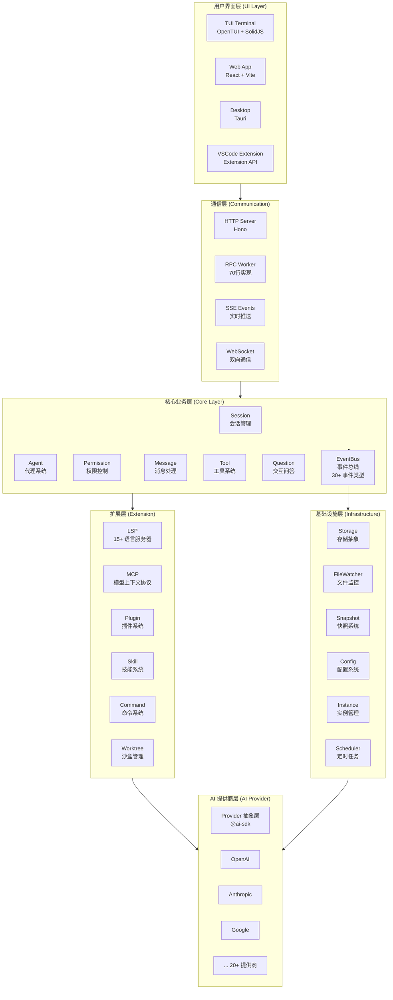
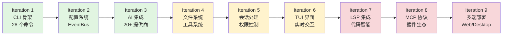
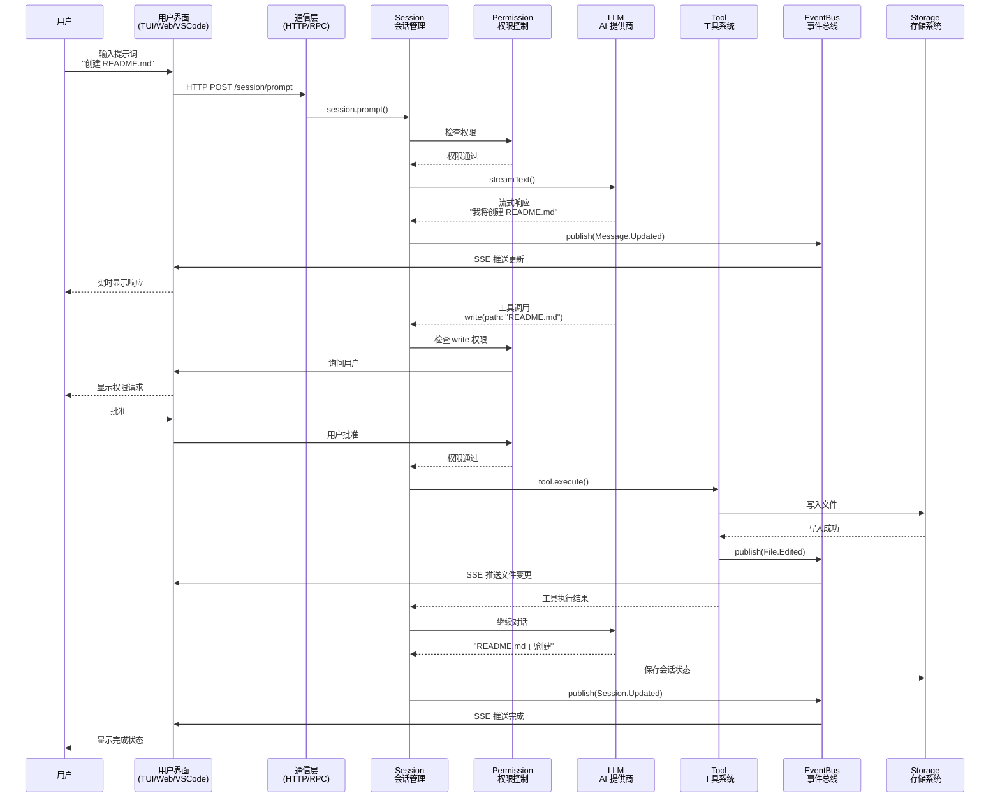
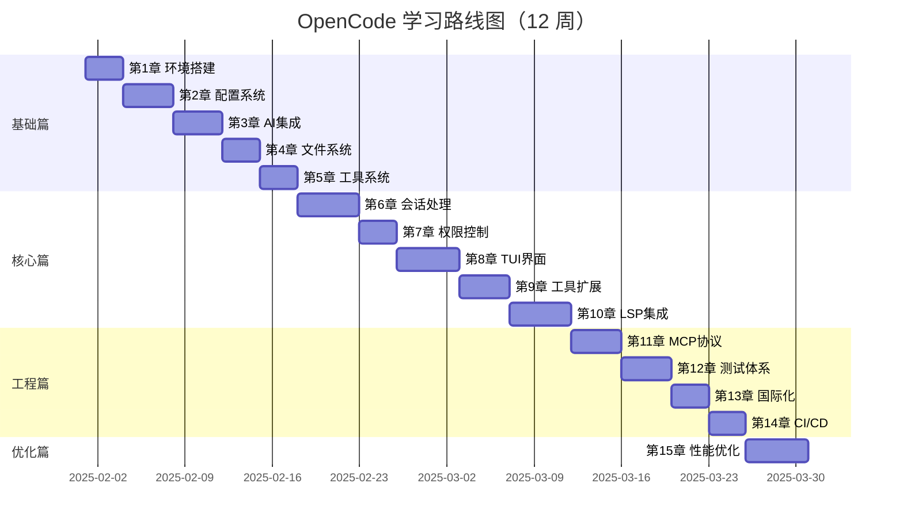

# 1.0 全景架构与设计哲学

> 在深入代码之前，我们需要理解 OpenCode 的整体架构和设计理念。这将帮助你建立全局视角，理解每个模块的定位和相互关系。

---

## 1.0.1 OpenCode 架构全景图

OpenCode 采用分层架构设计，从底层基础设施到顶层用户界面，共分为 5 个核心层次：



### 架构层次说明


**1. 用户界面层 (UI Layer)**
- **职责**：提供多端用户交互界面
- **技术栈**：
  - TUI: OpenTUI + SolidJS（终端界面）
  - Web: React + Vite（浏览器界面）
  - Desktop: Tauri（桌面应用）
  - VSCode: Extension API（编辑器集成）
- **特点**：响应式设计，实时更新，跨平台支持

**2. 通信层 (Communication)**
- **职责**：连接前端和后端，处理数据传输
- **技术栈**：
  - HTTP Server: Hono（轻量级 Web 框架）
  - RPC: 自研 70 行 RPC 实现（Worker 通信）
  - SSE: Server-Sent Events（服务器推送）
  - WebSocket: 双向实时通信
- **特点**：低延迟，支持流式响应，自动重连

**3. 核心业务层 (Core Layer)**
- **职责**：实现核心业务逻辑
- **关键模块**：
  - Session: 会话生命周期管理
  - Agent: AI 代理配置和执行
  - Permission: 细粒度权限控制
  - EventBus: 模块间解耦通信（30+ 事件类型）
  - Message: 消息存储和处理
  - Tool: 工具注册和执行
  - Question: 用户交互问答
- **特点**：事件驱动，松耦合，易扩展

**4. 基础设施层 (Infrastructure)**
- **职责**：提供底层能力支撑
- **关键模块**：
  - Storage: 统一存储接口（JSON 文件）
  - FileWatcher: 跨平台文件监控
  - Snapshot: Git-based 快照系统
  - Config: 配置加载和验证
  - Instance: 项目实例隔离
  - Scheduler: 定时任务调度
- **特点**：跨平台，高性能，自动清理

**5. 扩展层 (Extension)**
- **职责**：提供可扩展能力
- **关键模块**：
  - LSP: 语言服务器集成（15+ 语言）
  - MCP: Model Context Protocol 支持
  - Plugin: 插件系统（工具/认证）
  - Skill: 知识库管理
  - Command: 自定义命令
  - Worktree: Git 沙盒隔离
- **特点**：标准化协议，生态互通

**6. AI 提供商层 (AI Provider)**
- **职责**：统一 AI 模型调用接口
- **技术栈**：@ai-sdk（Vercel AI SDK）
- **支持提供商**：OpenAI, Anthropic, Google, Mistral, Cohere, Groq 等 20+
- **特点**：提供商无关，流式响应，工具调用

---

## 1.0.2 核心设计哲学

OpenCode 的架构设计遵循 5 大核心理念，这些理念贯穿整个系统设计。

### 1. 事件驱动架构 (Event-Driven Architecture)

**设计理念**：模块间通过事件解耦，发布者和订阅者互不依赖。

**代码示例**：

```typescript
// 发布者：Session 模块创建会话后发布事件
// src/session/index.ts
await Storage.write(["session", projectID, sessionID], session)

// 发布事件，不关心谁在监听
Bus.publish(Session.Event.Created, {
  sessionID,
  info: session
})

// 订阅者1：Share 模块监听并同步到云端
// src/share/share.ts
Bus.subscribe(Session.Event.Created, async (evt) => {
  await syncToCloud(evt.properties.info)
})

// 订阅者2：Analytics 模块监听并记录统计
// src/analytics/index.ts
Bus.subscribe(Session.Event.Created, async (evt) => {
  await trackEvent("session_created", {
    sessionID: evt.properties.sessionID
  })
})
```

**优势**：
- ✅ **松耦合**：Session 模块不需要知道 Share 和 Analytics 的存在
- ✅ **易扩展**：新增订阅者无需修改发布者代码
- ✅ **可观测**：所有事件可统一监控和日志记录
- ✅ **异步处理**：事件处理不阻塞主流程

**挑战**：
- ⚠️ **调试复杂**：事件链路追踪需要专门工具
- ⚠️ **顺序保证**：需要额外机制保证事件处理顺序
- ⚠️ **内存泄漏**：订阅者未正确清理会导致内存泄漏

**最佳实践**：
```typescript
// 使用 using 语法自动清理订阅
using unsub = Bus.subscribe(Event.Updated, handler)
// 作用域结束时自动取消订阅
```


### 2. 实例隔离 (Instance Isolation)

**设计理念**：每个项目目录对应一个独立实例，状态完全隔离，资源自动清理。

**代码示例**：

```typescript
// src/project/instance.ts
export function state<T>(
  init: () => T | Promise<T>,
  dispose?: (state: T) => void | Promise<void>
): () => T {
  // 使用 Symbol 作为 key，确保状态在不同实例间隔离
  const key = Symbol()
  
  return () => {
    // 获取当前实例（每个项目目录对应一个实例）
    const instance = getCurrentInstance()
    
    // 懒加载：首次访问时才初始化
    if (!instance.state.has(key)) {
      const value = init()
      instance.state.set(key, value)
      
      // 注册清理函数，实例销毁时自动调用
      if (dispose) {
        instance.disposers.push(() => dispose(value))
      }
    }
    
    return instance.state.get(key)
  }
}

// 使用示例：创建实例级状态
const sessions = Instance.state(
  () => new Map<string, Session>(),
  (map) => {
    // 清理所有会话
    for (const session of map.values()) {
      session.cleanup()
    }
  }
)

// 不同项目的状态互不影响
// /project-a → Instance A → sessions Map A
// /project-b → Instance B → sessions Map B
```

**优势**：
- ✅ **多项目支持**：可同时处理多个项目，状态不污染
- ✅ **资源隔离**：每个实例有独立的配置、会话、工具
- ✅ **自动清理**：实例销毁时自动释放资源（数据库连接、文件监控等）
- ✅ **内存安全**：避免内存泄漏和状态混乱

**挑战**：
- ⚠️ **内存开销**：多实例会增加内存占用
- ⚠️ **跨实例通信**：需要 GlobalBus 支持
- ⚠️ **状态同步**：跨实例状态同步需要额外机制

**实际应用场景**：
```typescript
// 场景1：用户同时打开两个项目
// Terminal 1: cd /project-a && opencode tui
// Terminal 2: cd /project-b && opencode tui
// 两个实例完全独立，互不干扰

// 场景2：Worktree 沙盒隔离
// 主项目：/main-project
// 沙盒1：/main-project/.opencode/worktree/brave-falcon
// 沙盒2：/main-project/.opencode/worktree/cosmic-nebula
// 每个沙盒都是独立实例
```

### 3. 类型安全优先 (Type-Safe First)

**设计理念**：使用 Zod 实现运行时验证 + TypeScript 编译时检查，双重保障类型安全。

**代码示例**：

```typescript
// src/config/config.ts
import { z } from "zod"

// 1. 定义 Zod Schema
export const Config = z.object({
  model: z.string().optional(),
  agent: z.record(z.string(), AgentConfig).optional(),
  permission: z.record(z.string(), z.any()).optional(),
  mcp: z.record(z.string(), McpConfig).optional()
})

// 2. 自动推导 TypeScript 类型
export type Config = z.infer<typeof Config>
// 等价于：
// type Config = {
//   model?: string
//   agent?: Record<string, AgentConfig>
//   permission?: Record<string, any>
//   mcp?: Record<string, McpConfig>
// }

// 3. 运行时验证
const data = await Bun.file("opencode.md").json()
const config = Config.parse(data)
// 如果 data 不符合 schema，会抛出详细错误：
// ZodError: [
//   {
//     "code": "invalid_type",
//     "expected": "string",
//     "received": "number",
//     "path": ["model"]
//   }
// ]

// 4. 安全的类型推断
config.model // TypeScript 知道这是 string | undefined
config.agent?.build // 自动补全，类型安全
```

**优势**：
- ✅ **编译时检查**：TypeScript 在编写代码时就能发现类型错误
- ✅ **运行时验证**：Zod 在运行时验证数据，防止非法输入
- ✅ **自动生成类型**：无需手动维护类型定义
- ✅ **详细错误信息**：Zod 提供精确的错误路径和原因

**挑战**：
- ⚠️ **学习成本**：需要学习 Zod API
- ⚠️ **性能开销**：运行时验证有轻微性能损耗
- ⚠️ **Schema 维护**：复杂类型的 Schema 可能冗长

**最佳实践**：
```typescript
// 使用 .safeParse() 处理可能失败的验证
const result = Config.safeParse(data)
if (!result.success) {
  console.error("配置验证失败：", result.error.format())
  // 使用默认配置
  return defaultConfig
}
return result.data

// 使用 .transform() 转换数据
const PortSchema = z.string().transform((val) => parseInt(val, 10))
const config = z.object({
  port: PortSchema // "3000" → 3000
})
```


### 4. 渐进式增强 (Progressive Enhancement)

**设计理念**：从 MVP 到完整系统，每个迭代都可独立运行，降低开发风险。

**迭代路线图**：



**每个迭代的可运行状态**：

```bash
# Iteration 1: 可运行基础命令
$ opencode --version
opencode version 1.1.39

$ opencode --help
Commands:
  session    Manage sessions
  project    Manage projects
  ...

# Iteration 2: 可加载配置
$ opencode config get model
anthropic/claude-3-5-sonnet-20241022

# Iteration 3: 可调用 AI
$ opencode session new --agent build
Session created: sess_abc123

$ opencode session prompt sess_abc123 "Hello"
AI: Hello! How can I help you today?

# Iteration 4: 可执行文件操作
$ opencode tool exec read --path README.md
[Tool Output] File content...

# Iteration 5: 可处理完整会话
$ opencode tui
[TUI 界面启动，支持实时交互]
```

**优势**：
- ✅ **快速验证**：每个迭代都能看到实际效果
- ✅ **降低风险**：问题早发现，避免大规模返工
- ✅ **易于理解**：学习曲线平缓，逐步深入
- ✅ **灵活调整**：可根据反馈调整后续迭代

**挑战**：
- ⚠️ **架构规划**：需要提前设计好模块边界
- ⚠️ **重构成本**：架构不合理会导致后期重构
- ⚠️ **功能取舍**：需要明确每个迭代的核心功能

### 5. 约定优于配置 (Convention over Configuration)

**设计理念**：提供合理的默认值，减少配置复杂度，同时保持灵活性。

**代码示例**：

```typescript
// 默认配置
const defaults = {
  model: "anthropic/claude-3-5-sonnet-20241022",
  agent: "build",
  permission: {
    edit: { "*": "ask" },    // 编辑文件需要询问
    bash: { "*": "ask" },    // 执行命令需要询问
    read: { "*": "allow" }   // 读取文件自动允许
  }
}

// 用户只需配置差异
// .opencode/opencode.md
---
model: "openai/gpt-4"
permission:
  edit:
    "*.ts": "allow"  # TypeScript 文件自动允许编辑
---

// 最终配置 = 默认配置 + 用户配置
const finalConfig = merge(defaults, userConfig)
```

**约定示例**：

| 约定 | 说明 | 覆盖方式 |
|------|------|---------|
| 配置文件路径 | `.opencode/opencode.md` | 环境变量 `OPENCODE_CONFIG` |
| 存储目录 | `~/.opencode/storage/` | 配置项 `storage.path` |
| 默认 Agent | `build` | 配置项 `agent` |
| 默认模型 | Claude 3.5 Sonnet | 配置项 `model` |
| 工具目录 | `.opencode/tool/*.ts` | 配置项 `tool.directories` |
| 技能目录 | `.opencode/skill/**/SKILL.md` | 配置项 `skill.directories` |

**优势**：
- ✅ **开箱即用**：无需配置即可运行
- ✅ **降低门槛**：新手友好，减少学习成本
- ✅ **保持灵活**：高级用户可自定义所有配置
- ✅ **最佳实践**：默认值体现最佳实践

**挑战**：
- ⚠️ **默认值设计**：需要精心设计，平衡通用性和特殊需求
- ⚠️ **文档维护**：需要清晰文档说明约定和覆盖方式
- ⚠️ **版本兼容**：默认值变更需要考虑向后兼容

**最佳实践**：
```typescript
// 使用环境变量覆盖约定
export OPENCODE_MODEL="openai/gpt-4"
export OPENCODE_STORAGE_PATH="/custom/path"

// 使用配置文件覆盖约定
// opencode.md
---
model: "openai/gpt-4"
storage:
  path: "/custom/path"
---

// 使用命令行参数覆盖约定
opencode session new --model "openai/gpt-4"
```

---

## 1.0.3 技术栈选型理由

OpenCode 的技术栈选型经过深思熟虑，每个技术都有明确的理由和权衡。

| 技术 | 选型理由 | 优势 | Trade-off |
|------|---------|------|-----------|
| **Bun** | 3-5x 快于 npm，原生 TypeScript | • 快速安装和执行<br/>• 内置测试框架<br/>• 原生 TypeScript | • 生态成熟度 < Node.js<br/>• 部分包不兼容 |
| **Turbo** | 增量构建，10x 提升大型项目 | • 智能缓存<br/>• 任务依赖管理<br/>• 并行执行 | • 配置复杂度增加<br/>• 学习曲线 |
| **Zod** | 类型安全，运行时验证 | • 编译时 + 运行时双重保障<br/>• 自动生成类型<br/>• 详细错误信息 | • 学习成本<br/>• 轻微性能开销 |
| **@ai-sdk** | 统一接口，20+ 提供商 | • 提供商无关<br/>• 流式响应<br/>• 工具调用支持 | • 抽象层性能损耗<br/>• 部分提供商特性受限 |
| **OpenTUI** | 终端原生组件，高性能 | • 响应式更新<br/>• 组件化开发<br/>• 跨平台支持 | • 学习曲线陡峭<br/>• 生态较小 |
| **SolidJS** | 细粒度响应式，小体积 | • 性能优异<br/>• 无虚拟 DOM<br/>• 体积小 | • 生态 < React<br/>• 社区较小 |
| **Playwright** | 跨浏览器 E2E 测试 | • 多浏览器支持<br/>• 自动等待<br/>• 录制功能 | • 测试速度较慢<br/>• 资源占用高 |
| **Hono** | 轻量级 Web 框架 | • 极快的路由<br/>• 边缘运行时支持<br/>• TypeScript 优先 | • 生态较新<br/>• 中间件较少 |

### 为什么选择 Bun？

```typescript
// 性能对比（安装 50 个包）
npm install    // ~45 秒
yarn install   // ~30 秒
pnpm install   // ~20 秒
bun install    // ~8 秒  ← 3-5x 提升

// 原生 TypeScript 支持
// 无需编译，直接运行
bun run src/index.ts

// 内置测试框架
import { test, expect } from "bun:test"

test("example", () => {
  expect(1 + 1).toBe(2)
})
```

### 为什么选择 Turbo？

```json
// turbo.json - 智能缓存和依赖管理
{
  "tasks": {
    "build": {
      "dependsOn": ["^build"],  // 先构建依赖包
      "outputs": ["dist/**"],   // 缓存输出目录
      "cache": true             // 启用缓存
    }
  }
}

// 性能对比（构建 10 个包）
// 首次构建
npm run build    // ~120 秒
turbo build      // ~120 秒

// 二次构建（无变更）
npm run build    // ~120 秒（重新构建）
turbo build      // ~2 秒（使用缓存）← 60x 提升
```

### 为什么选择 @ai-sdk？

```typescript
// 统一接口，切换提供商只需改配置
import { streamText } from "ai"
import { anthropic } from "@ai-sdk/anthropic"
import { openai } from "@ai-sdk/openai"

// 使用 Anthropic
const result = await streamText({
  model: anthropic("claude-3-5-sonnet-20241022"),
  messages: [{ role: "user", content: "Hello" }]
})

// 切换到 OpenAI，代码无需修改
const result = await streamText({
  model: openai("gpt-4"),
  messages: [{ role: "user", content: "Hello" }]
})

// 支持 20+ 提供商
// OpenAI, Anthropic, Google, Mistral, Cohere, Groq, 
// Together AI, Fireworks, Perplexity, DeepSeek...
```


---

## 1.0.4 数据流向图

理解数据如何在系统中流动，是掌握架构的关键。



### 关键流程说明

**1. 用户输入 → 会话处理**
```typescript
// 用户在 TUI 中输入提示词
const input = "创建 README.md 文件"

// TUI 发送 HTTP 请求
await fetch("/session/prompt", {
  method: "POST",
  body: JSON.stringify({
    sessionID: "sess_abc123",
    content: input
  })
})

// Session 处理请求
await Session.prompt({
  sessionID: "sess_abc123",
  content: input
})
```

**2. 权限检查**
```typescript
// 在执行敏感操作前检查权限
await Permission.ask({
  permission: "write",
  patterns: ["README.md"],
  sessionID: "sess_abc123"
})

// 如果配置为 "ask"，会弹出确认对话框
// 如果配置为 "allow"，自动通过
// 如果配置为 "deny"，抛出异常
```

**3. AI 流式响应**
```typescript
// 调用 AI 提供商
const stream = await streamText({
  model: anthropic("claude-3-5-sonnet-20241022"),
  messages: [...history, { role: "user", content: input }],
  tools: { write: WriteTool }
})

// 处理流式事件
for await (const event of stream.fullStream) {
  switch (event.type) {
    case "text-delta":
      // 实时显示文本
      Bus.publish(Message.Event.PartUpdated, {
        text: event.textDelta
      })
      break
    
    case "tool-call":
      // 执行工具调用
      await Tool.execute(event.toolName, event.args)
      break
  }
}
```

**4. 事件通知**
```typescript
// 工具执行后发布事件
Bus.publish(File.Event.Edited, {
  file: "README.md"
})

// 多个订阅者响应
Bus.subscribe(File.Event.Edited, async (evt) => {
  // 订阅者1：自动格式化
  await formatFile(evt.properties.file)
})

Bus.subscribe(File.Event.Edited, async (evt) => {
  // 订阅者2：更新文件树
  await refreshFileTree()
})
```

**5. 状态持久化**
```typescript
// 保存会话状态
await Storage.write(
  ["session", projectID, sessionID],
  session
)

// 保存消息内容
await Storage.write(
  ["message", sessionID, messageID],
  message
)
```

---

## 1.0.5 前置知识清单

在开始学习本书之前，请评估你的知识储备。

### 必备知识（⭐⭐⭐）

**1. TypeScript 基础**

你需要理解以下概念：

```typescript
// 类型注解
const name: string = "OpenCode"
const age: number = 1

// 接口
interface User {
  id: string
  name: string
  email?: string  // 可选属性
}

// 泛型
function identity<T>(value: T): T {
  return value
}

// 类型推断
const users = [{ id: "1", name: "Alice" }]
// TypeScript 自动推断 users 类型为 { id: string; name: string }[]

// 联合类型
type Status = "idle" | "busy" | "error"

// 交叉类型
type UserWithRole = User & { role: string }

// async/await
async function fetchData(): Promise<string> {
  const response = await fetch("/api/data")
  return response.text()
}

// 命名空间
namespace Utils {
  export function log(msg: string) {
    console.log(msg)
  }
}
```

**自测题**：
```typescript
// 你能理解这段代码吗？
export function state<T>(
  init: () => T | Promise<T>,
  dispose?: (state: T) => void
): () => T {
  const key = Symbol()
  return () => {
    const instance = getCurrentInstance()
    if (!instance.state.has(key)) {
      const value = init()
      instance.state.set(key, value)
      if (dispose) instance.disposers.push(() => dispose(value))
    }
    return instance.state.get(key)
  }
}

// 问题：
// 1. 泛型 <T> 的作用是什么？
// 2. Symbol() 为什么能确保状态隔离？
// 3. 闭包在这里如何应用？
// 4. dispose 函数的作用是什么？
```

**推荐学习资源**：
- [TypeScript 官方文档](https://www.typescriptlang.org/docs/)
- [TypeScript Deep Dive](https://basarat.gitbook.io/typescript/)

**2. Git 基础**

你需要掌握：

```bash
# 基本操作
git clone <url>           # 克隆仓库
git status                # 查看状态
git add .                 # 添加文件
git commit -m "message"   # 提交
git push                  # 推送
git pull                  # 拉取

# 分支管理
git branch feature        # 创建分支
git checkout feature      # 切换分支
git merge feature         # 合并分支

# 高级概念（OpenCode 使用）
git worktree add <path>   # 创建工作树
git worktree list         # 列出工作树
```

**自测题**：
- 什么是工作区、暂存区、仓库？
- `git reset` 和 `git revert` 的区别？
- 什么是 Git worktree？

**3. 终端操作**

你需要熟悉：

```bash
# 文件操作
cd /path/to/dir          # 切换目录
ls -la                   # 列出文件
mkdir -p dir/subdir      # 创建目录
rm -rf dir               # 删除目录
cat file.txt             # 查看文件
echo "text" > file.txt   # 写入文件

# 环境变量
export VAR=value         # 设置环境变量
echo $VAR                # 读取环境变量

# 包管理器
npm install              # 安装依赖
npm run build            # 运行脚本
```

### 推荐知识（⭐⭐）

**1. Node.js 生态**

```json
// package.json 配置
{
  "name": "@opencode/core",
  "version": "1.0.0",
  "type": "module",           // ESM 模块
  "exports": {
    ".": "./src/index.ts"     // 导出路径
  },
  "dependencies": {
    "zod": "^3.22.0"
  },
  "scripts": {
    "build": "tsc",
    "test": "bun test"
  }
}
```

**2. 设计模式**

OpenCode 使用的设计模式：

```typescript
// 观察者模式（EventBus）
Bus.subscribe(Event.Created, handler)

// 工厂模式（Provider）
Provider.create({ providerID: "openai", modelID: "gpt-4" })

// 单例模式（Instance）
const instance = Instance.current()

// 策略模式（Permission）
Permission.evaluate(rule, context)
```

**3. 函数式编程**

```typescript
// 高阶函数
const map = <T, U>(arr: T[], fn: (item: T) => U): U[] => {
  return arr.map(fn)
}

// 闭包
function counter() {
  let count = 0
  return () => ++count
}

// 纯函数
function add(a: number, b: number): number {
  return a + b  // 无副作用
}
```

### 加分项（⭐）

- 🔹 Monorepo 经验（Turborepo/Nx/Lerna）
- 🔹 LSP 协议了解（Language Server Protocol）
- 🔹 终端 UI 开发（Ink/Blessed/Charm）
- 🔹 AI/LLM 基础知识（Prompt Engineering）
- 🔹 Rust 基础（部分工具用 Rust 实现）

### 自测题答案

**TypeScript 自测题答案**：
1. **泛型 <T>**：允许函数适用于任意类型，保持类型安全
2. **Symbol()**：每次调用返回唯一值，确保不同实例的 key 不冲突
3. **闭包**：返回的函数捕获了 `key` 变量，形成闭包
4. **dispose**：清理函数，在实例销毁时释放资源

**Git 自测题答案**：
- **工作区/暂存区/仓库**：工作区是当前目录，暂存区是 `git add` 后的状态，仓库是 `git commit` 后的历史
- **reset vs revert**：reset 修改历史，revert 创建新提交撤销
- **worktree**：允许同一仓库有多个工作目录，用于并行开发


---

## 1.0.6 学习路线图

本书共 15 章，建议按以下路线学习，每个阶段都有明确的里程碑验证。

### 学习阶段规划



### 详细学习计划

**Week 1-2: 基础篇（第 1-5 章）**

| 天数 | 章节 | 学习内容 | 验证目标 |
|------|------|---------|---------|
| Day 1-3 | 第1章 | Monorepo + Bun + CLI | ✅ 能运行 `opencode --version` |
| Day 4-7 | 第2章 | 配置系统 + EventBus | ✅ 能加载配置并发布事件 |
| Day 8-11 | 第3章 | AI 提供商集成 | ✅ 能调用 LLM 并获得响应 |
| Day 12-14 | 第4-5章 | 文件系统 + 工具 | ✅ 能执行文件操作工具 |

**Week 3-4: 核心篇（第 6-10 章）**

| 天数 | 章节 | 学习内容 | 验证目标 |
|------|------|---------|---------|
| Day 15-19 | 第6章 | 会话处理循环 | ✅ 能创建会话并处理多轮对话 |
| Day 20-22 | 第7章 | 权限控制系统 | ✅ 能配置权限规则并验证 |
| Day 23-27 | 第8章 | TUI 界面开发 | ✅ 能启动 TUI 并交互 |
| Day 28-31 | 第9-10章 | 工具扩展 + LSP | ✅ 能使用 LSP 代码智能 |

**Week 5-6: 工程篇（第 11-14 章）**

| 天数 | 章节 | 学习内容 | 验证目标 |
|------|------|---------|---------|
| Day 32-35 | 第11章 | MCP 协议集成 | ✅ 能连接 MCP 服务器 |
| Day 36-39 | 第12章 | 测试体系构建 | ✅ 能运行完整测试套件 |
| Day 40-42 | 第13章 | 国际化实现 | ✅ 能切换语言界面 |
| Day 43-45 | 第14章 | CI/CD 自动化 | ✅ 能自动构建和部署 |

**Week 7-12: 优化篇 + 实践项目**

| 周数 | 内容 | 目标 |
|------|------|------|
| Week 7 | 第15章 性能优化 | ✅ 理解性能优化策略 |
| Week 8-9 | 实践项目1：自定义 Agent | ✅ 开发完整的自定义 Agent |
| Week 10-11 | 实践项目2：MCP 服务器 | ✅ 开发自己的 MCP 服务器 |
| Week 12 | 实践项目3：插件开发 | ✅ 开发并发布插件 |

### 里程碑验证

每个阶段结束后，请完成以下验证：

**里程碑 1（Week 2）：基础环境搭建完成**

```bash
# 验证清单
✅ Bun 安装成功
✅ 项目依赖安装完成
✅ 能运行 opencode --version
✅ 能加载配置文件
✅ 能调用 AI 并获得响应
✅ 能执行基础工具（read/write）

# 验证命令
bun --version
opencode --version
opencode config get model
opencode session new --agent build
opencode tool exec read --path README.md
```

**里程碑 2（Week 4）：核心功能实现**

```bash
# 验证清单
✅ 能创建和管理会话
✅ 能处理多轮对话
✅ 权限系统正常工作
✅ TUI 界面可用
✅ LSP 代码智能可用

# 验证命令
opencode tui
# 在 TUI 中：
# 1. 创建新会话
# 2. 发送消息并获得响应
# 3. 执行文件操作（需要权限确认）
# 4. 使用代码跳转功能
```

**里程碑 3（Week 6）：工程化完成**

```bash
# 验证清单
✅ MCP 服务器连接成功
✅ 测试套件全部通过
✅ 多语言界面切换正常
✅ CI/CD 流程配置完成

# 验证命令
bun test
bun run test:e2e
opencode mcp list
# 切换语言并验证界面
```

**里程碑 4（Week 12）：完整项目交付**

```bash
# 验证清单
✅ 性能优化完成（缓存、节流等）
✅ 自定义 Agent 开发完成
✅ MCP 服务器开发完成
✅ 插件开发并发布

# 验证命令
# 运行自己开发的功能
opencode session new --agent my-custom-agent
# 连接自己的 MCP 服务器
# 使用自己开发的插件
```

### 学习建议

**1. 循序渐进，不要跳章**
- 每章都是后续章节的基础
- 跳章会导致理解困难

**2. 动手实践，运行所有代码**
- 不要只看代码，要实际运行
- 修改代码参数，观察效果变化

**3. 完成所有练习**
- 练习题设计用于巩固知识
- 参考答案仅供验证，先独立完成

**4. 记录学习笔记**
- 记录遇到的问题和解决方案
- 总结每章的核心概念

**5. 参与社区讨论**
- 加入 Discord 社区
- 分享学习心得和问题

---

## 1.0.7 从零开始：完整项目初始化

现在让我们开始实际操作，从零搭建 OpenCode 开发环境。

### 步骤 1：克隆仓库

```bash
# 克隆 OpenCode 仓库
git clone https://github.com/anomalyco/opencode.git
cd opencode

# 查看项目结构
ls -la

# 输出：
# drwxr-xr-x  .git/
# drwxr-xr-x  packages/
# -rw-r--r--  package.json
# -rw-r--r--  turbo.json
# -rw-r--r--  bunfig.toml
# -rw-r--r--  README.md
# ...

# 查看分支（默认分支是 dev）
git branch -a
# * dev
#   remotes/origin/dev
#   remotes/origin/main
```

**注意事项**：
- OpenCode 的默认分支是 `dev`，不是 `main`
- 如果需要稳定版本，切换到 `main` 分支

### 步骤 2：安装 Bun

Bun 是 OpenCode 的核心依赖，必须先安装。

```bash
# macOS/Linux 安装
curl -fsSL https://bun.sh/install | bash

# 验证安装
bun --version
# 输出：1.3.5

# 查看 Bun 路径
which bun
# 输出：/Users/username/.bun/bin/bun

# 如果命令未找到，添加到 PATH
echo 'export PATH="$HOME/.bun/bin:$PATH"' >> ~/.zshrc
source ~/.zshrc
```

**Windows 用户**：
```bash
# 使用 WSL (Windows Subsystem for Linux)
wsl --install
# 然后在 WSL 中安装 Bun
curl -fsSL https://bun.sh/install | bash
```

**验证 Bun 功能**：
```bash
# 测试 Bun 运行 TypeScript
echo 'console.log("Hello from Bun!")' > test.ts
bun run test.ts
# 输出：Hello from Bun!

# 测试 Bun 包管理
bun --help
# 显示帮助信息
```

### 步骤 3：安装依赖

```bash
# 安装所有 workspace 依赖
bun install

# 安装过程输出：
# bun install v1.3.5
# 🔍 Resolving dependencies...
# 📦 Downloading packages...
# ⚙️  Installing packages...
# + 1234 packages installed [12.34s]

# 验证安装
ls node_modules/
# 输出：大量依赖包

# 检查 workspace 包
ls packages/
# 输出：
# app/
# console/
# desktop/
# docs/
# enterprise/
# function/
# opencode/
# plugin/
# sdk/
# ui/
# util/
# web/
```

**常见问题**：

```bash
# 问题1：安装失败 - 网络问题
# 解决：使用国内镜像
bun config set registry https://registry.npmmirror.com

# 问题2：权限错误
# 解决：不要使用 sudo
# Bun 应该安装在用户目录，不需要 root 权限

# 问题3：依赖冲突
# 解决：清理缓存重试
rm -rf node_modules bun.lock
bun install
```

### 步骤 4：构建项目

```bash
# 使用 Turbo 构建所有包
bun run build

# 构建过程输出：
# • packages/util:build: cache miss, executing...
# • packages/ui:build: cache miss, executing...
# • packages/opencode:build: cache miss, executing...
# ...
# • packages/opencode:build: finished in 5.2s
# 
# Tasks:    12 successful, 12 total
# Cached:   0 cached, 12 total
# Time:     15.3s

# 二次构建（验证缓存）
bun run build

# 输出：
# • packages/util:build: cache hit, replaying logs...
# • packages/ui:build: cache hit, replaying logs...
# ...
# Tasks:    12 successful, 12 total
# Cached:   12 cached, 12 total
# Time:     1.2s  ← 快了 10x+
```

**构建产物检查**：
```bash
# 查看构建产物
ls packages/opencode/dist/
# 输出：
# index.js
# index.d.ts
# ...

# 查看其他包的构建产物
ls packages/ui/dist/
ls packages/util/dist/
```

### 步骤 5：验证安装

```bash
# 方式1：直接运行源码
bun run packages/opencode/src/index.ts --version
# 输出：opencode version 1.1.39

# 方式2：运行构建产物
node packages/opencode/dist/index.js --version
# 输出：opencode version 1.1.39

# 查看所有可用命令
bun run packages/opencode/src/index.ts --help

# 输出：
# opencode <command>
# 
# Commands:
#   acp              Start ACP server
#   mcp              Manage MCP servers
#   tui              Launch TUI interface
#   session          Manage sessions
#   project          Manage projects
#   tool             Execute tools
#   config           Manage configuration
#   ... (28 个命令)
# 
# Options:
#   --version        Show version number
#   --help           Show help
```

**创建全局命令（可选）**：
```bash
# 创建软链接
sudo ln -s $(pwd)/packages/opencode/src/index.ts /usr/local/bin/opencode

# 或者使用 bun link
cd packages/opencode
bun link
cd ../..

# 验证全局命令
opencode --version
# 输出：opencode version 1.1.39
```

### 步骤 6：配置开发环境

```bash
# 创建配置目录
mkdir -p .opencode

# 创建配置文件
cat > .opencode/opencode.md << 'EOF'
---
model: "anthropic/claude-3-5-sonnet-20241022"
agent: "build"
permission:
  edit:
    "*.ts": "allow"
    "*.md": "allow"
  bash:
    "*": "ask"
  read:
    "*": "allow"
provider:
  anthropic:
    apiKey: "your-api-key-here"
---

# OpenCode 配置

这是项目的 OpenCode 配置文件。
EOF

# 设置环境变量（推荐方式）
cat >> ~/.zshrc << 'EOF'

# OpenCode 配置
export ANTHROPIC_API_KEY="sk-ant-your-key-here"
export OPENAI_API_KEY="sk-your-key-here"
EOF

source ~/.zshrc

# 验证配置
opencode config get model
# 输出：anthropic/claude-3-5-sonnet-20241022
```

**获取 API 密钥**：

1. **Anthropic (Claude)**
   - 访问：https://console.anthropic.com/
   - 注册账号并创建 API 密钥
   - 复制密钥：`sk-ant-...`

2. **OpenAI (GPT)**
   - 访问：https://platform.openai.com/api-keys
   - 创建 API 密钥
   - 复制密钥：`sk-...`

### 步骤 7：运行第一个会话

```bash
# 方式1：命令行模式
# 创建新会话
opencode session new --agent build
# 输出：Session created: sess_abc123def456

# 发送消息
opencode session prompt sess_abc123def456 "Hello, OpenCode!"
# 输出：
# AI: Hello! I'm OpenCode, an AI coding assistant. 
# How can I help you with your code today?

# 方式2：TUI 模式（推荐）
opencode tui

# TUI 界面启动：
# ┌─────────────────────────────────────┐
# │ OpenCode TUI                        │
# ├─────────────────────────────────────┤
# │ Sessions:                           │
# │   • New Session                     │
# │                                     │
# │ Prompt:                             │
# │ > _                                 │
# └─────────────────────────────────────┘

# 在 TUI 中输入：
# > 创建一个 hello.ts 文件，输出 "Hello, World!"

# AI 响应并执行工具：
# [Tool: write]
# path: hello.ts
# content: console.log("Hello, World!")
# 
# [Permission Request]
# Allow write to hello.ts? (y/n)
# > y
# 
# File created successfully!

# 验证文件
cat hello.ts
# 输出：console.log("Hello, World!")

# 运行文件
bun run hello.ts
# 输出：Hello, World!
```

### 常见问题排查

**问题1：Bun 安装失败**

```bash
# 症状
curl: (7) Failed to connect to bun.sh

# 原因：网络问题或防火墙

# 解决方案1：使用代理
export https_proxy=http://127.0.0.1:7890
curl -fsSL https://bun.sh/install | bash

# 解决方案2：手动下载
# 访问 https://github.com/oven-sh/bun/releases
# 下载对应平台的二进制文件
# 解压到 ~/.bun/bin/
```

**问题2：依赖安装失败**

```bash
# 症状
error: Failed to download package

# 解决方案：清理缓存
rm -rf node_modules bun.lock ~/.bun/install/cache
bun install

# 如果仍然失败，使用 npm
npm install
```

**问题3：构建失败**

```bash
# 症状
error TS2307: Cannot find module

# 原因：TypeScript 版本不兼容

# 解决方案：检查 Node.js 版本
node --version
# 需要 >= 18.0.0

# 升级 Node.js
nvm install 20
nvm use 20
```

**问题4：API 密钥未配置**

```bash
# 症状
Error: API key not found

# 解决方案：设置环境变量
export ANTHROPIC_API_KEY="sk-ant-..."

# 或在配置文件中设置
# .opencode/opencode.md
---
provider:
  anthropic:
    apiKey: "sk-ant-..."
---
```

**问题5：权限被拒绝**

```bash
# 症状
Permission denied: write to file.ts

# 原因：权限配置为 "deny"

# 解决方案：修改配置
# .opencode/opencode.md
---
permission:
  edit:
    "*.ts": "allow"  # 改为 allow
---
```

### 开发工具推荐

**VSCode 扩展**：

```bash
# 安装推荐扩展
code --install-extension dbaeumer.vscode-eslint
code --install-extension esbenp.prettier-vscode
code --install-extension oven.bun-vscode
code --install-extension bradlc.vscode-tailwindcss

# 配置 VSCode
mkdir -p .vscode
cat > .vscode/settings.json << 'EOF'
{
  "editor.formatOnSave": true,
  "editor.defaultFormatter": "esbenp.prettier-vscode",
  "editor.codeActionsOnSave": {
    "source.fixAll.eslint": true
  },
  "typescript.tsdk": "node_modules/typescript/lib",
  "typescript.enablePromptUseWorkspaceTsdk": true
}
EOF

# 配置推荐扩展
cat > .vscode/extensions.json << 'EOF'
{
  "recommendations": [
    "dbaeumer.vscode-eslint",
    "esbenp.prettier-vscode",
    "oven.bun-vscode"
  ]
}
EOF
```

**终端工具**：

```bash
# 安装 Oh My Zsh（可选）
sh -c "$(curl -fsSL https://raw.githubusercontent.com/ohmyzsh/ohmyzsh/master/tools/install.sh)"

# 安装 zsh-autosuggestions
git clone https://github.com/zsh-users/zsh-autosuggestions ${ZSH_CUSTOM:-~/.oh-my-zsh/custom}/plugins/zsh-autosuggestions

# 安装 zsh-syntax-highlighting
git clone https://github.com/zsh-users/zsh-syntax-highlighting.git ${ZSH_CUSTOM:-~/.oh-my-zsh/custom}/plugins/zsh-syntax-highlighting

# 启用插件
# 编辑 ~/.zshrc
plugins=(git zsh-autosuggestions zsh-syntax-highlighting)
```

---

## 🎉 恭喜！环境搭建完成

现在你已经完成了 OpenCode 开发环境的搭建，可以开始学习后续章节了。

**下一步**：
- 📖 阅读 [1.1 Monorepo 架构设计](./01-monorepo.md)
- 💻 完成第1章的练习题
- 🔍 探索 OpenCode 源码结构

**遇到问题？**
- 📚 查看 [故障排除指南](../../appendix/D-troubleshooting.md)
- 💬 加入 [Discord 社区](https://discord.gg/opencode)
- 🐛 提交 [GitHub Issue](https://github.com/anomalyco/opencode/issues)

**学习建议**：
- ✅ 不要急于求成，扎实掌握每个概念
- ✅ 多动手实践，运行所有代码示例
- ✅ 完成每章的练习题
- ✅ 记录学习笔记和遇到的问题
- ✅ 参与社区讨论，分享学习心得

祝你学习愉快！🚀
