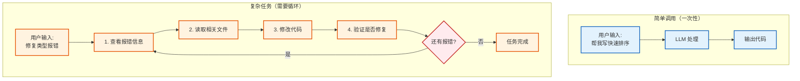
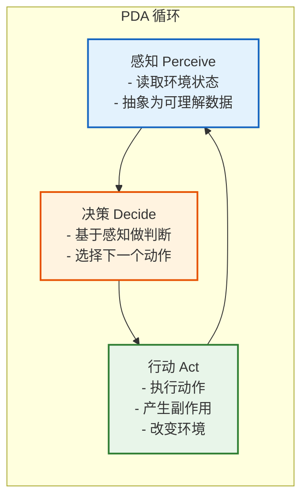
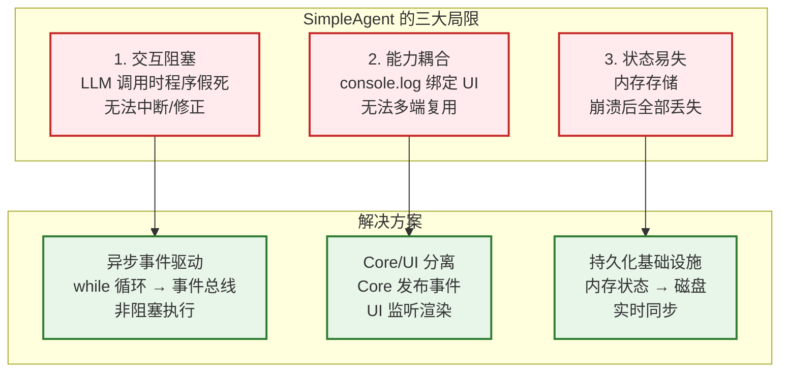
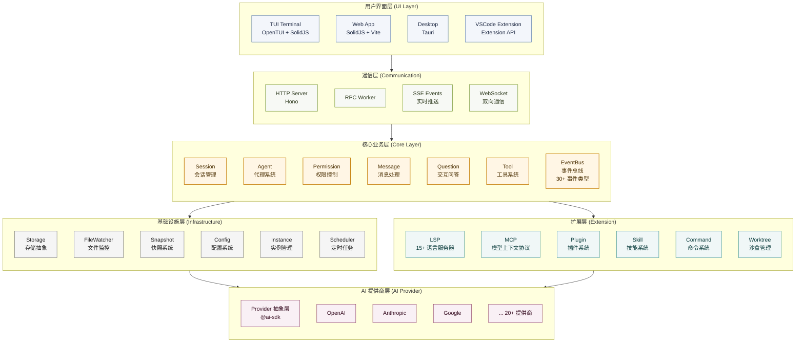

# 第 1 章：全景架构与设计哲学

> **本章目标**: 理解为什么选择 CLI Agent 形态，以及 OpenCode 的整体架构设计
>
> **核心问题**:
> - 为什么是 CLI Agent 而不是 IDE 插件？
> - Agent 的本质是什么？
> - OpenCode 如何通过分层架构解决核心问题？

---

当我们准备从零开始编写一个 AI 编码助手时，我们第一步该做什么？

在动手之前，我们需要先确定它的宿主形态。直觉告诉我们，开发者在 IDE 里写代码，所以将 AI 集成进 IDE 是理所当然的选择。现有的主流产品（如 Cursor 或 GitHub Copilot）大多也是这么做的。但还有另外一种宿主形态占据了相当大的市场份额——— CLI Agent。为什么会存在 CLI Agent 这种宿主形态呢？我们可以拿市面上两款主流产品来对比：Cursor 和 Claude Code。

## 1.1 上下文管理

Claude Code 是 Anthropic 推出的编程 Agent（智能体），可在终端、VS Code、JetBrains、桌面端以及 Web 端运行。它凭借对代码库的深度理解，能够自主规划并执行多步骤复杂任务。

Cursor 则是一款以 Agent 为核心重构的 VS Code 衍生编辑器，提供 Tab 键代码补全、多模型对话，以及可在 IDE 内直接编辑文件的 Cursor Agent 模式。如今，两者均已支持后台 Agent 与命令行（CLI）工作流，并持续深入对方的核心领域。

两者真正的产品哲学分歧在于**控制权**：

- **Claude Code** 采用 **Agent-first** 理念：你描述需求，AI 主导执行全流程，最终由你审查结果。
- **Cursor** 采用 **IDE-first（编辑器优先）** 理念：你主导开发节奏，AI 提供代码补全、修改建议与内联编辑，由你逐一确认。

| 维度       | Claude Code                  | Cursor                       |
|------------|------------------------------|------------------------------|
| **哲学**   | Agent-first    | IDE-first（编辑器优先）      |
| **工作流** | 你描述需求 → AI 主导执行 → 你审查结果 | 你主导开发 → AI 提供建议 → 你逐一确认 |
| **适用场景** | 重构、调试、模块级 / 项目级任务 | 代码补全、快速修复、内联编辑 |
| **用户角色** | Tech Lead（指挥者）          | Developer（执行者）          |

深度使用过两者的开发者可能有这样的感受：面对同样的重构任务，在 IDE 中使用与在 CLI 中使用的体验和效果是不一样的。

以开发者 Ian Nuttall 于 2025 年 8 月发布的头对头测试为例：同一提示词下，要求在 30 分钟内用 Next.js + Tailwind 4 + shadcn 组件构建一个用户反馈收集与展示的App。Claude Code 仅消耗 33k tokens，经一次人工中断后即零错误完成完整交互 Demo；而 Cursor Agent消耗 188k tokens（约 5.5 倍），过程最慢、偶现循环与轻微错误，最终需手动修正。 

问题出在哪里？上下文管理方式。

Cursor官方提到，其 Agent 可以基于代码库状态自动纳入当前打开的文件、终端输出及 linter 错误等信息。但实际使用时，这种自动注入主要以当前活跃文件为核心——用户仍需额外通过 @ 引用、拖拽文件或手动选中/添加才能补齐上下文。因此在多文件项目中，容易引发上下文膨胀和注意力分散，导致 token 消耗显著增加。

相反，Claude Code 采用极致纯净的混合策略：会话刚启动时，只加载极少量固定且必要的信息，比如CLAUDE.md，其余所有文件、子目录规则（.claude/rules/*.md）及终端输出均按需读取。Anthropic官方博客也明确提到：“与其把所有数据都预处理好，不如让 Agent 保持轻量指针（文件路径、存储的查询、网页链接等），使用这些引用，通过工具在运行时将数据动态加载到上下文中。”

因此，在同等复杂任务中，Claude Code 在上下文控制方面更具优势，实现更低的 token 开销、更高的上下文纯净度与注意力效率。对于追求大规模代码生成、长期项目维护的开发者而言，Claude Code 在 token 经济性与可控性上更具优势；而 Cursor 则以 IDE 集成便利性取胜，但需开发者主动管理上下文以避免膨胀风险。实际选用时，建议结合项目规模与 token 预算进行针对性测试。

## 1.2 可移植性与场景扩展

我们再来看看这两种形态在软件工程全生命周期中的差异。

IDE 天然强绑定于个人开发机器和特定可视化界面，而 CLI 本质上是一个标准的系统命令，具备极强的可移植性。你可以在本地终端运行，可以在远程服务器执行，可以塞进 Docker 容器，也能无缝集成到 CI/CD 流水线。

Anthropic 官方已发布 Claude Code GitHub Action，支持在 PR 或 Issue 中直接 @claude 触发自动 Code Review、Bug 修复，甚至完整实现 Issue 描述的功能。GitLab CI/CD 同样支持官方集成，只需几行 YAML 即可完成编排。

CLI 已从“帮你写下一行代码的辅助工具”，进化成“可编排的虚拟工程师”。当 Agent 的自治能力越过临界点后，开发者不再需要逐行确认代码，而是切换到 Tech Lead 角色——通过终端指令调度 Agent 完成模块级乃至项目级的任务。

场景还可以继续扩展。大量开发者已将 Claude Code 用于编程之外的工作：批量处理文件、生成数据报告、操作数据库、甚至辅助视频剪辑。只要以命令行为入口，编程只是它能力的一部分。

Anthropic 进一步推出 Claude Cowork 桌面 Agent（Mac/Windows），支持与 Excel、PowerPoint 原生共享上下文，可自主生成、编辑并优化幻灯片，完全无需手动打开办公软件即可产出专业级 PPT。这一趋势清晰可见：人类正逐步从“直接操作软件”转向“指挥 Agent 操作软件”。


## 1.3 模型集成的飞轮效应

从模型集成角度看，Cursor 作为第三方工具，可接入 Claude、GPT、Gemini 等多种模型，看似灵活，实则面临巨大适配成本：每种模型都需要单独优化系统提示词、工具调用方式和领域专长。

不同模型的调用习惯差异明显，适配工作量巨大。每次模型升级，这些适配都要重新调整，维护成本极高，且难以做到极致优化。

而 Claude Code 只专注一件事：如何将 Claude 模型的能力发挥到最大。它掌握模型全部技术细节、最优提示策略和最高效的任务拆分方式。Anthropic 甚至可以反向针对 Claude Code 的真实使用场景，专门优化下一代模型。

这形成了强大的飞轮效应：用户使用 Claude Code 产生的真实交互数据（消费者计划在用户主动开启“帮助改进 Claude”设置时，商业/企业计划默认不用于训练），Anthropic 可用于训练下一代模型。模型变强后，Claude Code 更好用，吸引更多用户，产生更多高质量数据。Cursor 因数据与模型分属不同公司，无法形成这一闭环。

飞轮效应同样体现在定价策略上。Anthropic 可将 Claude Code 订阅价格保持在合理区间，因为用户数据本身具备训练价值，相当于用正向循环实现长期补贴。

Cursor 的商业模式则是赚取 API 差价：用户付月费，它调用外部模型，差价即利润。Token 用得越少，Cursor 利润越高。这也解释了为何它在2025年6月从早期“大方包月”转向“订阅 + 超额按 API 付费”模式。在 Agent 场景下，Cursor 有强烈动机节省 Token，却容易导致上下文截断，实际效果打折。

这也是为什么同样的模型，Cursor 的表现不一定比得上 Claude Code。需要强调的是，我们并不是在批判Cursor有多么的不好，相反，Cursor在特定工作场景中表现出色，比如：自动补全速度、可视化体验、快速修复等。作为工具，它们本来就是为不同的场景而设计的。Reddit 上一个比较中肯的观点：

> "Cursor to get started, Claude Code to debug and refactor."

## 1.4 从函数调用到状态机

有了对编码辅助工具的清晰认识，我们就可以在设计自己的Opencode架构时，根据自己的产品定位，去选择合适的运行形态。接下来我们从一个最基础的Agent入手，理解编码辅助Agent的本质原理。

### 1.4.1 从一次调用到持续循环

最简单的 AI 调用是一个异步函数，传入一段文本，等待返回：

```typescript
async function main() {
  const answer = await llm.ask("帮我写一个快速排序");
  console.log(answer);
}

main();
```
但当我们尝试用这种模式去处理真实世界的工程问题时，会面临着诸多挑战。

假设用户提出了一个任务：「帮我修复项目中的类型报错」。这时，AI 仅靠一次「输入-输出」是无法完成任务的。因为它必须先查看具体的报错信息，读取代码文件，尝试修改，然后再次确认是否还有报错。

这意味着，智能体的行为不再是一次性的，而是一个持续的、有反馈的过程。为了实现这种持续性，我们必须引入一个最基础的结构：循环。



为了理解这一点，我们可以试着写一个最简陋的 Agent。为了让它能够不断地检查环境并做出反应，最直观的代码可能是这样的：

```typescript
// 这是一个有缺陷的初步设计
function runAgent() {
  while (true) {
    const userInput = getUserInput();
    const result = llm.think(userInput);
    console.log(result);
  }
}
```

然而，以上简单的循环存在两个致命的问题：

第一个问题是缺乏终止条件。在计算机科学中，任何递归或循环都需要一个基准情形来退出。对于 LLM Agent 而言，无限循环意味着无限消耗 Token。

第二个问题是状态丢失。runAgent 函数内部是无状态的。Agent 不知道自己上一轮做了什么，也不知道距离目标还有多远。它就像一条金鱼，每一轮循环都是全新的开始。

为了解决这些问题，我们需要将 AI 助手从一个简单的函数升级为一个对象，利用对象来通过内存维持状态。

### 1.4.2 引入状态与资源约束

让我们声明一个 SimpleAgent 类，并定义一个状态接口 AgentState 来描述 Agent 的状态。为了解决无限消耗 Token 问题，我们引入了一个资源约束变量：energy。为了解决 Agent 不知道什么时候完成目标，我们引入了一个验收条件变量：targetCondition。

```typescript
interface AgentState {
  // 资源约束：用于解决无限循环和成本控制问题
  energy: number;
  // 核心指令：Agent 存在的终极目的
  goal: string;
  // 可变状态：描述 Agent 当前在环境中的状态
  progress: number;
  // 验收条件：Agent 怎么知道自己做完了
  targetCondition: number;
}

class SimpleAgent {
  // 使用 private 封装状态，避免外部随意修改导致状态机混乱
  private state: AgentState;

  constructor() {
    // 初始化状态，这相当于 Agent 的「出厂设置」
    this.state = {
      energy: 100,
      goal: "reach target",
      progress: 0,
      targetCondition: 10
    };
  }

  // 后续逻辑
}
```

我们可以将以上代码与真实的 LLM 编码助手场景进行对应：

**energy** 代表资源约束，在真实场景中对应上下文窗口（Context Window）的剩余空间，或者是用户的 API 预算。每次 Agent 执行操作，都会消耗能量。当能量耗尽时，无论任务是否完成，Agent 都必须强制停止。这是为了防止程序陷入死循环而设计的「熔断机制」。

**goal** 对应系统提示词（System Prompt），它定义了 Agent 的行为边界，例如「你是一个资深的 TypeScript 程序员」。

**progress** 是一个典型的可变状态。在编码助手中，它代表当前代码库的状态、报错信息或文件内容。随着 Agent 的运行，这个状态会不断发生变化。

**targetCondition** 是验收条件。Agent 怎么知道自己做完了？在前面的简单循环中，Agent 是不知道停下来的。而在状态机模型中，当 progress 达到 targetCondition（例如：单元测试全绿），即视为任务达成。在这个简化示例中，我们用数值来表示进度，但在真实场景中，验收条件可能是更复杂的判定逻辑。

### 1.4.3 感知–决策–行动（PDA）

有了状态，Agent 依然是静止的。为了让它动起来，我们需要实现一个驱动循环。但在实现循环之前，必须先定义循环体内的逻辑。

在控制论中，智能体的行为通常遵循 PDA 范式：

1. 感知：从环境中获取信息，更新内部认知。
2. 决策：基于感知到的信息和当前目标，选择下一个动作。
3. 行动：执行动作，产生副作用，改变环境。



### 感知

Agent 无法直接处理原始的物理世界数据，它需要将环境信息抽象为它能理解的数据格式。

```typescript
// Agent perceives its environment
private perceive(): { distanceToTarget: number; energyLevel: string } {
  const distance = Math.abs(this.state.targetCondition - this.state.progress);
  // 将连续的数值离散化为状态标签，降低决策的复杂度
  const energyLevel = this.state.energy > 50 ? "high" : this.state.energy > 20 ? "medium" : "low";

  return { distanceToTarget: distance, energyLevel };
}
```

注意这里的一个细节：我们在 perceive 中并没有直接返回 energy 的数值，而是将其转换为了 high | medium | low 这样的语义化标签。这种处理方式在 AI 领域非常常见——通过抽象降低决策模型的输入维度。对于 LLM 来说，「High」比「87」更容易作为 prompt 的一部分进行推理。

### 决策

有了感知数据，Agent 就需要做出判断。这部分逻辑构成了 Agent 的「大脑」。

```typescript
// Agent decides what to do
private decide(perception: { distanceToTarget: number; energyLevel: string }): string {
  // 优先级 1：生存优先。如果能量过低，必须休息，否则任务会失败。
  if (perception.energyLevel === "low") {
    return "rest";
  }

  // 优先级 2：任务优先。如果还未到达目标，继续移动。
  if (perception.distanceToTarget > 0) {
    return "move";
  }

  // 优先级 3：任务完成。
  return "celebrate";
}
```

这里的 decide 函数是一个纯函数，它完全依赖于输入产生输出，没有副作用。在真实的 AI Agent 中，这个函数内部通常就是一次 LLM API Call。我们把感知到的环境发给 LLM，它返回一个意图。

### 行动

最后，我们需要一个函数来执行决策。这是整个系统中唯一产生副作用的地方。

```typescript
// Agent takes action
private act(action: string): boolean {
  console.log(`Agent action: ${action}`);

  switch (action) {
    case "move":
      // 模拟向目标逼近的副作用
      if (this.state.progress < this.state.targetCondition) {
        this.state.progress++;
      } else if (this.state.progress > this.state.targetCondition) {
        this.state.progress--;
      }
      // 关键点：行动必然伴随着资源的消耗
      this.state.energy -= 10;
      console.log(`   Moved to progress ${this.state.progress} (Energy: ${this.state.energy})`);
      break;

    case "rest":
      this.state.energy += 30;
      console.log(`   Resting... (Energy: ${this.state.energy})`);
      break;

    case "celebrate":
      console.log(`   Goal achieved! Reached progress ${this.state.progress}`);
      return true; // 信号：任务完成
  }

  return false; // 信号：继续运行
}
```

### 组装运行时

现在，我们将上述所有部件组装在一起，放入一个循环中，让 Agent 动起来，形成最终的 run 方法。

```typescript
public run(): void {
  console.log("Agent starting...\n");

  let isRunning = true;
  let step = 0;
  
  // 这里的 20 是一个硬性的 Safety Limit，防止程序失控
  while (isRunning && step < 20) { 
    step++;
    console.log(`--- Step ${step} ---`);

    // 1. 感知
    const perception = this.perceive();
    // 2. 决策
    const decision = this.decide(perception);
    // 3. 行动（并获取反馈）
    const missionComplete = this.act(decision);

    // 检查终止条件：任务完成
    if (missionComplete) {
      isRunning = false;
    }

    // 检查终止条件：资源耗尽（熔断机制）
    if (this.state.energy <= 0) {
      console.log("Agent ran out of energy!");
      isRunning = false;
    }

    console.log(); 
  }

  console.log("Agent stopped.");
}
```

下面是完整的代码实现：

```typescript
interface AgentState {
  energy: number;
  goal: string;
  progress: number;
  targetCondition: number;
}

class SimpleAgent {
  private state: AgentState;

  constructor() {
    this.state = {
      energy: 100,
      goal: "reach target",
      progress: 0,
      targetCondition: 10
    };
  }

  // Agent perceives its environment
  private perceive(): { distanceToTarget: number; energyLevel: string } {
    const distance = Math.abs(this.state.targetCondition - this.state.progress);
    const energyLevel = this.state.energy > 50 ? "high" : this.state.energy > 20 ? "medium" : "low";

    return { distanceToTarget: distance, energyLevel };
  }

  // Agent decides what to do
  private decide(perception: { distanceToTarget: number; energyLevel: string }): string {
    if (perception.energyLevel === "low") {
      return "rest";
    }

    if (perception.distanceToTarget > 0) {
      return "move";
    }

    return "celebrate";
  }

  // Agent takes action
  private act(action: string): boolean {
    console.log(`Agent action: ${action}`);

    switch (action) {
      case "move":
        // Move towards target
        if (this.state.progress < this.state.targetCondition) {
          this.state.progress++;
        } else if (this.state.progress > this.state.targetCondition) {
          this.state.progress--;
        }
        this.state.energy -= 10;
        console.log(`   Moved to progress ${this.state.progress} (Energy: ${this.state.energy})`);
        break;

      case "rest":
        this.state.energy += 30;
        console.log(`   Resting... (Energy: ${this.state.energy})`);
        break;

      case "celebrate":
        console.log(`   Goal achieved! Reached progress ${this.state.progress}`);
        return true; // Mission complete
    }

    return false; // Continue running
  }

  // Main agent loop
  public run(): void {
    console.log("Agent starting...\n");

    let isRunning = true;
    let step = 0;

    while (isRunning && step < 20) { // Safety limit
      step++;
      console.log(`--- Step ${step} ---`);

      // Agent cycle: Perceive -> Decide -> Act
      const perception = this.perceive();
      const decision = this.decide(perception);
      const missionComplete = this.act(decision);

      // Check if mission is complete
      if (missionComplete) {
        isRunning = false;
      }

      // Check if agent is out of energy
      if (this.state.energy <= 0) {
        console.log("Agent ran out of energy!");
        isRunning = false;
      }

      console.log(); // Empty line for readability
    }

    console.log("Agent stopped.");
  }
}

// Run the agent
async function main() {
  const agent = new SimpleAgent();
  agent.run();
}

main();
```

通过这段 SimpleAgent 的实现，我们构建了一个最小化的智能体模型。它不仅解决了最初「无限循环」和「状态丢失」的问题，还引入了资源约束和感知抽象的概念。

然而，细心的读者可能会发现，当前的 SimpleAgent 依然存在一个巨大的局限性：它的行为逻辑是硬编码的，写死在 switch-case 中。

第一个问题是交互的阻塞性。当 LLM API 调用正在进行网络请求时，整个程序是「假死」的。用户无法中断当前的执行，无法输入新的指令修正方向，甚至连实时的流式输出都很难优雅地插入到这个同步循环中。

第二个问题是能力的耦合。SimpleAgent 使用了很多 console.log，如果某天我们需要为它开发一个 VS Code 插件或者 Web 界面，这段逻辑就必须重写，因为 VS Code 不需要 console.log，而是需要 window.showInformationMessage。我们需要一套机制，让核心逻辑「看不见」用户界面，无论是 TUI、Web 还是 IDE，对核心逻辑来说都应该只是不同的「渲染端」。

第三个问题是状态的易失性。所有的上下文都保存在内存变量中。一旦用户关闭终端，或者程序因网络波动崩溃，所有的对话历史、AI 对项目结构的理解瞬间归零。


为了解决这些问题，我们需要对上述代码重新进行架构设计。

首先，为了解决耦合问题，我们将「大脑」与「肢体」分离。Core 层只负责思考和决策，不负责显示；UI 层只负责渲染，不负责逻辑。两者之间不能直接调用，必须通过事件或消息进行通信。这样，Core 层就不再依赖于 console.log，而是发布一个 MessageUpdated 事件，无论是 TUI 还是 Web UI，监听到这个事件后自行决定如何渲染。

其次，为了解决阻塞问题，我们将同步的 while 循环改为异步的事件驱动模型。AI 的思考、工具的执行、文件的读写，都被抽象为系统中的异步任务。

最后，为了解决易失性，我们需要引入一个持久化的基础设施层，实时将内存中的状态同步到硬盘上。


---

## 1.5 OpenCode 架构：分层与解耦

我们综合上一节3个问题的解决方案，很自然就能得到 OpenCode 采用的架构——分层架构。它不再是一个简单的脚本，而更像是一个运行在本地的微型操作系统。

从底层基础设施到顶层用户界面，OpenCode 共分为 6 个核心层次：



自上而下划分为表现层、通信层、领域核心层、基础设施层及扩展层。各层之间通过标准协议或事件总线进行交互，确保了高内聚低耦合。

**1. 用户界面层 (UI Layer)**
该层的设计理念是「Write Once, Run Anywhere」，旨在实现跨端的无缝交付。它通过共享核心业务逻辑和数据接口，支持 TUI、Web 和 Desktop 多种终端，使用户体验一致。UI 组件采用状态驱动渲染，只依赖下层分发的状态进行响应式渲染，不包含复杂的业务逻辑。

**2. 通信层 (Communication)**
作为前端与核心业务层之间的桥梁，通信层负责处理跨进程通信和网络请求，确保核心层的纯粹性和稳定性。它通过集成 Hono 框架提供 RESTful API 和 SSE 实时流推送，同时使用 WebSocket 维持全双工通信。针对 TUI 场景，内部集成了轻量级 RPC 机制，使得核心层通过事件总线发布数据时，无需关心调用端是 HTTP 请求还是本地 Worker，实现了传输协议与业务逻辑的完全解耦。

**3. 核心业务层 (Core Layer)**
作为系统的大脑，核心业务层采用事件驱动架构，围绕 EventBus 构建核心生命周期。事件总线作为系统的中枢神经，实现模块间的松耦合通信，所有业务流转皆通过事件触发。集成 AI Agent 执行引擎，通过 @ai-sdk 调用外部 LLM，动态调度包含文件操作、代码索引等在内的 20+ 种原子工具。会话状态管理负责维护上下文窗口、消息历史及会话生命周期，确保多轮对话的连贯性。

**4. 基础设施层 (Infrastructure Layer)**
为上层提供持久化存储、环境隔离及文件系统监听等底层服务，解决「状态易失性」问题。状态持久化采用文件系统存储，结合内存快照技术，实时将运行时状态同步至磁盘。环境感知通过集成 @parcel/watcher 和 chokidar 实现文件系统的高效监听，通过 Instance 机制实现实例隔离，确保多项目并行开发时的环境独立性与配置安全。

**5. 生态扩展层 (Extension Layer)**
基于开放封闭原则（OCP）设计的插件化体系，该层旨在构建可生长的开发者生态。全面支持 LSP 接入 20+ 种语言服务（包括 TypeScript、Python、Rust、Go、Java 等主流语言），并通过 MCP 引入外部知识库与工具。提供 Plugin 和 Skill 扩展点，允许第三方开发者通过定义标准接口注入自定义能力。

**6. AI 提供商层 (AI Provider)**
该层基于 @ai-sdk 抽象层，提供对 20+ 种 AI 模型的统一访问接口。支持 OpenAI、Anthropic、Google 等主流模型，未来还计划整合其他厂商的模型。通过插件化设计，允许开发者根据需求自定义模型配置和调用逻辑。

---
## 本章小结

通过本章，我们理解了：

1. **为什么选择 CLI Agent**: 上下文更纯净、可移植性强、模型集成深度优化
2. **Agent 的本质**: 从简单的函数调用演进为状态机，通过 PDA 循环实现持续执行
3. **OpenCode 的架构**: 6层分层架构，通过事件总线解耦，实现多端支持

在接下来的章节中，我们将从零开始，一步步实现这个完整的系统。

---

**下一章预告**: 第 2 章 - 环境搭建，我们将配置 Bun、Turbo 和 TypeScript 开发环境。
